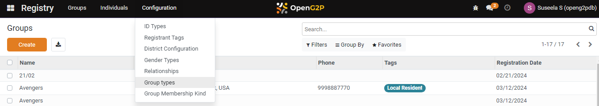
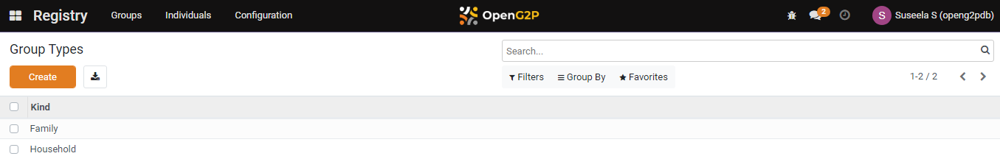
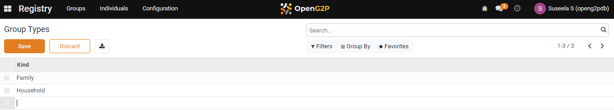
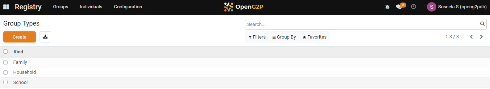

---
layout:
  title:
    visible: true
  description:
    visible: false
  tableOfContents:
    visible: true
  outline:
    visible: true
  pagination:
    visible: true
---

# 📔 Configure Group Types

This document provides instructions to configure group types in the _**Beneficiary Registry**_ module.

## Prerequisites

* The user must have Registrar and Administrator role.
* The user must have access to the Beneficiary Registry module in OpenG2P systems.

## Procedure

1. Click the main menu icon  and select _**Registry**_.

<figure><figcaption></figcaption></figure>

_**Registry**_ screen is displayed.

<figure><figcaption></figcaption></figure>

2. Click the _**Configuration**_ in the menu bar and then select _**Group Types**_.

<figure><figcaption></figcaption></figure>

_**Group Types**_ screen is displayed.

<figure><figcaption></figcaption></figure>

3. Click the _**Create**_ button. It enables an empty field.

<figure><figcaption></figcaption></figure>

4. Enter the relevant [Group types](../#group-types) in the Kind field.

For example, here, enter School in the Kind field.

<figure><figcaption></figcaption></figure>

5. Click the _**Save**_ button to save the group types configuration.
6. Click the _**Discard**_ button to exit from the screen.

The newly created group type is added to the group types list.

<figure><figcaption></figcaption></figure>

7. Repeat the steps 3, 4, and 5 to add the relevant group types.

This completes the configuration of the group types in Beneficiary Registry module.

## Delete Group Types

Refer to the user guide's [Configure Registrant Tags](configure-registrant-tags.md#delete-registrant-tags) section to delete the configuration of the group types.
