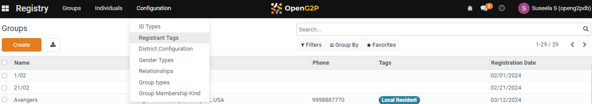
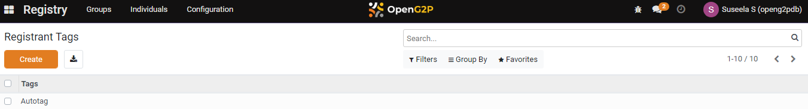
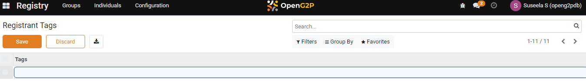
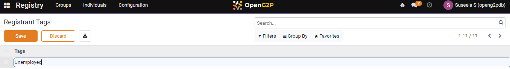
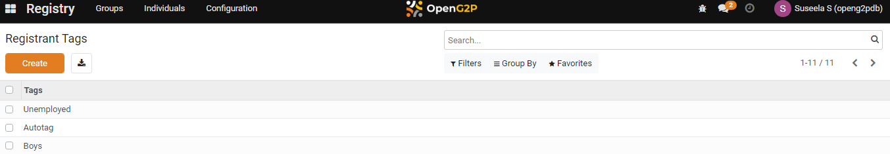
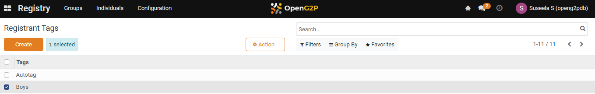
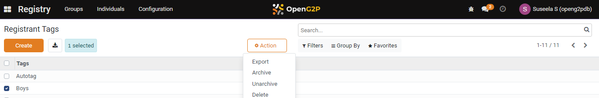

# 📔 Configure Registrant Tags

This document provides instructions to configure registrant tags in the _**Beneficiary Registry**_ module.

## Prerequisites

* The user must have Registrar and Administrator role.
* The user must have access to the Beneficiary Registry module in OpenG2P systems.

## Procedure

1. Click the main menu icon  and select _**Registry**_.

<figure><figcaption></figcaption></figure>

_**Registry**_ screen is displayed.

<figure><figcaption></figcaption></figure>

2. Click the _**Configuration**_ in the menu bar and then select Registrant Tags.

<figure><figcaption></figcaption></figure>

_**Registrant Tags**_ screen is displayed.

<figure><figcaption></figcaption></figure>

3. Click the _**Create**_ button. It enables an empty field.

<figure><figcaption></figcaption></figure>

4. Enter the relevant [Registrant Tags](../#registrant-tags) in the Tags field.&#x20;

For example, here, enter the registrant tags as Unemployed.

<figure><figcaption></figcaption></figure>

5. Click the _**Save**_ button to save the registrant tag.
6. Click the _**Discard**_ button to exit from the screen.

The newly created registrant tag is added to the registrant tag list.

<figure><figcaption></figcaption></figure>

7. Repeat the steps 3, 4, and 5 to add the relevant registrant tags.

This completes the configuration of registrant tag in Beneficiary Registry module.

## Delete Registrant Tags

8. Select the registrant tag you want to delete. It enables the _**Actions**_ button. It also shows the number of selected tags you want to delete.

<figure><figcaption></figcaption></figure>

9. Click the _**Actions**_ button. It displays the list of actions you can perform.

<figure><figcaption></figcaption></figure>

10. Click the _**Delete**_ option in the list.&#x20;

_**Confirmation**_ dialog box is displayed.

<figure><figcaption></figcaption></figure>

11. Click the _**OK**_ button to remove the selected tag from the Registrant Tags list.
12. Click the _**Cancel**_ button to retain the selected tag.

This completes the deletion of the selected tag from the Registrant Tags list.
