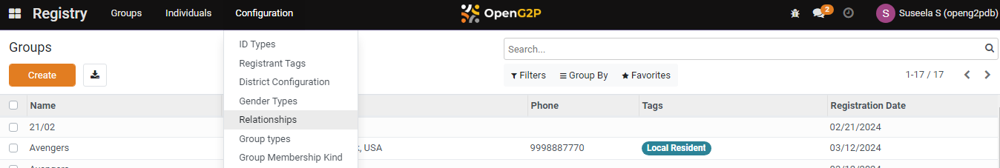
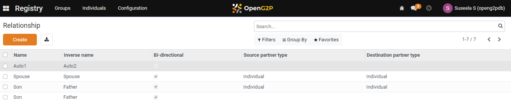
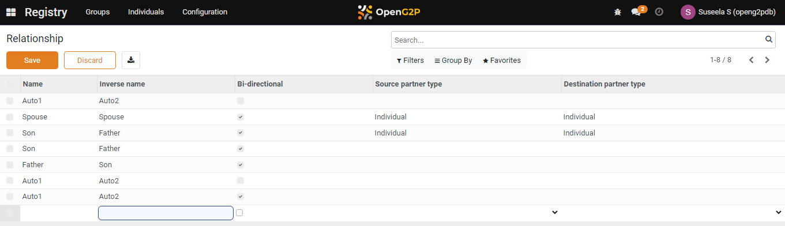
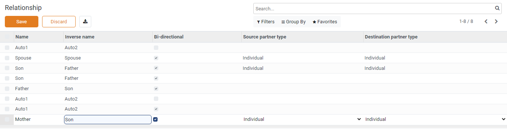
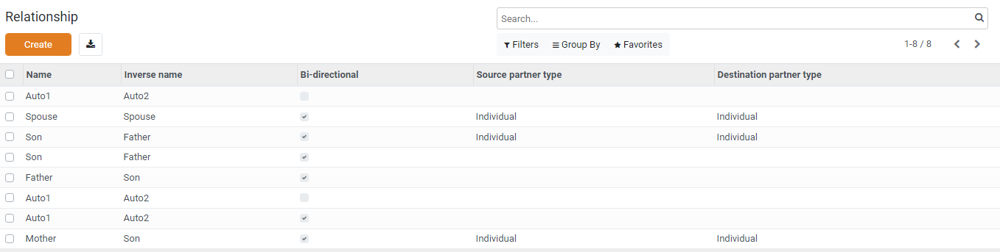

---
layout:
  title:
    visible: true
  description:
    visible: false
  tableOfContents:
    visible: true
  outline:
    visible: true
  pagination:
    visible: true
---

# 📔 Configure Relationships

This document provides instructions to configure relationships in the _**Beneficiary Registry**_ module.

## Prerequisites

* The user must have Registrar and Administrator role.
* The user must have access to the Beneficiary Registry module in OpenG2P systems.

## Procedure

1. Click the main menu icon  and select _**Registry**_.

<figure><figcaption></figcaption></figure>

_**Registry**_ screen is displayed.

<figure><figcaption></figcaption></figure>

2. Click the _**Configuration**_ in the menu bar and then select _**Relationships**_.

<figure><figcaption></figcaption></figure>

_**Relationship**_ screen is displayed.

<figure><figcaption></figcaption></figure>

3. Click the _**Create**_ button. It enables an empty field.

<figure><figcaption></figcaption></figure>

4. Enter the relevant [Relationship](../#relationships) value in the associated fields.
5. Enter the _**Name**_, _**Inverse name**_, _**Bi-directional**_ in the associated field. Inverse name is a mandatory field.&#x20;
6. Select the appropriate value from the drop-down for _**Source partner type**_ and _**Destination partner type**_ in the associated field.

<figure><figcaption></figcaption></figure>

7. Click the _**Save**_ button to save the relationships configuration.
8. Click the _**Discard**_ button to exit from the screen.

The newly created relationships is added to the relationship list.

<figure><figcaption></figcaption></figure>

9. Repeat the steps 3, 4, 5 and 6 to add the relevant relationship.

This completes the configuration of relationship in Beneficiary Registry module.

## Delete Relationships configuration

Refer to the user guide's [Configure Registrant Tags](configure-registrant-tags.md#delete-registrant-tags) section to delete the configuration of the relationship.
