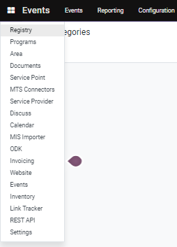

---
layout:
  title:
    visible: true
  description:
    visible: false
  tableOfContents:
    visible: true
  outline:
    visible: true
  pagination:
    visible: true
---

# 📔 Assign a Program to a Group

&#x20;This document provides instructions to assign a program to a group

## Prerequisites

* The user must have Registrar and Administrator role.
* The user must have access to the Beneficiary Registry module in OpenG2P systems.

## Procedure

1. Click the main menu icon  and select _**Registry**_.

<figure><figcaption></figcaption></figure>

_**Registry**_ screen is displayed.

<figure><figcaption></figcaption></figure>

The group names are listed below the Name column.

2. Click the group name which has to be assigned to a program.

For example, here the group name "Family Group" is selected.

_**Groups/Family Group**_ screen is displayed.

<figure><figcaption></figcaption></figure>

3. Click the _**Action**_ button and select  _**Add to Program**_.

<figure><figcaption></figcaption></figure>

_**Add to Program**_ screen is displayed.

<figure><figcaption></figcaption></figure>

4. Select the appropriate program from the drop-down.

or

5. Select the _**Search More.**_

<figure><figcaption></figcaption></figure>

_**Search: Program**_ screen is displayed.

<figure><figcaption></figcaption></figure>

6. Search for the appropriate program or click the program below the _**Name**_ column.

The program name is displayed in the _**Program**_ drop-down.

<figure><figcaption></figcaption></figure>

7. Click the _**Assign**_ button to assign the program to a group.
8. Click the _**Cancel**_ button to exit from the screen.

For example, you can find the newly assigned program listed in the _**Program**_ tab in the _**Family Group**_ screen.

<figure><figcaption></figcaption></figure>
