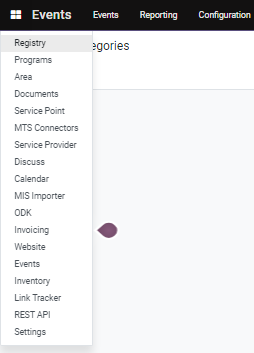
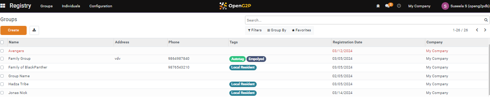
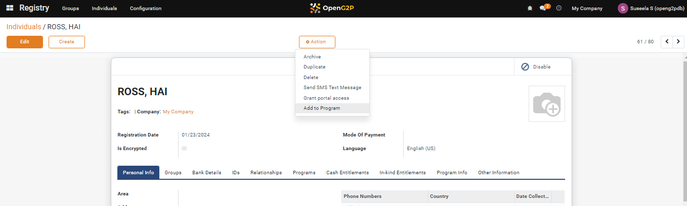
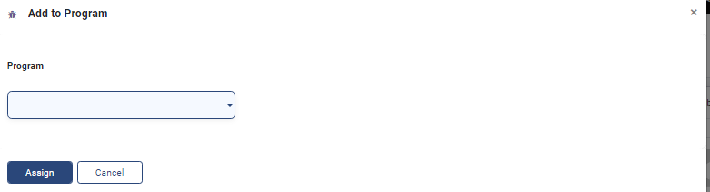
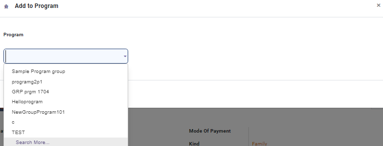
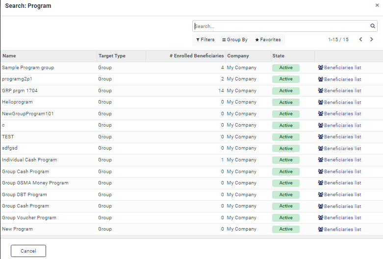
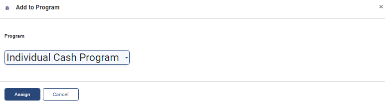
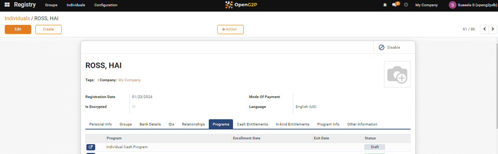

---
layout:
  title:
    visible: true
  description:
    visible: false
  tableOfContents:
    visible: true
  outline:
    visible: true
  pagination:
    visible: true
---

# 📔 Assign a Program to an Individual

This document provides instructions to assign a program to an individual.

## Prerequisites

* The user must have Registrar and Administrator role.
* The user must have access to the Beneficiary Registry module in OpenG2P systems.

## Procedure

1. Click the main menu icon  and select _**Registry**_.

<figure><figcaption></figcaption></figure>

_**Registry**_ screen is displayed.

<figure><figcaption></figcaption></figure>

2. Click the _**Individuals**_ in the menu bar.&#x20;

_**Individuals**_ screen is displayed.

<figure><figcaption></figcaption></figure>

The individuals names are listed below the _**Name**_ column.

3. Click the individual name which has to be assigned to a program.

For example, here the individual name "Ross, Hai" is selected.

_**Individuals/ROSS, HAI**_ screen is displayed.

<figure><figcaption></figcaption></figure>

4. Click the _**Action**_ button and select  _**Add to Program**_.

_**Add to Program**_ screen is displayed.

<figure><figcaption></figcaption></figure>

5. Select the appropriate program from the drop-down.

or

6. Select the _**Search More.**_

<figure><figcaption></figcaption></figure>

_**Search: Program**_ screen is displayed.

<figure><figcaption></figcaption></figure>

7. Search for the appropriate program or click the program below the _**Name**_ column.

The program name is displayed in the _**Program**_ drop-down.

<figure><figcaption></figcaption></figure>

8. Click the _**Assign**_ button to assign the program to an individual.
9. Click the _**Cancel**_ button to exit from the screen.

For example, you can find the newly assigned program listed in the _**Program**_ tab in the Individuals/Ross, Hai screen.

<figure><figcaption></figcaption></figure>
