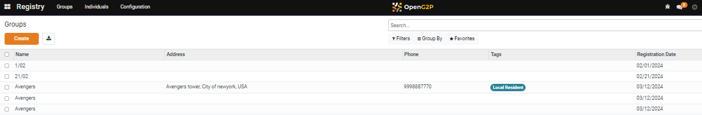

# 📔 Create a Group and Add Individual Registrants to the Group

This document provides instructions to create a group and add individual registrants to the group in the _**Beneficiary Registry**_ module.&#x20;

## Prerequisites

* The user must have a Registrar or an Administrator role.
* The user must have access to the Beneficiary Registry module in OpenG2P systems.

## Procedure

1. Click the main menu icon  and select _**Registry**_.

<figure><figcaption></figcaption></figure>

_**Registry**_ screen is displayed.

<figure><figcaption></figcaption></figure>

2. Click the _**Groups**_ in the menu bar.

_**Groups/New**_ screen is displayed.

<figure><figcaption></figcaption></figure>

The fields and their descriptions are given below:

| Field                                                                                  | Description                                                                                                                            |
| -------------------------------------------------------------------------------------- | -------------------------------------------------------------------------------------------------------------------------------------- |
| Enter name of the group                                                                | Enter the name of the new group                                                                                                        |
| Tags                                                                                   | Select the tag from the drop-down                                                                                                      |
|  | Add the group member's photo                                                                                                           |
| Registration Date                                                                      | Displays the current date by default                                                                                                   |
| Mode of Payment                                                                        | 
Select the mode of payment from the drop-down. The available values are: 
<ul><li>Cash</li><li>Voucher</li><li>Digital</li></ul> |
| Kind                                                                                   | Select the Kind from the drop-down                                                                                                     |

3. Click the _**Members**_ tab.
4. Click the _**Add a line.**_

It enables the _**Member Name**_ field.

There are two method to add individual registrant in a group.

Method 1: Select the individual registrant name from the _**Member Name**_ drop-down.

Method 2: Select the _**Search More...**_ option in the drop-down.

### Method 1

5. Select the individual registrant name from the _**Member Name**_ drop-down.

<figure><figcaption></figcaption></figure>

It auto-populates the other fields as shown below.

<figure><figcaption></figcaption></figure>

6. Repeat the step 4 and 5 to add individual registrant in a group.

<figure><figcaption></figcaption></figure>

7. Click the delete icon to remove the individual members from the group.

### Method 2

8. Click the _**Search More...**_ option in the Member Name drop-down.

<figure><figcaption></figcaption></figure>

_**Search: Member Name**_ screen is displayed.

<figure><figcaption></figcaption></figure>

You can search and find the name of the individual registrants in the search field (or) directly click the individual registrant in the member name list. It gets added or auto-populated in the Groups/New screen.

<figure><figcaption></figcaption></figure>

9. Click the _**Save**_ button to save the group registrant.
10. Click the _**Discard**_ buttom to exit from the screen.

The newly created group registrant gets added in the Groups list.

<figure><figcaption></figcaption></figure>

This completes the creation of a group and adding individual registrants to the group in the _**Beneficiary Registry**_ module.
