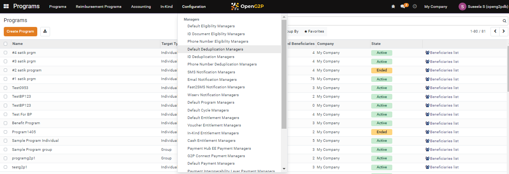
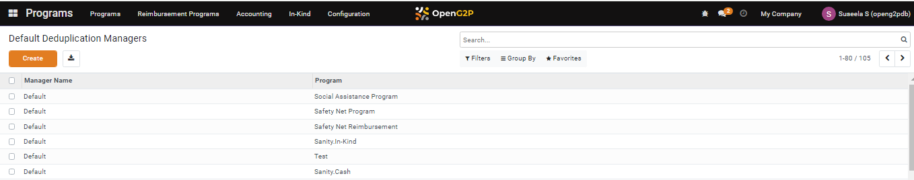
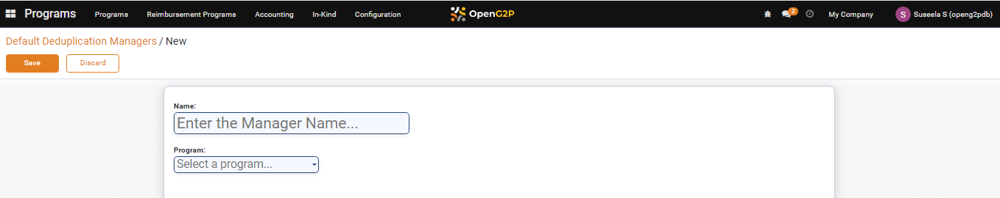
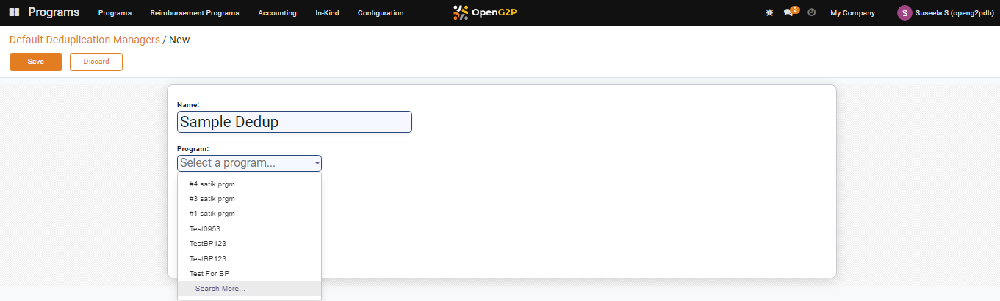
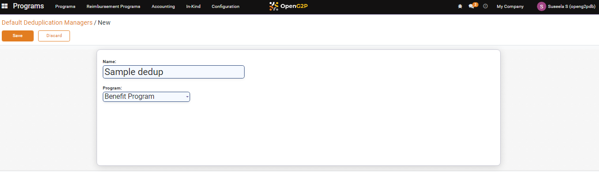
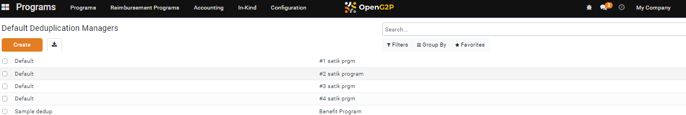

---
layout:
  title:
    visible: true
  description:
    visible: false
  tableOfContents:
    visible: true
  outline:
    visible: true
  pagination:
    visible: true
---

# 📔 Configure Default Deduplication Manager

This document provides instruction to configure default deduplication manager in Program module.

## Prerequisites

* The user must have access to Program module in OpenG2P systems.
* The user should be assigned to the Program Manager role.

## Procedure

1. Click the main menu icon  and select _**Programs**_.

<figure><figcaption></figcaption></figure>

_**Programs**_ screen is displayed.

2. Click the _**Configuration**_ in the menu bar and then select _**Default Deduplication Managers**_.

<figure><figcaption></figcaption></figure>

_**Default Deduplication Managers**_ screen is displayed.

<figure><figcaption></figcaption></figure>

3. Click the _**Create**_ button.

_**Default Deduplication Managers/New**_ screen is displayed.

<figure><figcaption></figcaption></figure>

4. Enter the name of the deduplication manager.
5. Select the appropriate program from the drop-down. (or) Select the _**Search More...**_ option from the drop-down.&#x20;

<figure><figcaption></figcaption></figure>

_**Search: Program**_ screen is displayed.

<figure><figcaption></figcaption></figure>

6. Click the program name to configure the default deduplication manager.&#x20;

The program name appears in the Program drop-down.

<figure><figcaption></figcaption></figure>

7. Click the _**Save**_ button to save and exit from the screen.
8. Click the _**Discard**_ button to exit from the screen without saving.

The newly configured Default Deduplication Managers is listed in the Default Deduplication Managers screen.

<figure><figcaption></figcaption></figure>
