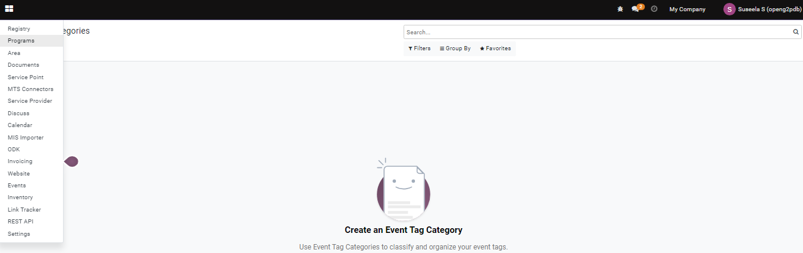
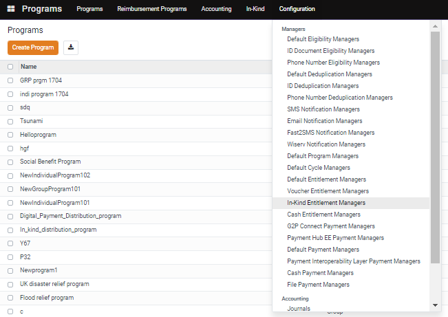
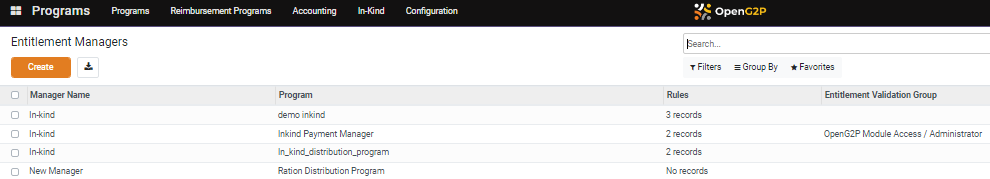
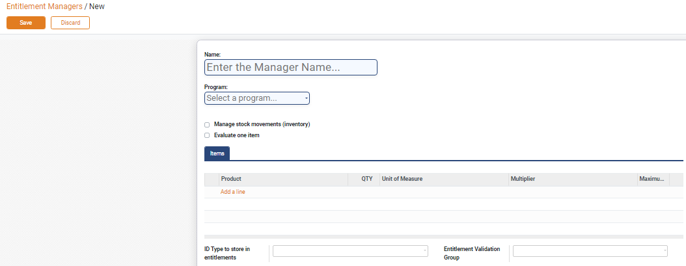
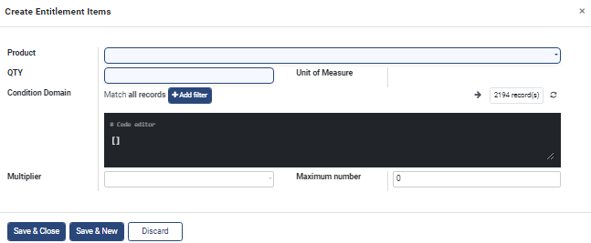
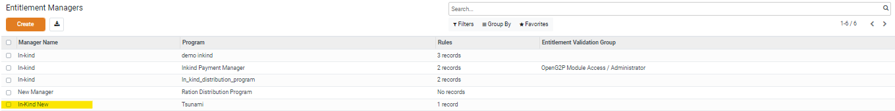

# Configure In-Kind Entitlement Manager

This document provides instructions to configure In-Kind Entitlement Manager in the Program Module.

## Prerequisites

* The user must have access to OpenG2P systems.
* The user must have Program Manager role.

## Procedure

1. Click the main menu icon  and select _**Programs**_.

<figure><figcaption></figcaption></figure>

_**Programs**_ screen is displayed.

2. Click the _**Configuration**_ in the menu bar and then select _**In-Kind Entitlement Managers**_.

<figure><figcaption></figcaption></figure>

_**Entitlement Managers**_ screen is displayed.

<figure><figcaption></figcaption></figure>

3. Click the _**Create**_ button.

_**Entitlement Managers/New**_ screen is displayed.

<figure><figcaption></figcaption></figure>

The fields and their descriptions are given below:

| Field                              | Description                                    |
| ---------------------------------- | ---------------------------------------------- |
| Name                               | Enter the manager name                         |
| Program                            | Select the relevant program from the drop-down |
| Manage stock movements (inventory) | Check the option, if required                  |
| Evaluate one item                  | Check the option, if required                  |

4. Click the _**Item**_ tab.
5. Click the _**Add a line**_.

_**Create Entitlement Items**_ screen is displayed.

<figure><figcaption></figcaption></figure>

The fields and their descriptions are given below:

| Field            | Description                                                                               |
| ---------------- | ----------------------------------------------------------------------------------------- |
| Product          | Select the product from the drop-down                                                     |
| QTY              | Enter the quantity                                                                        |
| Unit of Measure  | Auto-populates the unit of measure                                                        |
| Condition Domain | Use condition domain filters to add filters                                               |
| Multiplier       | Enter the number in the multiplier which multiplies the quantity entered in the QTY field |
| Maximum number   | Enter the maximum number                                                                  |
| Save & Close     | Click the Save & Close button to save and close the screen                                |
| Save & New       | Click the Save & New button to save and create a new entitlement items                    |
| Discard          | Click the Discord button to exit the screen                                               |

The above entered data gets auto-populated in the _**Entitlement Managers/New**_ screen.

<figure><figcaption></figcaption></figure>

6. Enter the _**ID type to store in entitlements**_.
7. Enter the _**Entitlement Validation Group**_.
8. Click the _**Save button**_ to save the data and exit the screen.
9. Click the _**Discard**_ button to exit the screen without saving the data .
10. The newly created entitlement manger is added in the existing entitlement managers list.

<figure><figcaption></figcaption></figure>

This completes the process of configuration of In-Kind Entitlement Managers in the Program module.

