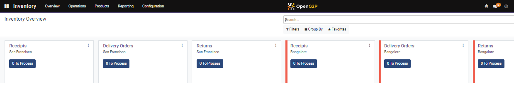
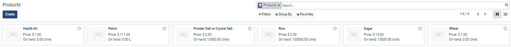
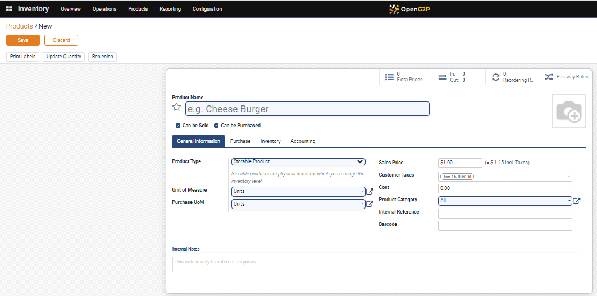
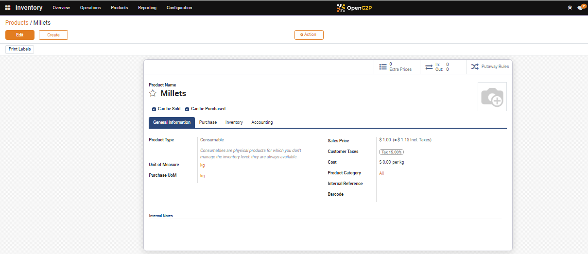
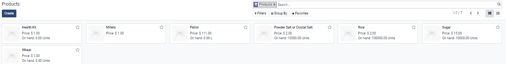

# Create a Product in Inventory

This document provides instructions to add an in-kind product to the Inventory module.

## Prerequisites

* The user must have access to OpenG2P systems.
* The user must have Program Manager role.

## Procedures

1. Click the main menu icon  and select _**Inventory**_.

_**Inventory**_ _**Overview**_ screen is displayed.

<figure><figcaption></figcaption></figure>

2. Click the _**Products**_ in the menu bar and then click _**Products**_.

_**Products**_ screen is displayed.

<figure><figcaption></figcaption></figure>

3. Click the _**Create**_ button.

_**Products/New**_ screen is displayed.

<figure><figcaption></figcaption></figure>

4. Enter the Product Name in the _**Product Name**_ field.

For example, here, the product name is entered as Millets.

5. Check the appropriate option. The available options are:

* Can be Sold
* Can be Purchased

6. Click the _**General Information**_ tab.

The fields and their descriptions available in the General Information tab are:

| Field              | Description                                                                                                                                                                                                                                                   |
| ------------------ | ------------------------------------------------------------------------------------------------------------------------------------------------------------------------------------------------------------------------------------------------------------- |
| Product Type       | 
Select the appropriate option. The available options are: 
<ul><li>Consumable</li><li>Service</li><li>Storable Product</li></ul>
Note: 

To create a product choose the option Consumable
                                                    |
| Unit of Measure    | 
In the drop-down, click <strong>Search More...</strong>

<em><strong>Search: Unit of Measure</strong></em> screen is displayed.
<ul><li>Select the relevant unit of measure.</li></ul>
For example, here, unit of measure is selected as kg.
 |
| Purchase of UoM    | It auto-populates the value selected in the unit of measure field                                                                                                                                                                                             |
| Sales Price        | Enter the sales price                                                                                                                                                                                                                                         |
| Customer Taxes     | Enter the customer tax                                                                                                                                                                                                                                        |
| Cost               | Enter the cost                                                                                                                                                                                                                                                |
| Product Category   | Enter the product category                                                                                                                                                                                                                                    |
| Internal Reference | Enter the internal reference                                                                                                                                                                                                                                  |
| Barcode            | Enter the barcode                                                                                                                                                                                                                                             |
| Internal Notes     | Enter additional information, if any.                                                                                                                                                                                                                         |
| Save               | Click the _**Save**_ button to save the data                                                                                                                                                                                                                  |
| Discard            | Click the _**Discard**_ button to exit from _**Products/New**_ screen                                                                                                                                                                                         |

_**Products/{Product Name}**_ screen is displayed.

<figure><figcaption></figcaption></figure>

The newly added product name Millets is added in the Products screen.

<figure><figcaption></figcaption></figure>

This completes the process of creating a new product in the Inventory module.
