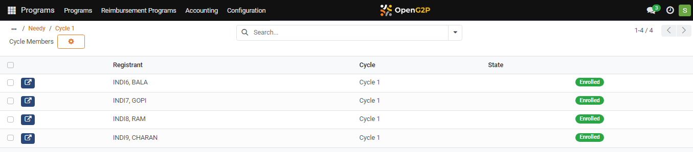
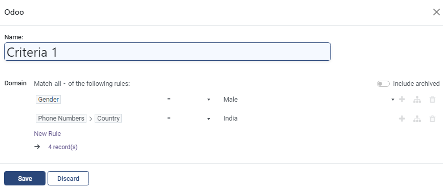
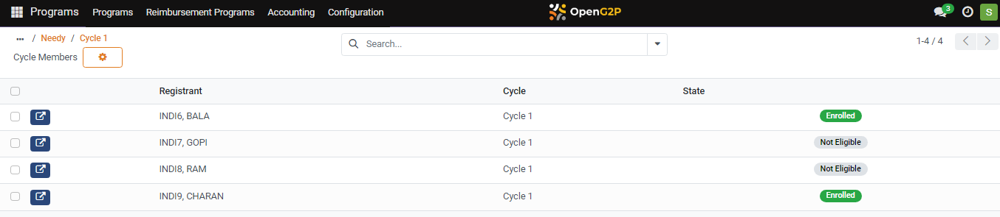

---
layout:
  title:
    visible: true
  description:
    visible: false
  tableOfContents:
    visible: true
  outline:
    visible: true
  pagination:
    visible: true
---

# 📔 Verify Eligibility of Registrants in a Cycle

This document provides instructions on verify eligibility of registrants in a cycle.

## Prerequisites

* The user must have a [Program Manager](../../../../features/program-management/role-of-a-program-manager.md) role.
* A program must have a Cycle with enrolled registrants.

Notes:

Verify Eligibility feature is used after the beneficiaries are enrolled in a Cycle and if there is a need to reassess the enrolled beneficiaries based on the scenarios such as,

* If the program manager has not modified the criterion when enrolling the beneficiaries.
* If it becomes necessary to confirm the enrolled beneficiaries' eligibility based on the recently introduced criterion in a cycle.
* If the enrolled beneficiaries must be reassessed based on the ad hoc criterion.
* If the program manager adds a criterion that was overlooked during beneficiary enrollment.

## Procedure

1. Verify the Cycle has enrolled registrants.

For example, the program _**Needy**_ has a Cycle 1 with enrolled registrants.

<figure><figcaption></figcaption></figure>

In the Programs Needy screen, add a new criterion in the _**Configuration**_ tab to enroll the eligible registrants among the currently enrolled registrants in _**Cycle 1**_ based on the added new criterion.&#x20;

<figure><figcaption></figcaption></figure>

For example, a new criteria _**Phone Numbers > Country**_ is added in the Eligibility Manager in the _**Configuration tab**_.

<figure><figcaption></figcaption></figure>

2. Click the _**Save**_ button.
3. Click the _**Cycles**_ tab and Open cycle form.

Programs > Needy > Cycle 1 screen is displayed.

<figure><figcaption></figcaption></figure>

4. Click the _**Verify Eligibility**_ button.
5. Click the _**Beneficiaries**_ tab.

Programs > Needy > Cycle 1 > Cycle Members screen is displayed.

<figure><figcaption></figcaption></figure>

You can find beneficiaries are enrolled based on the appended criteria.&#x20;

The currently enrolled registrants in a Cycle who are not eligible based on added criterion, the status becomes Not Eligible.&#x20;

Verify Eligibility in a Cycle screen enrolls only currently enrolled registrants based on the added criterion.
