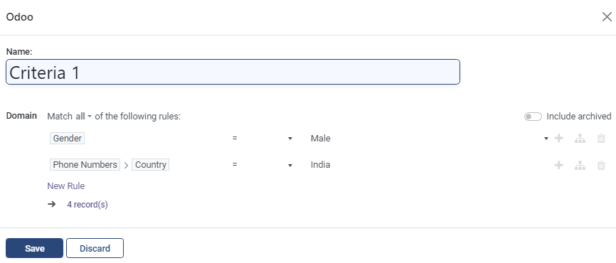

---
layout:
  title:
    visible: true
  description:
    visible: false
  tableOfContents:
    visible: true
  outline:
    visible: true
  pagination:
    visible: true
---

# 📔 Verify Eligibility of Enrolled Registrants

This document provides instructions on verifying the eligibility of enrolled registrants in a program.

## Prerequisites

* The user must have a [Program Manager](../../../features/program-management/role-of-a-program-manager.md) role.&#x20;
* A program must have enrolled eligible registrants.

Notes:

Verify Eligibility feature is used after the beneficiaries are enrolled and if there is a need to reassess the enrolled beneficiaries based on the scenarios such as,

* If the program manager has not modified the criterion when enrolling the beneficiaries.
* If it becomes necessary to confirm the enrolled beneficiaries' eligibility based on the recently introduced criterion.
* If the enrolled beneficiaries must be reassessed based on the ad hoc criterion.
* If the program manager adds a criterion that was overlooked during beneficiary enrollment.

For example, here the program Needy is considered.

## Procedure

1. Verify the program has enrolled registrants.
2. Click the program _**Needy**_.

Programs Needy screen is displayed.

<figure><figcaption></figcaption></figure>

2. Add the new criterion in the _**Configuration**_ tab to enroll the eligible registrants among the currently enrolled registrants based on the added new criterion.&#x20;

For example, a new criteria _**Phone Numbers > Country**_ is added in the Eligibility Manager in the _**Configuration tab**_.

<figure><figcaption></figcaption></figure>

3. Click the _**Save**_ button.

<figure><figcaption></figcaption></figure>

4. Click the _**Verify eligibility**_ button.

A pop-up message displays the count of enrolled eligible individual registrants based on the added criterion.

5. Click the _**Beneficiaries**_ tab.

_**Programs > Needy > Beneficiaries**_ screen is displayed.&#x20;

<figure><figcaption></figcaption></figure>

You can find a beneficiary is enrolled based on the added criterion.&#x20;

For example, in the above screenshot, though the registrant (INDI7, GOPI) is eligible to be enrolled, he is not enrolled as he is in Draft status.&#x20;

The currently enrolled registrants who are not eligible based on the added criterion, their status becomes Not Eligible.&#x20;

Verify Eligibility enrolls only the currently enrolled registrants based on the added criterion.
