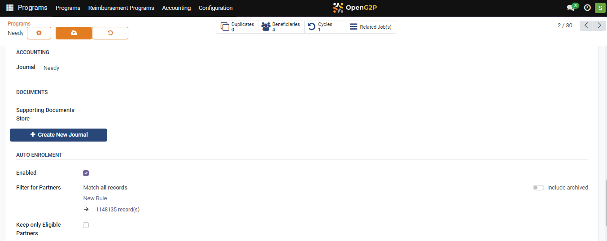

---
layout:
  title:
    visible: true
  description:
    visible: false
  tableOfContents:
    visible: true
  outline:
    visible: true
  pagination:
    visible: true
---

# 📔 Auto-Enroll New Registrants into a Program

This document provides instructions to auto-enroll new registrants into a program.

## Prerequisites

* The user must have a [Program Manager](../../../features/program-management/role-of-a-program-manager.md) role.&#x20;

## Procedure

### Enable auto-enrollment feature

1. Click the main menu icon  and select _**Programs**_.

The _**Programs**_ screen is displayed.

<figure><figcaption>
Choose the Programs screen
</figcaption></figure>

2. Select a program from the program list.
3. Click the program _**Needy**_ from the program list.

_**Needy Programs**_ screen is displayed.

\<image to be incorporated>

4. Click the _**Configuration**_ tab.

You can find the _**AUTO ENROLMENT**_ section.

<figure><figcaption></figcaption></figure>

5. Click the _**Enabled**_ check box.

Once the Auto Enrolment is enabled, you can set new rules, based on which new registrants are auto-enrolled.

<figure><figcaption></figcaption></figure>

6. Click theicon to save.

### Add new registrants

1. Click the main menu icon  and select _**Registry**_.

<figure><figcaption></figcaption></figure>

_**Registry**_ screen is displayed.

<figure><figcaption></figcaption></figure>

2. Click the _**Individual**_ in the menu bar.

_**Individual**_ screen is displayed.

<figure><figcaption></figcaption></figure>

3. Click the _**Create**_ button.

_**Individual/New**_ screen is displayed.

<figure><figcaption></figcaption></figure>

To know more about create an individuals in Beneficiary Registry, [click here](../../beneficiary-management/beneficiary-registry/user-guides/create-an-individual-registrant.md).

For example, a new individual Neel is created and saved.

4. Click the _**Programs**_ tab.

<figure><figcaption></figcaption></figure>

You can find the newly created individual is auto-enrolled to the program Needy.

This completes the process of auto-enrollment of new individuals into a program.
