---
layout:
  title:
    visible: true
  description:
    visible: false
  tableOfContents:
    visible: true
  outline:
    visible: true
  pagination:
    visible: true
---

# 📔 Enroll Eligible Individual Registrants into a Program

This document provides instructions to enroll eligible individual registrants into a program.

## Prerequisites

* The user must have a [Program Manager](../../../features/program-management/role-of-a-program-manager.md) role.
* Beneficiary Registry must have individual applicants assigned to a program.

## Requirement

The enrollment of eligible individual registrants into a program based on your project requirements.&#x20;

* [Enroll registrants with default eligibility criteria](enroll-eligible-individual-registrants-into-a-program.md#enroll-registrants-with-default-eligibility-criteria)
* [Enroll registrants with customised eligibility criteria](enroll-eligible-individual-registrants-into-a-program.md#enroll-registrants-with-customised-eligibility-criteria)

### Enroll registrants with default eligibility criteria

The enrollment of individual registrants occurs with default criteria configured in the Managers in the program's _**Configuration**_ tab  without customised rules.&#x20;

#### Procedure

1. Assign the individuals to a program.&#x20;

For example, the individuals are assigned to a program _**Needy**_.

2. Click the main menu icon  and select _**Programs**_.

<figure><figcaption>
Choose Programs in the menu 
</figcaption></figure>

_**Programs**_ screen is displayed.

<figure><figcaption></figcaption></figure>

3. Click the program _**Needy**_ from the program list.

_**Needy Programs**_ screen is displayed.

<figure><figcaption></figcaption></figure>

4. Click the _**Beneficiaries**_ tab in the Needy program screen.

_**Programs Needy Beneficiaries**_ screen is displayed with the program's beneficiaries in _**Draft**_ status.

<figure>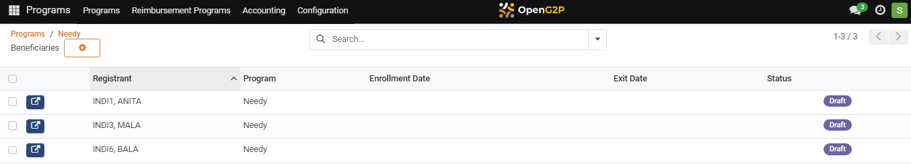<figcaption></figcaption></figure>

5. The default _**Eligibility Manager**_ and default _**Program Manager**_ must be configured to enroll the beneficiaries.

<figure><figcaption></figcaption></figure>

Note:

The below message pops up, when you click the _**Enroll Eligible Registrants**_ button without configuring the default _**Eligibility Manager**_ and default _**Program Manager**_ in the program's _**Configuration**_ tab.

<figure>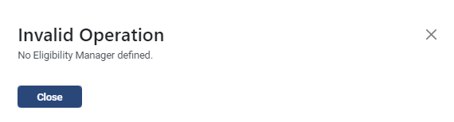<figcaption></figcaption></figure>

6. Click the _**Enroll Eligible Registrants**_ button to enroll the individuals assigned to the program.&#x20;

A pop-up message displays the count of enrolled eligible individual registrants.

<figure>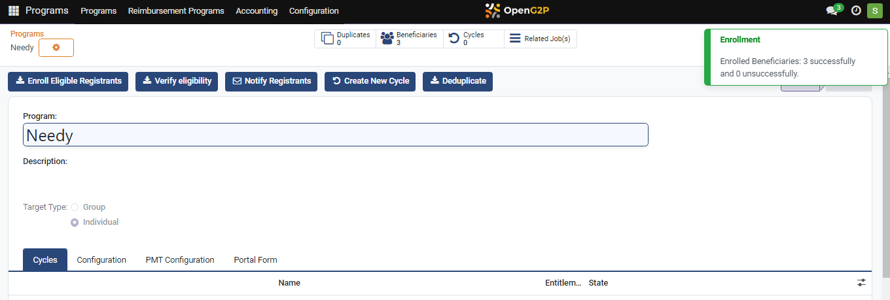<figcaption></figcaption></figure>

7. Click the _**Beneficiaries**_ tab to view the list of enrolled eligible individual registrants.

The beneficiaries's status is changed from _**Draft**_ to _**Enrolled**_.

<figure>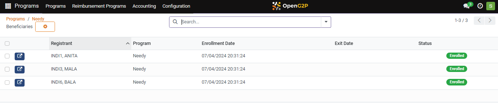<figcaption></figcaption></figure>

This completes the process of enrolling eligible individual registrants into a program.

### Enroll registrants with customised eligibility criteria

The enrollment of individual registrants occurs with customised criteria configured in the Managers in the _**Configuration**_ tab.

#### Procedure

1. Click the program _**Needy**_ from the program list.

_**Needy Programs**_ screen is displayed.

<figure><figcaption></figcaption></figure>

2. Click the _**Configuration**_ tab. &#x20;
3. Click the icon  in the _**Eligibility Managers**_ in the Configuration tab.

<figure>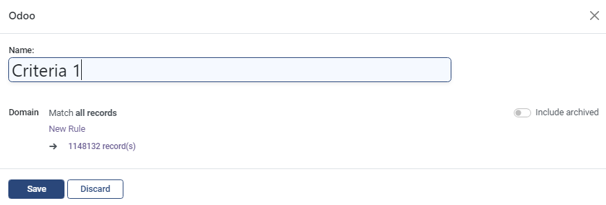<figcaption></figcaption></figure>

4. Enter the _**Name**_ of the Eligibility Manager.
5. Click the _**New Rule**_.

<figure>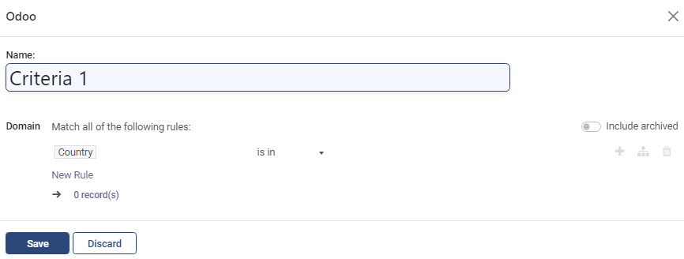<figcaption></figcaption></figure>

By default, you can find _**Country**_ tab.

6. Click the _**Country**_ tab.

You can find the list of criteria to configure to enroll the registrants.

<figure>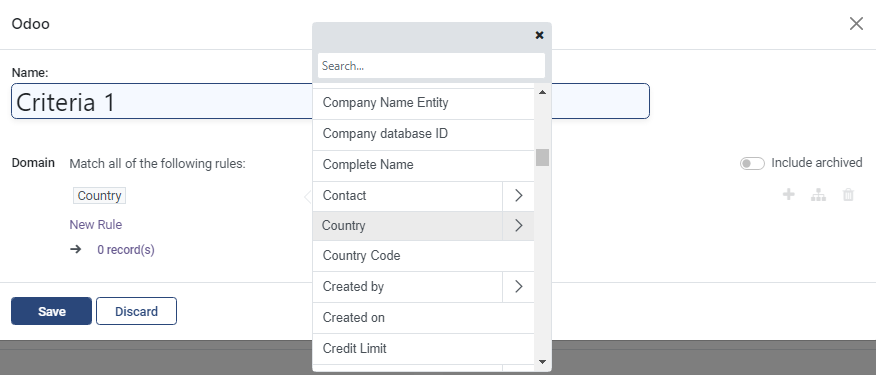<figcaption></figcaption></figure>

7. For example, enter the criteria _**Gender**_ in the _**Search**_ field and select _**Gender**_.

<figure>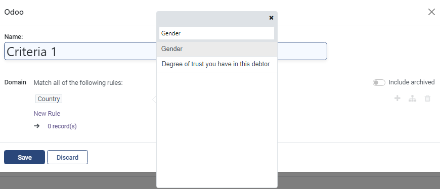<figcaption></figcaption></figure>

8. Select the operator _**=**_ in the operator drop-down.
9. Select _**Male**_ in the value drop-down.

<figure>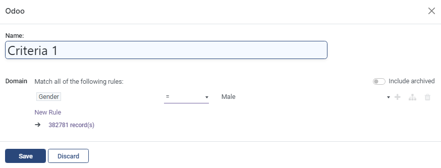<figcaption></figcaption></figure>

10. Click the _**Save**_ button to save the eligibility criteria and exit from the screen.
11. Click the _**Discard**_ button to exit the screen without saving the data.

You can find the customised criteria added in the _**Eligibility Managers**_.

<figure>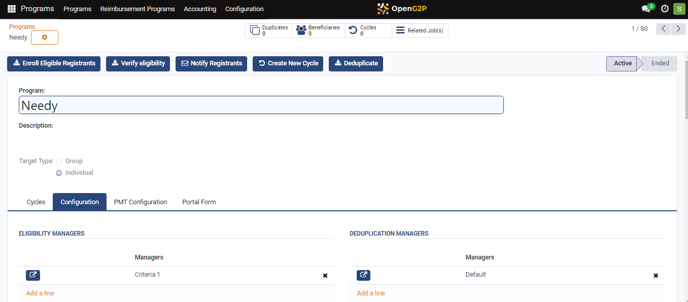<figcaption></figcaption></figure>

12. Click the _**Enroll Eligible Registrants**_ button.
13. Click the _**Beneficiaries**_ tab to view the eligible registrants based on the customised criteria in the Eligibility Managers.

A pop-up message displays the count of enrolled eligible individual registrants based on customised criteria.

<figure>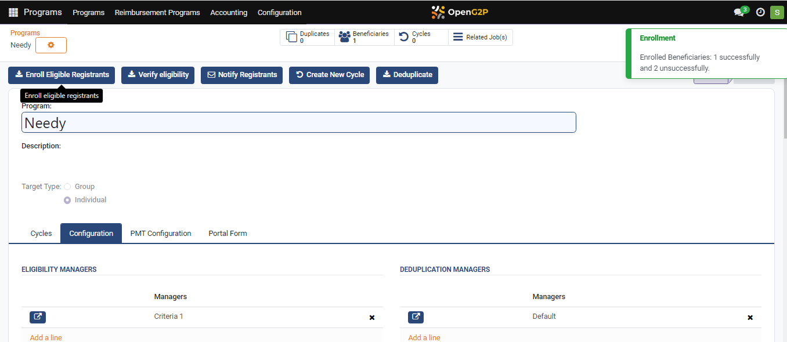<figcaption></figcaption></figure>

You can find that only the male beneficiary has the status as _**Enrolled**_ based on the customised criteria set in the Eligibility Managers. The remaining beneficiaries have the status as _**Not Eligible**_.

<figure>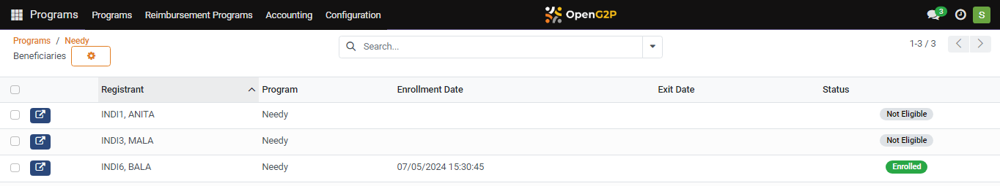<figcaption></figcaption></figure>

This completes the process of enrolling eligible individual registrants into a program based on customised criteria set in the Eligibilty Managers.

Similarly, you can customise the criteria from the list of criteria to enroll the eligible registrants as per your project requirements.
