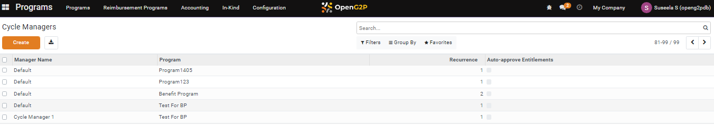

---
layout:
  title:
    visible: true
  description:
    visible: false
  tableOfContents:
    visible: true
  outline:
    visible: true
  pagination:
    visible: true
---

# 📔 Configure Cycle Managers

This document provides instructions to configure _**Cycle Managers**_ in Program module.

## Prerequisites

* The user must have access to OpenG2P systems.
* The user must have Program Manager role.

## Procedure

1. Click the main menu icon  and select _**Programs**_.

<figure><figcaption></figcaption></figure>

_**Programs**_ screen is displayed.

2. Click the _**Configuration**_ in the menu bar and then select _**Default Cycle Managers**_.

<figure><figcaption></figcaption></figure>

_**Cycle Managers**_ screen is displayed.

<figure><figcaption></figcaption></figure>

3. Click the _**Create**_ button.

_**Cycle Managers/New**_ screen is displayed.

<figure><figcaption></figcaption></figure>

The fields and their descriptions are given below.

| Field                     | Description                                                                                                                                                                                                                                                                                                                                                                                                                                                                                                                                            |
| ------------------------- | ------------------------------------------------------------------------------------------------------------------------------------------------------------------------------------------------------------------------------------------------------------------------------------------------------------------------------------------------------------------------------------------------------------------------------------------------------------------------------------------------------------------------------------------------------ |
| Name                      |  Enter the manager name. It is a mandatory field.                                                                                                                                                                                                                                                                                                                                                                                                                                                                                                      |
| Program                   | Select the appropriate Program from the drop-down. It is a mandatory field.                                                                                                                                                                                                                                                                                                                                                                                                                                                                            |
| Cycle Settings            |                                                                                                                                                                                                                                                                                                                                                                                                                                                                                                                                                        |
| Auto-approve Entitlements | Check the option, if required. It is an optional field.                                                                                                                                                                                                                                                                                                                                                                                                                                                                                                |
| Approver Group            | Select the appropriate option from the drop-down. It is a mandatory field.                                                                                                                                                                                                                                                                                                                                                                                                                                                                             |
| Recurrence                | 
Select the appropriate option from the drop-down. The valid values are 
<ul><li>Days - Enter the number of days to repeat the cycle of the entitlement.</li><li><a href="configure-cycle-managers.md#recurrence-weeks">Weeks</a> - Enter the number of weeks to repeat the cycle of the entitlement.</li><li><a href="configure-cycle-managers.md#recurrence-months">Months</a> - Enter the number of months to repeat the cycle of the entitlement.</li><li>Years - Enter the number of years to repeat the cycle of the entitlement.</li></ul> |

<figure><figcaption></figcaption></figure>

4. Click the _**Save button**_ to save the data and exit the screen.
5. Click the _**Discard**_ button to exit the screen without saving the data .

The newly created cycle manger is added in the existing cycle managers list.

<figure><figcaption></figcaption></figure>

### Recurrence - Weeks

4. Select the option _**Weeks**_ in the drop-down.

Name of the weeks with check boxes are displayed.

<figure><figcaption></figcaption></figure>

5. Check the appropriate week to repeat the cycle of the entitlement.

### Recurrence - Months

6. Select the option _**Months**_ in the drop-down.

_**Day of Month**_ field is displayed.

7. Select the appropriate option from the drop-down. The valid values are:

* Date of month
* Day of month

<figure><figcaption></figcaption></figure>

This completes the process of configuration of Cycle Managers in the Program module.
