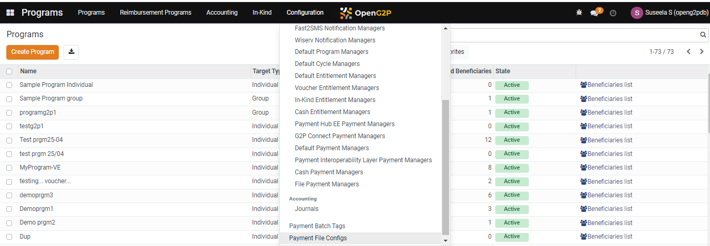
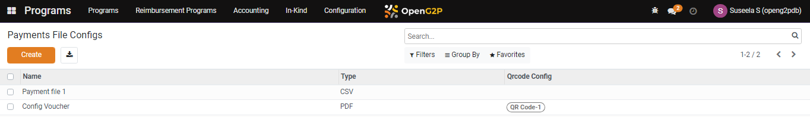
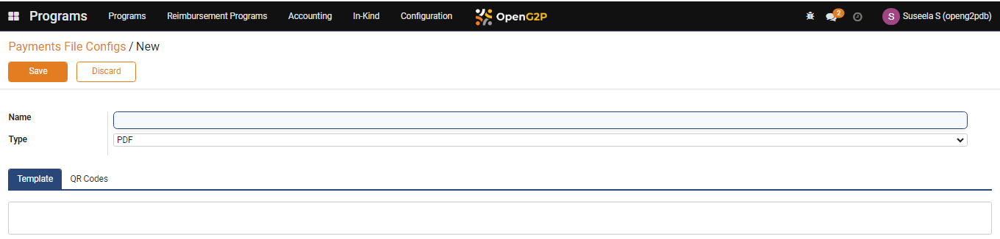
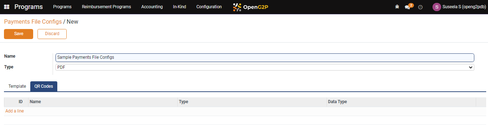
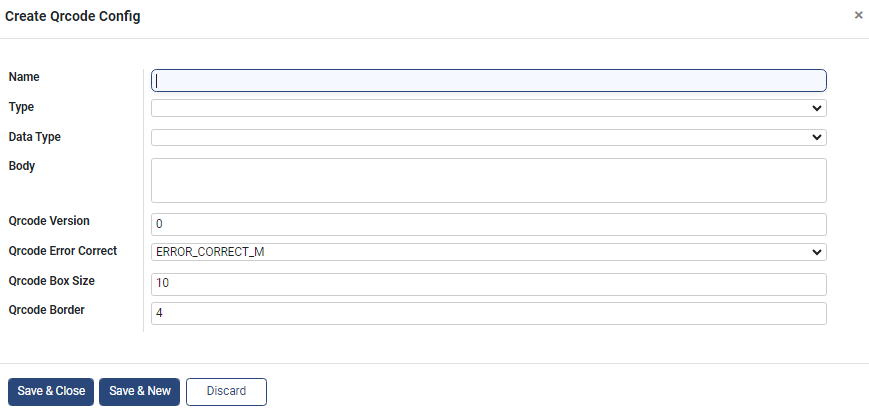
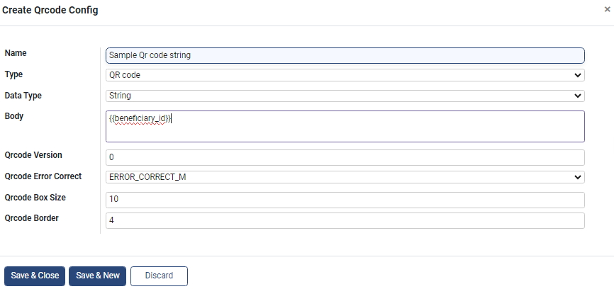
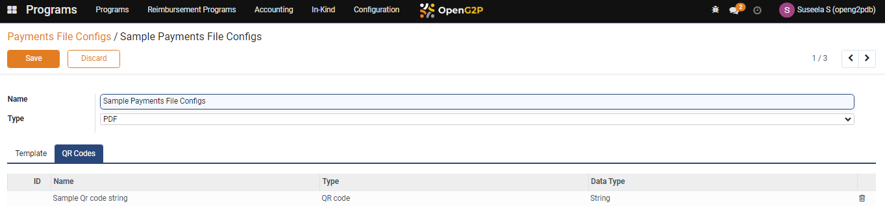
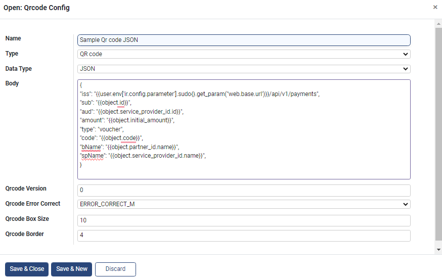
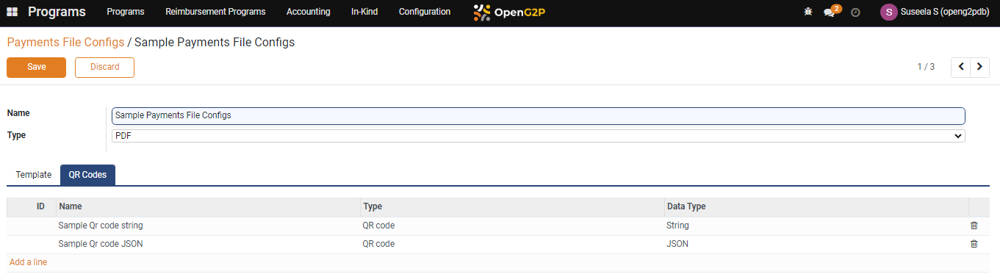
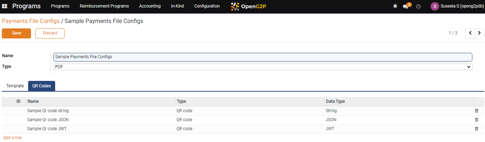

---
layout:
  title:
    visible: true
  description:
    visible: false
  tableOfContents:
    visible: true
  outline:
    visible: true
  pagination:
    visible: true
---

# 📔 Configure the Payments File with QR Code

This guide provides instructions to configure the payments file with QR Code.

## Prerequisites

* The user must have Program Administrator role.
* The user must have access to Program module in Open G2P systems.

## Procedure

1. Click the main menu icon  and select _**Programs**_.

<figure><figcaption></figcaption></figure>

_**Programs**_ screen is displayed.

2. Click the _**Configuration**_ in the menu bar and then select _**Payments File Configs**_.

<figure><figcaption></figcaption></figure>

_**Payments File Configs**_ screen is displayed.

<figure><figcaption></figcaption></figure>

3. Click the _**Create**_ button.

_**Payments File Configs /New**_ screen is displayed.

<figure><figcaption></figcaption></figure>

The fields and their descriptions are given below:

| Field    | Description                                                                                                                |
| -------- | -------------------------------------------------------------------------------------------------------------------------- |
| Name     | Enter the name for the payments file configuration                                                                         |
| Type     | 
Select the format for the payments file from the drop-down. The valid values are: 
<ul><li>PDF</li><li>CSV</li></ul> |
| Template | Click the template tab to add the template of the payments file                                                            |
| QR Codes | Click the QR codes to configure the QR codes in the payments file                                                          |

### Configure QR codes in payments file

4. Click the _**QR Codes**_ tab and click the _**Add a line**_ link.

<figure><figcaption></figcaption></figure>

_**Create Qrcode Config**_ screen is displayed.

<figure><figcaption></figcaption></figure>

The fields and their descriptions are given below:

| Field                | Description                                                                                                                                                                                                                            |
| -------------------- | -------------------------------------------------------------------------------------------------------------------------------------------------------------------------------------------------------------------------------------- |
| Name                 | Enter the name for the QR code                                                                                                                                                                                                         |
| Type                 | 
Select the appropriate option from the drop-down. The available options are: 
<ul><li>QR code</li><li>Code 128 Barcode</li></ul>                                                                                                 |
| Data Type            | 
Select the appropriate option from the drop-down. The available options are: 
<ul><li>String</li><li>JSON</li><li>JWT</li></ul>                                                                                                  |
| Body                 | Fill the body based on the selected datatype                                                                                                                                                                                           |
| Qrcode Version       | Enter the Qrcode version, if required. It is an optional field.                                                                                                                                                                        |
| Qrcode Error Correct | 

Select the appropriate option from the drop-down. The available options are: 
<ul><li>ERROR_CORRECT_M </li><li>ERROR_CORRECT_L </li><li>ERROR_CORRECT_H</li><li> ERROR_CORRECT_Q</li></ul>
It is an optional field.
 |
| Qrcode Box Size      | Enter the size of the Qrcode box. Default size is 10. It is an optional field.                                                                                                                                                         |
| Qrcode Border        | Enter the number of border for the Qrcode. Default border count is 4. It is an optional field.                                                                                                                                         |

Based on the requirement you can configure QR code with different data types.

* Configure QR code with the data type - string
* Configure QR code with the data type - JSON
* Configure QR code with the data type - JWT



#### Configure QR code with data type - string

1. Select the _**String**_ from the data type drop-down.

If you want to configure QR code with minimum values, then select the data type as string (i.e., a  normal string to display inside the QR code). For example, the Qr codes may contain any one of the values like beneficiary ID, national ID, URL and so on.

<figure><figcaption></figcaption></figure>

2. Click the _**Save & Close**_ button to save Qrcode configuration.
3. Click the _**Discard**_ button to exit from the screen.
4. Click the _**Save & New**_ button to save and to create new Qrcode configuration.

The created Qrcode Config is displayed in the QR Codes list.

<figure><figcaption></figcaption></figure>



#### Configure QR code with data type -  JSON

1. Select the _**JSON**_ from the data type drop-down.

If you want to configure a QR code with more data, then select the data type as JSON (i.e.,  more data to display inside the QR code). For example, the QR code may contain data like issuer, subject, audience, expiry, amount, type, code, beneficiary name, service provider name, and so on.

<figure><figcaption></figcaption></figure>

2. Click the _**Save & Close**_ button to save Qrcode configuration.
3. Click the _**Discard**_ button to exit from the screen.
4. Click the _**Save & New**_ button to save and to create new Qrcode configuration.

The created Qrcode Config is displayed in the QR Codes list.

<figure><figcaption></figcaption></figure>



#### Configure QR code with data type -  JWT

1. Select the _**JWT**_ from the data type drop-down.

If you want to configure a QR code with a digitally signed JSON data, select the data type as JWT (i.e., digitally signed JSON data to display inside the QR code). For example, the QR code may contain digitally signed JSON data like issuer, subject, audience, expiry, amount, type, code, beneficiary name, service provider name, and so on.

<figure><figcaption></figcaption></figure>

2. Click the _**Save & Close**_ button to save the Qrcode configuration.
3. Click the _**Discard**_ button to exit from the screen.
4. Click the _**Save & New**_ button to save and to create new Qrcode configuration.

The created Qrcode Config is displayed in the QR Codes list.

<figure><figcaption></figcaption></figure>



## Render QR codes

After you configured the QR code, you must render QR codes in the template.

* Click the _**Template**_ tab.

It displays the html code. Template contains the html code which defines the appearance of the files in PDF format.&#x20;

In the html code, search for the image source and update the QR code name that must appear in pdf format. For example&#x20;

\**_').content\_htmlsafe"/>.

**Sample file with QR code**

<figure><figcaption></figcaption></figure>
