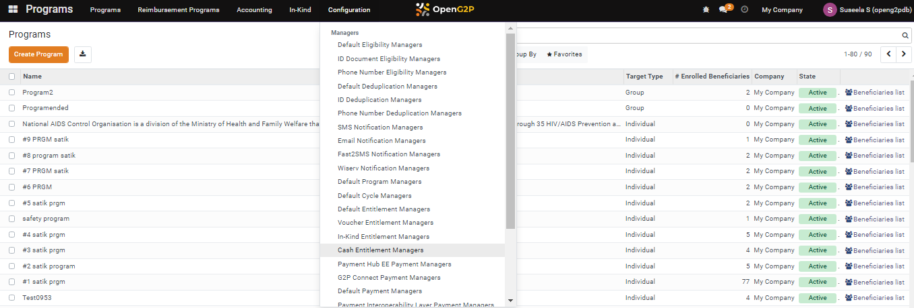
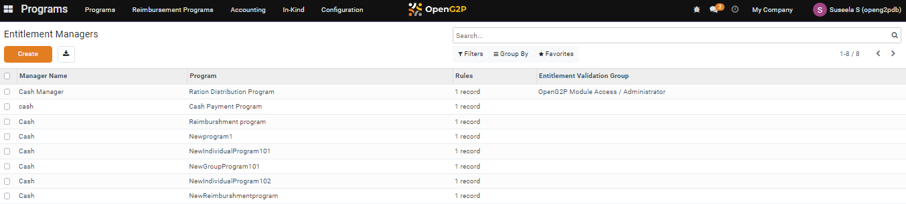
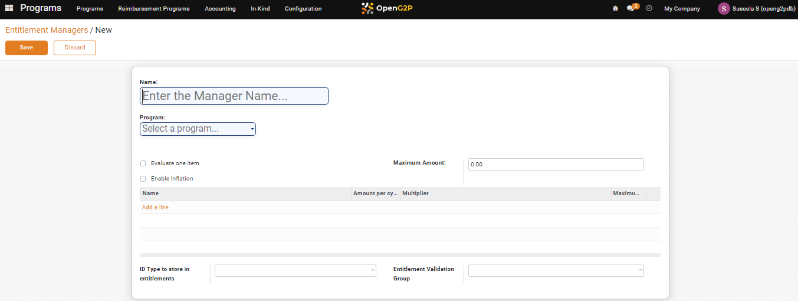
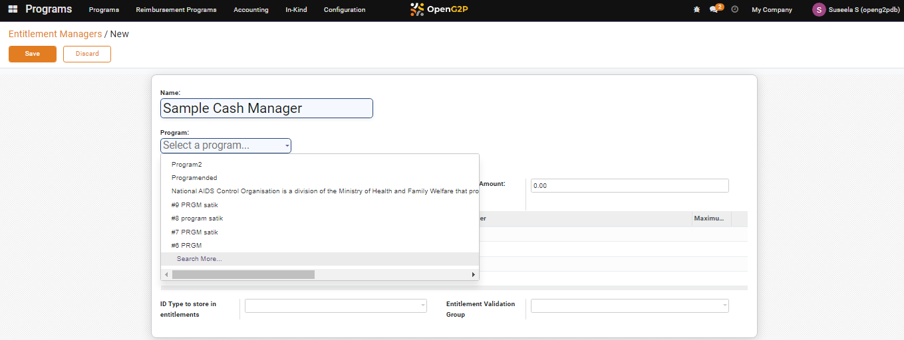
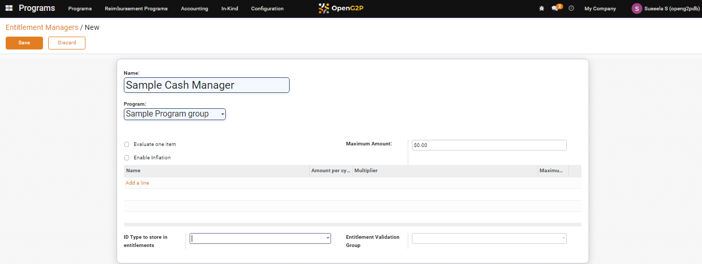
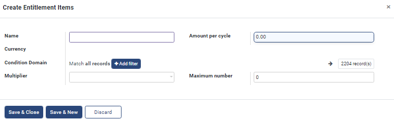
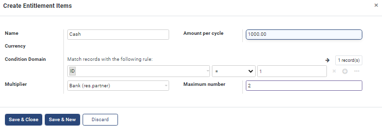
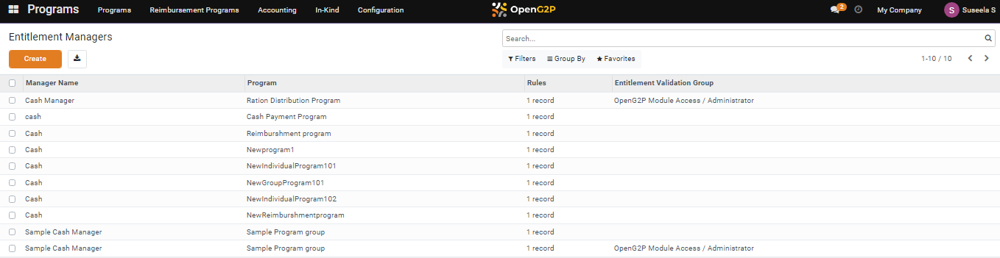

---
layout:
  title:
    visible: true
  description:
    visible: false
  tableOfContents:
    visible: true
  outline:
    visible: true
  pagination:
    visible: true
---

# 📔 Configure Cash Entitlement Manager

This document provides instructions to configure cash entitlement managers.

## Prerequisites

* The user must have access to Program module in OpenG2P systems.
* The user should be assigned to the Program Manager role.

## Procedure

1. Click the main menu icon  and select _**Programs**_.

<figure><figcaption></figcaption></figure>

_**Programs**_ screen is displayed.

2. Click the _**Configuration**_ in the menu bar and then select _**Cash Entitlement Managers**_.

<figure><figcaption></figcaption></figure>

_**Entitlement Managers**_ screen is displayed.

<figure><figcaption></figcaption></figure>

3. Click the _**Create**_ button.

_**Entitlement Managers/New**_ screen is displayed.

<figure><figcaption></figcaption></figure>

4. Enter the name of the entitlement manager.
5. Select the appropriate program from the drop-down. (or) Select the _**Search More...**_ option from the drop-down.&#x20;

<figure><figcaption></figcaption></figure>

_**Search: Program**_ screen is displayed.

<figure><figcaption></figcaption></figure>

6. Click the program name to configure the cash entitlement manager.&#x20;

The program name appears in the Program drop-down.

<figure><figcaption></figcaption></figure>

7. Check the box _**Evaluate one item**_ to evaluate an entitlement item.
8. Enter the amount in the _**Maximum Amount**_ field.
9. Check the box _**Enable Inflation**_ to enable the inflation rate.

Notes:

If the _**Enable Inflation**_ box is checked, then the _**Inflation Rate**_ field appears.

10. Enter the inflation rate.
11. Click the _**Add a line**_ in the _**Name**_ column.

_**Create Entitlement Items**_ screen is displayed.

<figure><figcaption></figcaption></figure>

The fields and their descriptions are given below.

<table><thead><tr><th width="183">Field</th><th>Description</th></tr></thead><tbody><tr><td>Name</td><td>Enter the name of the entitlement items.</td></tr><tr><td>Amount per cycle</td><td>Enter the amount of the entitlement items that has to be disbursed per cycle.</td></tr><tr><td>Currency</td><td>Enter the currency type of the entitlement items</td></tr><tr><td>Condition Domain</td><td><ol><li>Click the <em><strong>Add filter</strong></em> button. </li><li>Set the rules to filter the beneficiaries based on the criteria.</li></ol>
For example, the rule to search for criteria is selected as ID in the drop-down, assign the mathematical operation (for example, = is selected) for the rule, and enter the value for the rule ( for example, 1 is selected). Similarly you have added rules.
</td></tr><tr><td>Multiplier</td><td>Select the appropriate value from the drop-down </td></tr><tr><td>Maximum number</td><td>Enter the maximum number for the multiplier</td></tr></tbody></table>

<figure><figcaption></figcaption></figure>

12. Click the _**Save & Close**_ button to save and exit from the screen.
13. Click the _**Save & New**_ button to save and create new entitlement items.
14. Click the _**Discard**_ button to exit from the screen without saving.

_**Entitlement Managers/New**_ screen lists the newly created entitlement items.

<figure><figcaption></figcaption></figure>

15. Select the appropriate ID type from the drop-down in the _**ID Type to store in entitlements** field._
16. Select the appropriate entitlement validator from the drop-down in the _**Entitlement Validation Group**_ field.
17. Click the _**Save**_ button to save and exit from the screen.
18. Click the _**Discard**_ button to exit from the screen without saving.

The newly configured cash entitlement manager is listed in the Entitlement Managers screen.

<figure><figcaption></figcaption></figure>
