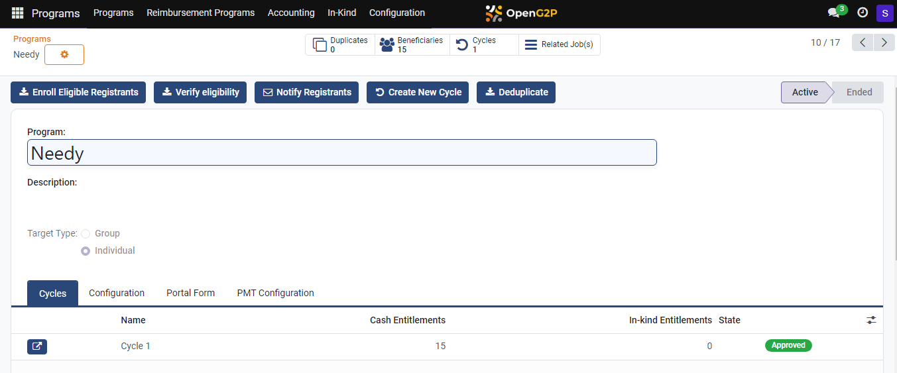
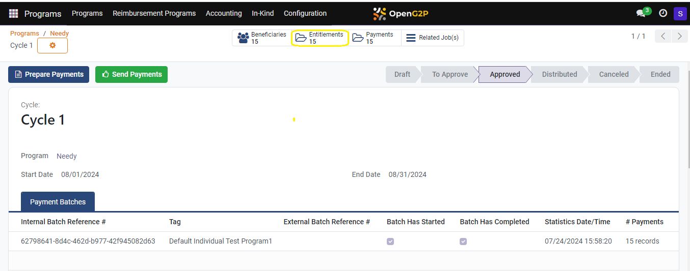
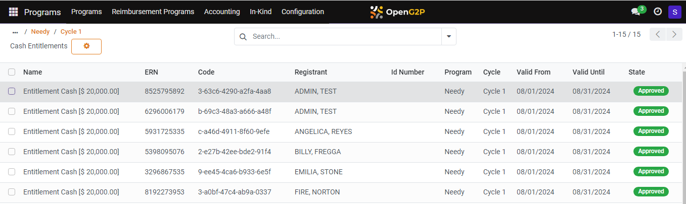
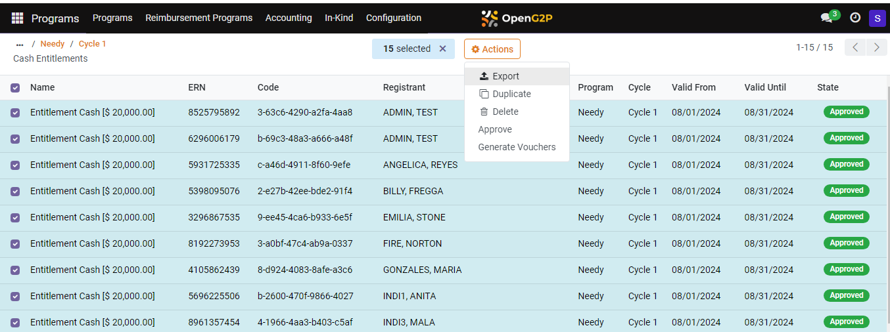
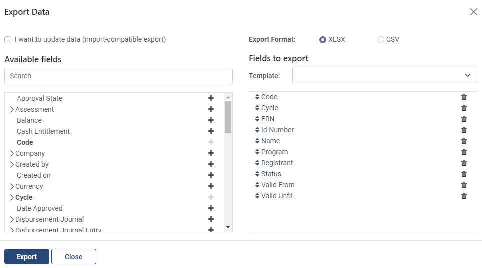
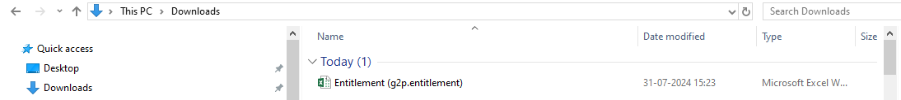

---
layout:
  title:
    visible: true
  description:
    visible: false
  tableOfContents:
    visible: true
  outline:
    visible: true
  pagination:
    visible: true
---

# 📔 Export Beneficiaries Approved Entitlement

This document provides instructions to export the recorded beneficiaries' approved entitlement from the PBMS module.

## Prerequisites

* The user must have access to PBMS module in OpenG2P systems.
* The user must have Program Manager role.

## Procedure

1. Click the main menu icon  and select _**Programs**_.

<figure><figcaption></figcaption></figure>

_**Programs**_ screen is displayed.

2. Select the Program from the Programs list.&#x20;

For example, here the program Needy is selected.

Programs Needy screen is displayed.

<figure><figcaption></figcaption></figure>

3. In the Programs Needy, click the _**Cycle**_ tab and then click the icon .

Programs > Needy > Cycle 1 screen is displayed.

<figure><figcaption></figcaption></figure>

4. Click the _**Entitlement**_ tab.

Programs > Needy > Cycle 1 > \<type of Entitlement> Entitlements screen is displayed.

<figure><figcaption></figcaption></figure>

4. Select the Entitlement you want to export in CSV/XSL format.

<figure><figcaption></figcaption></figure>

5. Click the _**Actions**_ button and then select _**Export**_ option.

_**Export data**_ screen is displayed.

<figure><figcaption></figcaption></figure>

6. Choose the appropriate Export Format option. The valid values are XLSX and CSV.
7. Add the required fields from _**Available fields**_ to _**Fields to export.**_
8. Click the _**Export**_ button.
9. Click the _**Close**_ button to close the window.

You can find the exported file in the chosen format in the download folder in your system.

<figure><figcaption></figcaption></figure>

This completes the proess of exporting the beneficiaries approved entitlements.
