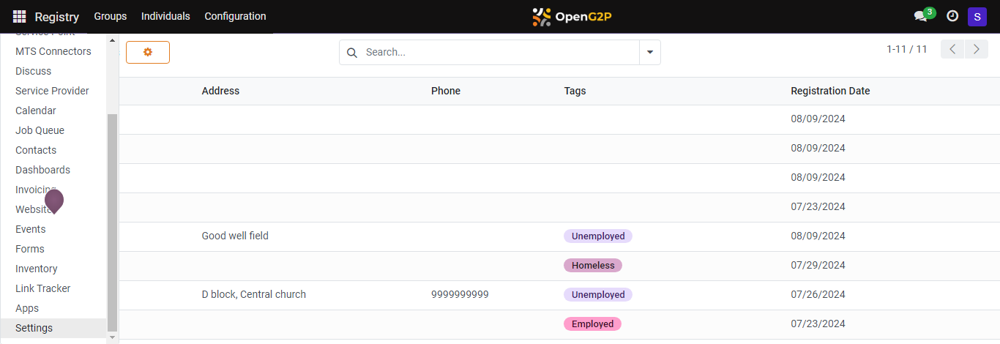
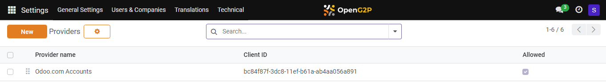
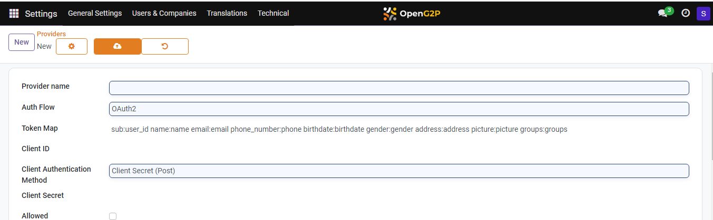

---
layout:
  title:
    visible: true
  description:
    visible: false
  tableOfContents:
    visible: true
  outline:
    visible: true
  pagination:
    visible: true
---

# 📔 Configure eSignet Auth Provider for ID Authentication

This document provides instructions on how to configure eSignet Authentication Provider in PBMS to help the end-users to utilise the eSignet option to log into PBMS.

## Prerequisites

* Create an eSignet client for PBMS/Social Registry as given in eSignet Client Creation guide.
  * Create a public key and a private key JWKS pair. Use the public key JWK during eSignet creation and keep the private key JWK.
  *   Allowed redirect URIs of the client must contain

      `https://socialregistry.your.org/auth_oauth/g2p_registry_id/authenticate`
* Create two ID types on the Registry such as `NATIONAL ID` and `NATIONAL ID TOKEN`. To configure ID types refer the [Configure ID Types](../../beneficiary-management/beneficiary-registry-configurations/user-guides/configure-id-types.md) documentation.
* Install the [OpenID Connect Authentication](../../../development/odoo-modules/openid-connect-authentication.md) and [G2P Auth: OIDC - Reg ID](../../../development/odoo-modules/authentication-oidc-reg-id.md) module.

Note:

* OAuth providers can be created from Odoo Settings (debug mode).

## Procedure

1. Click the main menu icon  and select _**Settings**_.

<figure><figcaption></figcaption></figure>

The _**Settings**_ screen is displayed.

2. Select the tab _**Users & Companies**_, and click the option _**OAUTH Providers**_.

<figure><figcaption></figcaption></figure>

_**Providers**_ screen is displayed.

<figure><figcaption></figcaption></figure>

3. Click the _**New**_ button.

_**Providers New**_ screen is displayed.

<figure><figcaption></figcaption></figure>

4. Enter the values in the respective fields.

For example, the fields, their descriptions, and sample values are given below.

<table><thead><tr><th width="230">Feature</th><th width="281">Description</th><th>Value</th></tr></thead><tbody><tr><td>Provider name</td><td>Enter the provider name.</td><td>For example: eSignet for beneficiary portal</td></tr><tr><td>Auth Flow</td><td>Select the option <em><strong>OpenID Connect Authorization Code Flow</strong></em> from the drop-down.</td><td></td></tr><tr><td>Token Map</td><td>You can find a default value. In the default value change <code>groups:groups</code> to <code>client_roles:groups</code> .</td><td></td></tr><tr><td>Client ID</td><td>
The ID of the eSignet client.

To learn more refer to eSignet Client Creation.
</td><td></td></tr><tr><td>Client Authentication Method</td><td>Select the option <em><strong>Private Key JWT</strong></em> from the drop-down.</td><td></td></tr><tr><td>Client Private Key</td><td>The <em><strong>Client Private Key</strong></em> of the eSignet client. To learn more, refer to eSignet Client Creation.</td><td></td></tr><tr><td>Allowed</td><td>Uncheck the box.  </td><td></td></tr><tr><td>Allowed in Self Service Portal</td><td>Check the box to enable Self Service Portal</td><td></td></tr><tr><td>Allowed in Service Provider Portal</td><td>Uncheck the box.</td><td></td></tr><tr><td>G2P Portal OAuth Callback Url</td><td>Enter the oauth callback url</td><td></td></tr><tr><td>Login button label</td><td>Enter the label name for the eSignet Login button.</td><td>
For example:  <code>Login with eSignet.</code>

Note: This text with the button name will appear on login page. 
</td></tr><tr><td>Image Icon URL</td><td>Enter the URL of an image for the eSignet Login button.</td><td></td></tr><tr><td>Authorization URL, Userinfo URL, Token Endpoint, JWKS URL</td><td>These are to be configured as available in the well-known config of eSignet. </td><td></td></tr><tr><td>Verify Access Token Hash</td><td>Check the box to enable the option <em><strong>Verify Access Token</strong></em>.</td><td></td></tr><tr><td>Allow Signup</td><td>Select the option <em><strong>Allows user signup</strong></em> from the drop-down. </td><td></td></tr><tr><td>Signup Default Groups</td><td>Select the option <em><strong>User types/Portal</strong></em> from the drop-down. </td><td></td></tr><tr><td>Sync User Groups</td><td>Select the option <em><strong>Never</strong></em> from the drop-down. </td><td></td></tr><tr><td>G2P REG ID SETTINGS</td><td></td><td></td></tr><tr><td>G2P Registrant ID Type </td><td>Enter the configured ID type</td><td>For example: <code>NATIONAL ID</code> and <code>NATIONAL ID TOKEN.</code></td></tr></tbody></table>

Note:

The rest of the fields have the default values.

5. Click the icon  to save the changes.

If you have configured the _**eSignet Authentication Provider**_ successfully, you can find the _**Log in eSignet**_ button in the PBMS log in page.&#x20;

Before log in using the option eSignet in PBMS, ensure the following:

* Create client roles on eSignet application for the client. The client roles can be
  * Administrator/Settings.
  * OpenG2P Module Access/Administrator.
  * OpenG2P Module Access/Registrar.

This completes the configuration of _**eSignet Authentication Provider**_ in PBMS for user log in.

6. Navigate to the Registry feature.
7. Click the Individual in the menu bar.
8. Select the Individual in the name column who has National ID configured in ID types.

You can find the authentication status is _**Not authenticated.**_

9. Click the _**Authenticate**_ button.

A popup gets displayed.

10. Proceed to sign in with eSignet authentication.
