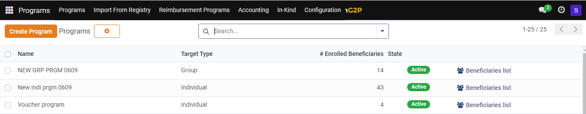

---
layout:
  title:
    visible: true
  description:
    visible: false
  tableOfContents:
    visible: true
  outline:
    visible: true
  pagination:
    visible: true
---

# 📔 Import Social Registry Data into PBMS

This document provides instructions to import data from the Social Registry (SR) into Program Beneficiary Management Systems' (PBMS) individual/group registries.

## Prerequisites

* A user must have an Administrator role to access the OpenG2P systems.

## Procedure

You must follow the procedures listed below to import data from the SR into the PBMS.&#x20;

* [Configure SR into PBMS](import-social-registry-data-into-pbms.md#configure-sr-into-pbms)
* [Import data from the SR into PBMS](import-social-registry-data-into-pbms.md#import-data-from-sr-into-pbms)

### Configure SR into PBMS

1. Click the main icon  and select _**Settings**_.

<figure><figcaption></figcaption></figure>

_**Settings**_ screen is displayed.

<figure><figcaption></figcaption></figure>

2. Click the _**Data Source**_ tab.

_**Data Source**_ screen is displayed.

3. Click the _**New**_ button.

_**Data Source New**_ screen is displayed.

<figure><figcaption></figcaption></figure>

The fields and their descriptions are given below.

**Table 1: New data source**

<table><thead><tr><th width="189">Field</th><th>Description</th></tr></thead><tbody><tr><td>Data Source Name</td><td>Enter the source name from where the data is imported.</td></tr><tr><td>Target URL</td><td>Enter the URL for the API request from where the data is retrieved.</td></tr><tr><td>Auth Type</td><td>
Select the type of authentication from the drop-down. It is used to verify the legitimacy of the user. The valid values are:
<ul><li>Basic Authentication</li><li>Bearer Authentication</li><li>API Key</li></ul></td></tr></tbody></table>

4. Click the _**URL Paths**_ tab.
5. Click the _**Add a line**_ link.
6. Enter the _**Data Source Path Name**_ and the associated _**URL Path**_.

**Table 2: Icons and their functions**

| Icon                                                                                         | Click to                                                                                                                                                                                                                                     |
| -------------------------------------------------------------------------------------------- | -------------------------------------------------------------------------------------------------------------------------------------------------------------------------------------------------------------------------------------------- |
|               | 
Select the appropriate value. The available values are: 
<ul><li>Archive</li><li>Duplicate</li><li>Change Password</li><li>Disable two-factor authentication</li><li>Send Password Reset Instructions</li><li>Privacy Lookup</li></ul> |
|    | Save manually the individual data and exit from the screen.                                                                                                                                                                                  |
|  | Discard changes and exit from the screen.                                                                                                                                                                                                    |

**Sample data source screen**

<figure><figcaption></figcaption></figure>

You can find the newly created data source listed in the _**Data Source**_ screen.

<figure><figcaption></figcaption></figure>

### Import data from SR into PBMS

After configuring SR into PBMS, follow the below procedure.

7. Click the main icon  and select _**Programs**_.

_**Programs**_ screen is displayed.

8. Click the _**Import From Registry**_ from the menu bar.

<figure><figcaption></figcaption></figure>

_**Previous Search Criterias**_ screen is displayed.

9. Click the _**New**_ button.

_**Previous Search Criterias New**_ screen is displayed.

<figure><figcaption></figcaption></figure>

The fields and their description are given below.

<table><thead><tr><th width="275">Field</th><th>Description</th></tr></thead><tbody><tr><td>Name</td><td>Enter the name of the new search criterias.</td></tr><tr><td>Data Source</td><td>Enter the name of the data source name as mentioned in Table 1 in the preceding section.</td></tr><tr><td>Import Registrant without ID</td><td>Check the box to import registrant without ID, if required.</td></tr><tr><td>Target Registry</td><td>
Select the target registry from the drop-down. The valid values are:
<ul><li>Group</li><li>Individual</li></ul></td></tr><tr><td>Target Program</td><td>
Select the target program from the drop-down. 

Note:

You can also use the <em><strong>Search More</strong></em> or <em><strong>Start typing</strong></em> options from the drop-down, to select the desired program.
</td></tr><tr><td>Query</td><td>Enter the GraphQL query to import only the required data from the SR.</td></tr><tr><td>Last synced on</td><td>
Enter the previous date of SR's PBMS synchronization to import data. 

Note:

You can also use the calendar widget feature to select the date.
</td></tr><tr><td>Imported Registrants</td><td>
Shows the imported registrants' information.

Registrant - Displays the name of the group/individual

Is Group - Shows if the registrant belongs to a group

Created - Shows 

Updated - Shows if the registrant is updated.
</td></tr></tbody></table>

10. Click the _**Fetch**_ button to import the data from SR into relevant individual/group registries of PBMS based on the GraphQL.

| Icon                                                                                         | Click to                                                                                                                                                                                                                                     |
| -------------------------------------------------------------------------------------------- | -------------------------------------------------------------------------------------------------------------------------------------------------------------------------------------------------------------------------------------------- |
|               | 
Select the appropriate value. The available values are: 
<ul><li>Archive</li><li>Duplicate</li><li>Change Password</li><li>Disable two-factor authentication</li><li>Send Password Reset Instructions</li><li>Privacy Lookup</li></ul> |
|    | Save manually the entered data and exit from the screen.                                                                                                                                                                                     |
|  | Discard changes and exit from the screen.                                                                                                                                                                                                    |

**Sample previous search criterias screen**

<figure><figcaption></figcaption></figure>

You can find the newly created one listed in the previous search criterias screen.

<figure><figcaption></figcaption></figure>
