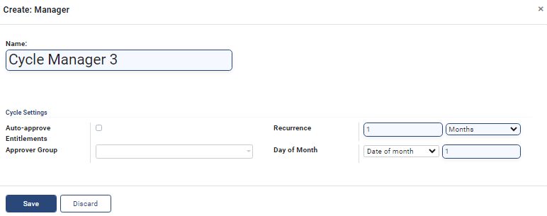

---
layout:
  title:
    visible: true
  description:
    visible: false
  tableOfContents:
    visible: true
  outline:
    visible: true
  pagination:
    visible: true
---

# 📔 Create Cycle Manager for a Program

This document provides instructions to configure Cycle Manager in a Program.

## Prerequisites

* The user must have access to OpenG2P systems.
* The user must have a Program Manager role.

## Procedure

1. Click the main menu icon  and select _**Programs**_.

<figure><figcaption></figcaption></figure>

_**Programs**_ screen is displayed.

<figure><figcaption></figcaption></figure>

2. Select a program from the list of program name.

For example, here the _**Benefit Program**_ is selected.

_**Programs/Benefit Program**_ screen is displayed.

<figure><figcaption></figcaption></figure>

3. Click the _**Configuration**_ tab in the Benefit Program.

The list of various managers are displayed.

<figure><figcaption></figcaption></figure>

4. In the Cycle Manager, click the _**Add a line**_.

_**Add: Cycle Managers**_ screen is displayed.

<figure><figcaption></figcaption></figure>

5. Click the _**Create**_ button to add a new cycle manager.

<figure><figcaption></figcaption></figure>

6. In the _**Manager**_ drop-down field, select the _**default**_ option.

A drop-down field appears.

<figure><figcaption></figcaption></figure>

7. Select the option _**Start typing**_.

It enables the field to add a new cycle manager.

<figure><figcaption></figcaption></figure>

8. Enter the name of the cycle manager and then click the option _**Create and Edit.**_

_**Create: Manager**_ screen is displayed.

<figure><figcaption></figcaption></figure>

The fields and their descriptions are given below.

| Field                     | Description                                                                                                                                                                                                                                                                                                                                                                                                                                                                                                                                                                |
| ------------------------- | -------------------------------------------------------------------------------------------------------------------------------------------------------------------------------------------------------------------------------------------------------------------------------------------------------------------------------------------------------------------------------------------------------------------------------------------------------------------------------------------------------------------------------------------------------------------------- |
| Name                      |  Displays the manager name. It is a mandatory field.                                                                                                                                                                                                                                                                                                                                                                                                                                                                                                                       |
| Cycle Settings            |                                                                                                                                                                                                                                                                                                                                                                                                                                                                                                                                                                            |
| Auto-approve Entitlements | Check the option, if required. It is an optional field.                                                                                                                                                                                                                                                                                                                                                                                                                                                                                                                    |
| Approver Group            | Select the appropriate option from the drop-down. It is a mandatory field.                                                                                                                                                                                                                                                                                                                                                                                                                                                                                                 |
| Recurrence                | 
Select the appropriate option from the drop-down. The valid values are 
<ul><li>Days - Enter the number of days to repeat the cycle of the entitlement.</li><li><a href="create-cycle-manager-for-a-program.md#recurrence-weeks">Weeks</a> - Enter the number of weeks to repeat the cycle of the entitlement.</li><li><a href="create-cycle-manager-for-a-program.md#recurrence-months">Months</a> - Enter the number of months to repeat the cycle of the entitlement.</li><li>Years - Enter the number of years to repeat the cycle of the entitlement.</li></ul> |

4. Click the _**Save**_ button to save the data and exit from the screen.
5. Click the _**Discard**_ button to exit from the screen without saving the data .

<figure><figcaption></figcaption></figure>

6. Click the _**Save & Close**_ button to save and exit from the screen.
7. Click the _**Save & New**_ button to save and create new cycle manager.

The newly created cycle manger is added below the cycle manager.

<figure><figcaption></figcaption></figure>

This completes the process of configuration of Cycle Managers in a specific program.

### Recurrence - Weeks

4. Select the option _**Weeks**_ in the drop-down.

Name of the weeks with check boxes are displayed.

5. Check the appropriate week to repeat the cycle of the entitlement.

### Recurrence - Months

6. Select the option _**Months**_ in the drop-down.

_**Day of Month**_ field is displayed.

7. Select the appropriate option from the drop-down. The valid values are:

* Date of month
* Day of month
