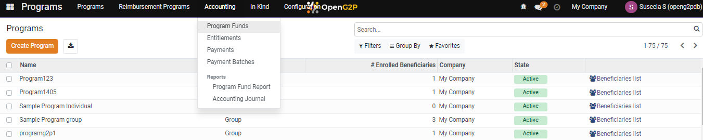
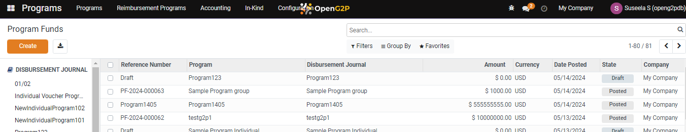
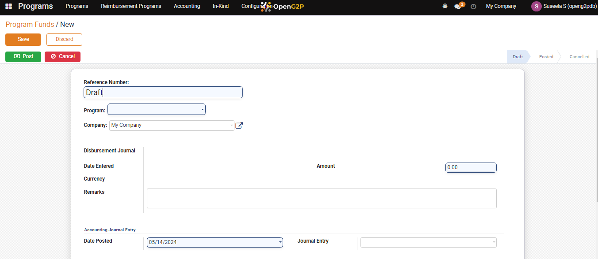
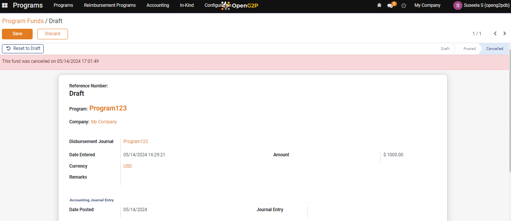
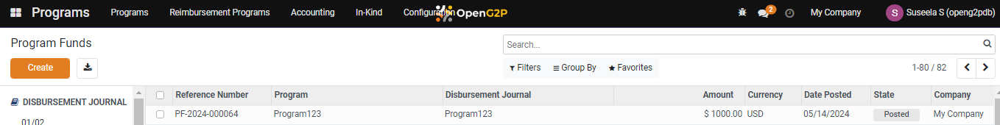

---
layout:
  title:
    visible: true
  description:
    visible: false
  tableOfContents:
    visible: true
  outline:
    visible: true
  pagination:
    visible: true
---

# 📔 Create Program Fund

This document provides instructions to allocate fund for a program.

## Prerequisites

* A user must have the administrator role.
* A user must have access to the program module.

## Procedure

1. Click the main menu icon  and select _**Programs**_.

_**Programs**_ screen is displayed.

<figure><figcaption></figcaption></figure>

2. Click the _**Accounting**_ in the menu bar and then click _**Program Funds**_.

<figure><figcaption></figcaption></figure>

_**Program Funds**_ screen is displayed.

<figure><figcaption></figcaption></figure>

3. Click the _**Create**_ button.

_**Program Funds / New**_ screen is displayed.

<figure><figcaption></figcaption></figure>

The fields and their descriptions are given below.

|                          |                                                                                                                                                     |
| ------------------------ | --------------------------------------------------------------------------------------------------------------------------------------------------- |
| Reference Number         | Displays reference number as Draft by default                                                                                                       |
| Program                  | Select the appropriate program from the drop-down                                                                                                   |
| Company                  | Select the appropriate company from the drop-down                                                                                                   |
| Disbursement Journal     | Displays the program name                                                                                                                           |
| Date Entered             | Displays the date on which fund is allocated                                                                                                        |
| Amount                   | Enter the amount to be allocated to the selected program                                                                                            |
| Currency                 | Displays the currency type                                                                                                                          |
| Remarks                  | Enter additional information, if any                                                                                                                |
| Accounting Journal Entry |                                                                                                                                                     |
| Date Posted              | Click the drop-down arrow and select the date on which the fund is allocated for the program                                                        |
| Journal Entry            | 
Select the appropriate entry from the drop-down.

Note:

You can also click the Search More ... options to find the journal entry.
 |

4. Click the _**Save**_ button to save the data and exit from the screen.
5. Click the _**Discard**_ button to exit from the screen without saving the data.
6. Click the _**Post**_ button to post the allocated fund to a program.
7. Click the _**Cancel**_ button. A message pops up that indicates the allocated fund's cancellation with the time details.

<figure><figcaption></figcaption></figure>

8. Click the _**Reset to Draft**_ button to reset the allocated fund to a program.

The newly added program fund with the reference number is listed in the program fund screen.

<figure><figcaption></figcaption></figure>
