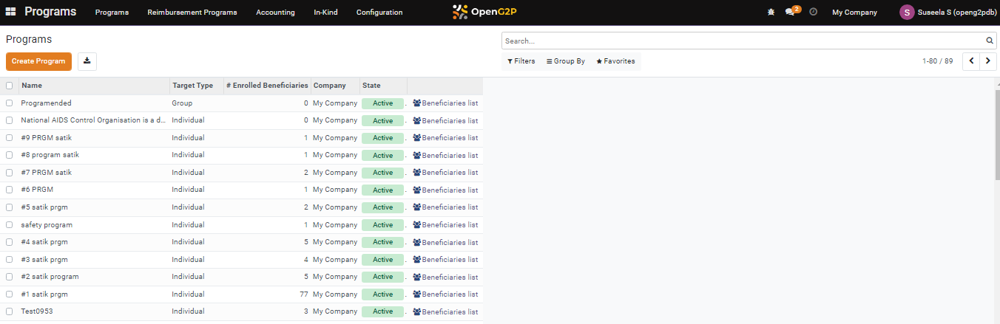

---
layout:
  title:
    visible: true
  description:
    visible: false
  tableOfContents:
    visible: true
  outline:
    visible: true
  pagination:
    visible: true
---

# 📔 Archive, Delete, End, and Re-activate a Program

This document provides instructions to archive, delete, end, and re-activate a program in the Program module.

## Prerequisites

The user must have the Program Administrator role.

## Table of contents

[Archive a program](archive-delete-end-and-re-activate-a-program.md#archive-a-program)

[Delete a program](archive-delete-end-and-re-activate-a-program.md#delete-a-program)

[End a Program](archive-delete-end-and-re-activate-a-program.md#end-a-program)

[Re-activate a Program](archive-delete-end-and-re-activate-a-program.md#re-activate-a-program)

## Procedure

### Archive a program

1. Click the main menu icon  and select _**Programs**_.

<figure><figcaption></figcaption></figure>

_**Programs**_ screen is displayed.

<figure><figcaption></figcaption></figure>

2. Click a program that has to be archived.&#x20;

For example, here the program "Program1" selected.

<figure><figcaption></figcaption></figure>

3. Click the Program1.

_**Programs/Program1**_ screen is displayed.

<figure><figcaption></figcaption></figure>

4. Click the _**Action**_ button and select the option _**Archive**_.

<figure><figcaption></figcaption></figure>

A _**Confirmation**_ dialog box is displayed.

<figure><figcaption></figcaption></figure>

5. Click the _**Ok**_ button to archive the program.
6. Click the _**Cancel**_ button to exit from the screen.

#### Archived program

The steps to find the archived program are:

7. In the _**Programs**_ screen, click the _**Filters**_ button and select the option _**Archived**_.&#x20;

<figure><figcaption></figcaption></figure>

You can find the list of archived program.

<figure><figcaption></figcaption></figure>

### Delete a program

1. Click the main menu icon  and select _**Programs**_.

<figure><figcaption></figcaption></figure>

_**Programs**_ screen is displayed.

<figure><figcaption></figcaption></figure>

2. Click a program that has to be deleted.&#x20;

For example, here the program "Program1" selected.

3. Click the Program1.

_**Programs/Program1**_ screen is displayed.

4. Click the _**Action**_ button and select the option _**Delete**_.

<figure><figcaption></figcaption></figure>

A _**Confirmation**_ dialog box is displayed.

<figure><figcaption></figcaption></figure>

5. Click the _**Ok**_ button to delete the program.
6. Click the _**Cancel**_ button to exit from the screen.

The program is deleted from the _**Programs**_ screen.

### End a program

1. Click the main menu icon  and select _**Programs**_.

<figure><figcaption></figcaption></figure>

_**Programs**_ screen is displayed.

<figure><figcaption></figcaption></figure>

2. Click a program to end the program.

For example, here the program "Program2" selected.

3. Click the Program2.

_**Programs/Program2**_ screen is displayed.

<figure><figcaption></figcaption></figure>

4. Click the _**Action**_ button and select the option _**End Program.**_

The program is ended and you can find the program status is changed from active to ended in the Program list.

<figure><figcaption></figcaption></figure>

### Re-activate a program

1. Click the main menu icon  and select _**Programs**_.

<figure><figcaption></figcaption></figure>

_**Programs**_ screen is displayed.

<figure><figcaption></figcaption></figure>

2. Click a program to end the program.

For example, here the program "Program2" selected.

Note:

Only the program with the status ended can be re-activated.

3. Click the Program2.

_**Programs/Program2**_ screen is displayed.

<figure><figcaption></figcaption></figure>

4. Click the _**Action**_ button and select the option Re-activate Program.

Now you can find the program's (for example: Program2) status has changed from ended to active.

<figure><figcaption></figcaption></figure>
