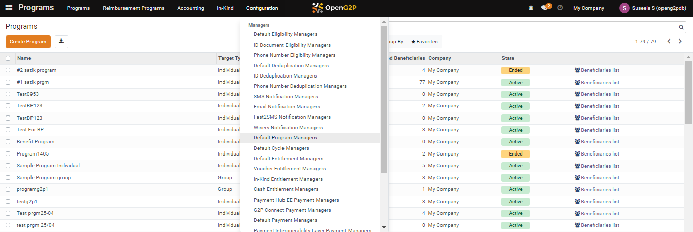

---
layout:
  title:
    visible: true
  description:
    visible: false
  tableOfContents:
    visible: true
  outline:
    visible: true
  pagination:
    visible: true
---

# 📔 Configure Default Program Manager

This document provides instructions to configure default program manager in the program module.&#x20;

## Prerequisites

The user must have the Program Administrator role.

## Procedure

1. Click the main menu icon  and select _**Programs**_.

<figure><figcaption></figcaption></figure>

_**Programs**_ screen is displayed.

2. Click the _**Configuration**_ in the menu bar and then select _**Default Program Managers**_.

<figure><figcaption></figcaption></figure>

_**Program Managers**_ screen is displayed.

<figure><figcaption></figcaption></figure>

3. Click the _**Create Program**_ button.

_**Program Managers/New**_ screen is displayed.

<figure><figcaption></figcaption></figure>

The fields and their descriptions are given below.

| Field               | Description                                                                            |
| ------------------- | -------------------------------------------------------------------------------------- |
| Name                | Enter the program manager name. It is a mandatory field.                               |
| Program             | Select the appropriate program from the drop-down. It is a mandatory field.            |
| Number of cycles    | Enter the number of cycles on which the entitlements are allocated to the beneficiary. |
| Is Cycleless        | Check the option, if required.                                                         |
| Copy pervious cycle | Check the option to repeat the pervious cycle configuration.                           |

3. Click the _**Save**_ button to save the data and exit from the screen
4. Click the _**Discard**_ button to exit from the screen without saving the data.

<figure><figcaption></figcaption></figure>

The newly configured program manager is listed in the program managers list.

<figure><figcaption></figcaption></figure>
