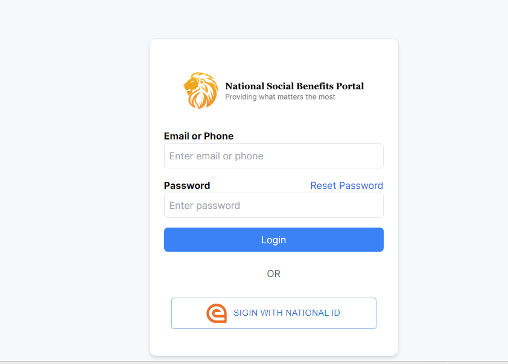
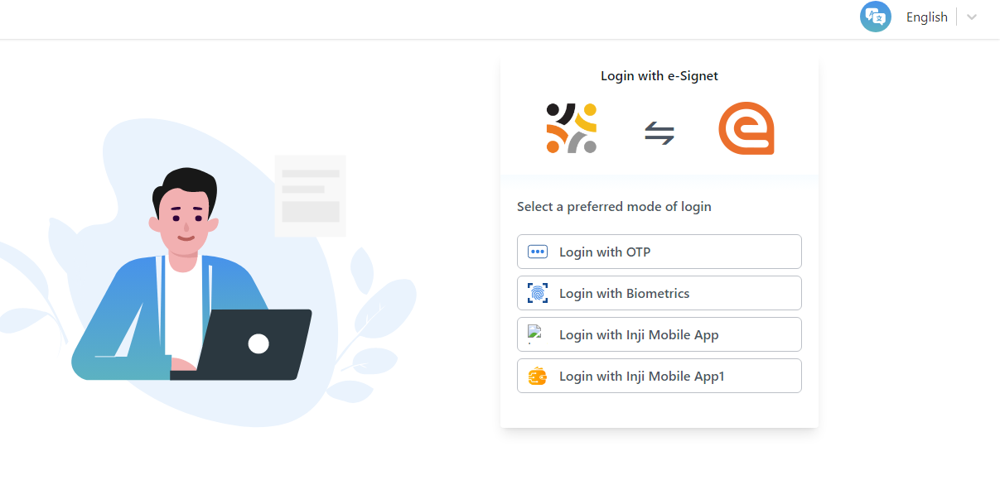

---
layout:
  title:
    visible: true
  description:
    visible: false
  tableOfContents:
    visible: true
  outline:
    visible: true
  pagination:
    visible: true
---

# Self Service Portal

The Self Service Portal allows an individual registrant seeking assistance to register from any place and any device with internet connectivity. The individual registrant logs in using a foundational or functional ID and then applies for a program.&#x20;

<figure><figcaption></figcaption></figure>

## Login process

An OTP or QR code is typically used in addition to a unique ID number to log in for self-registration.  The assisting officer uses a biometric device connected to a machine with access to the Self Service Portal to do biometric authentication for assisted registration.

<figure><figcaption></figcaption></figure>

The Self Service Portal registration process assumes that an authentication service is available for ID verification. The portal allows an individual to perform the following functions:

### **Program management**

* View the list of available programs
* Apply for a new program
* Upload supporting documents if required for a program
* View the registrant's enrolled programs
* Track the status of the application
* Track the entitlement status of the program

### **Profile management**

* Update personal information and demographic details
* View all the demographic information submitted across programs

Depending on the program implementation, the registrant can seek assistance to apply for the same program multiple times. For example, a registrant seeks medical assistance for different treatments. It is assumed that Program administrators applies mechanisms to prevent cases of double-dipping.

## Registration process

A program administrator must do these steps to allow registrants to apply for a program:

* Create a program.
* Create a Self Service Portal form.
* Map Self Service Portal form.

Registrant's ID is verified during login. The Self Service Portal seeks consent to share demographic details from the registrant. Upon successful ID verification, the Self Service Portal automatically populates the registrant's demographic details based on the consent provided during login. The registrant fills in the rest of the details and applies for a program.

## **Features and functionality**

<table><thead><tr><th width="145">Feature</th><th>Functionality</th><th data-hidden></th></tr></thead><tbody><tr><td>My Programs</td><td><ul><li>The list shows only the programs which contain the registered and enrolled registrants.</li><li>It also shows the enrolled status of the registrants with the program.</li><li>Total funds awaited indicate the amount the user is eligible to receive for the programs when entitlements are approved for the program cycle. </li><li>Total funds received indicate the payment made and the amount received by the beneficiary/registrant.</li></ul></td><td></td></tr><tr><td>All Programs</td><td><ul><li>It shows the active and available programs, where the registrant can apply/reapply for the relevant program. </li></ul></td><td></td></tr><tr><td>My Application</td><td><ul><li>It shows the list of programs that the user has applied for. </li><li>The generated application ID is shown against each application with the applied date. </li></ul></td><td></td></tr><tr><td>My Benefits</td><td><ul><li>The list shows only the programs that contain the applied and enrolled user. </li><li>It will show the entitlement reference number with the approved entitlement date</li><li>It also shows the approved entitlement and funds received on each approved entitlement.</li></ul></td><td></td></tr></tbody></table>

## OpenID Connect integration

The Self Service Portal allows integration with any OpenID Connect (OIDC) client. The portal has an existing integration with [eSignet](https://docs.esignet.io/).&#x20;

To learn more about OpenID Connect integration, click [here](https://openid.net/developers/how-connect-works/).

### OIDC integration

The Self Service Portal can integrate with any OIDC server to provide user login.

## Related user guides

:notebook\_with\_decorative\_cover:[Create Program](../../features/program-management/user-guides/create-a-program.md)

:notebook\_with\_decorative\_cover:[Create a Self Service Portal form](../../user-guides/eligibility-and-program-enrollment/website/create-portal-form.md)

:notebook\_with\_decorative\_cover:[Map Self Service Portal form](user-guides/map-self-service-portal-form.md)

:notebook\_with\_decorative\_cover:[Self Register Online](user-guides/self-register-online.md)

**Jira Board**\
Link the US on the SSP\

{% embed url="https://openg2p.atlassian.net/jira/software/c/projects/G2P/issues/?filter=allissues&jql=project+=+%22G2P%22+and+type+=+Story+and+parent+=+G2P-1156+ORDER+BY+created+DESC" %}

\<image and demo video to be integrated>
