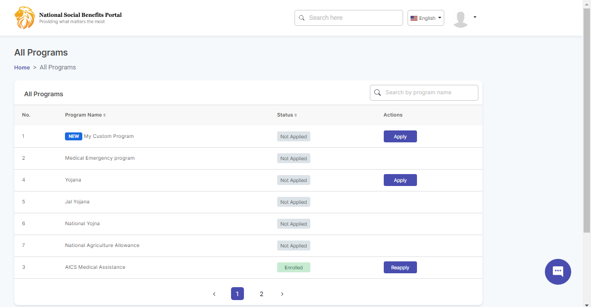
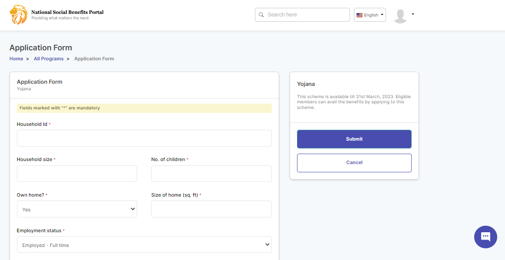
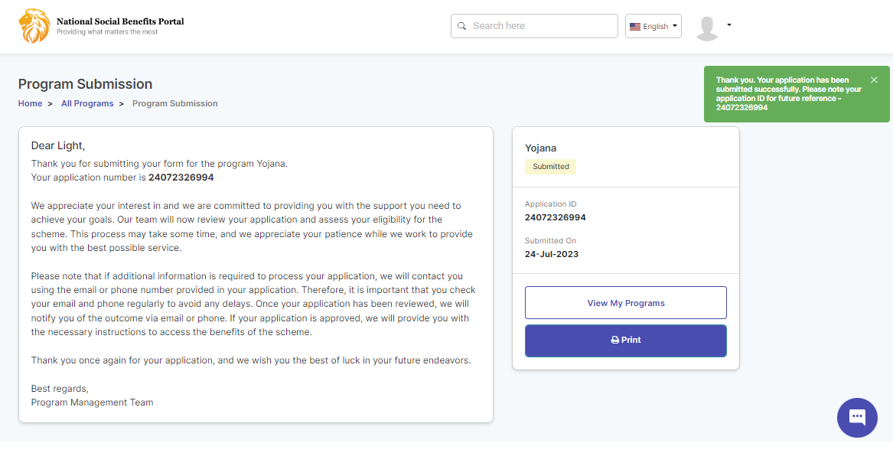
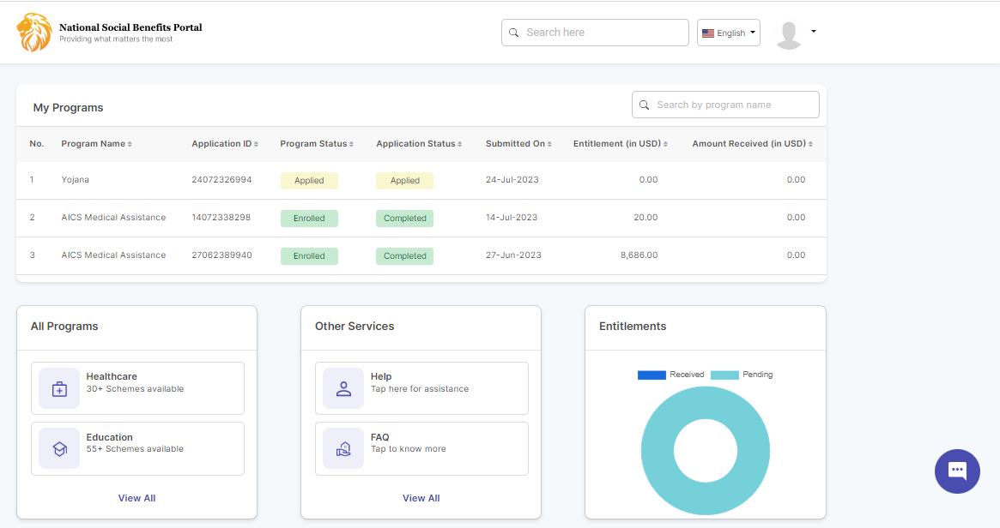
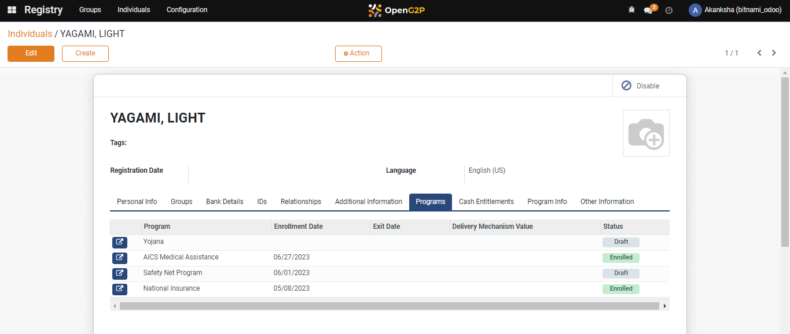

# 📔 Self Register Online

## Description

This document provides step-by-step instructions for beneficiaries to self-register via beneficiary portal.

## Prerequisites

* The user must have valid credentials (Email ID and password).
* The user must have must have the MOSIP-issued national ID.

## Procedure

1. Open the beneficiary URL on your browser, for example, https://selfservice.sandbox.your.org

Note:

You must modify the URL  https://selfservice.sandbox.your.org based on your installation hostname. The beneficiary must _**Sign Up**_ to register his/her details. After registration, the beneficiary can login using the login credentials.

2. _**Beneficiary portal**_ page is displayed.

<figure><figcaption>
Beneficiary portal page
</figcaption></figure>

### Sign Up

3. Click the _**Sign Up**_ button.
4. _**Sign Up**_ page is displayed.

<figure><figcaption>
Sign Up page
</figcaption></figure>

In Sign Up page, the fields and descriptions are:

| Field            | Description                                       |
| ---------------- | ------------------------------------------------- |
| Email            | Enter the email address. It is a mandatory field. |
| Mobile No.       | Enter the mobile no. It is a mandatory field.     |
| Ext.             | Enter the ext.                                    |
| First Name       | Enter the first name. It is a mandatory field.    |
| Middle Name      | Enter the middle name.                            |
| Last Name        | Enter the last name. It is a mandatory field.     |
| Sex              | Select the appropriate option from the drop-down  |
| Birthdate        | Choose the birthdate from the calendar widget.    |
| Password         | Enter the password. It is a mandatory field.      |
| Confirm Password | Re-enter the password. It is a mandatory field.   |

5. Click the _**Sign Up**_ button.

You will receive a verification mail in your email id which is used for Sign Up.

6. Click the _**Verify**_ link in you verification mail.

You will receive a message, Your email id is successfully verified. This completed the sign up process.

### Login

7. _**Login**_ page of self-service portal for beneficiaries is displayed.

<figure><figcaption>
Beneficiary portal page
</figcaption></figure>

There are two options available to login self-service portal.

* Login with your credentials (email id, password)
* Sign In with MOSIP

### Login with credentials

8. Enter the _**Email**_ ID.
9. Enter the _**Password**_.
10. Click the _**Login**_ button.

(OR)

### Sign In with MOSIP

11. Click the _**Sign IN with MOSIP** button_.
12. _**Login with eSignet**_ page is displayed.

<figure><figcaption>
eSignet login page.
</figcaption></figure>

You can select your preferred mode of login.

* [Login with OTP](self-register-online.md#login-with-otp)
* Login with Biometrics
* Login with Inji Mobile App
* Login with Inji Mobile App1

#### Login with OTP

13. Click the _**Login with OTP**_ button.
14. _**Login with OTP**_ page pops up.

<figure><figcaption>
Login with OTP.
</figcaption></figure>

15. Enter the _**VID**_ number and click the _**Get OTP**_ button.

You receive the OTP number in your registered phone number.

16. Enter the OTP number and click the _**Verify**_ button.

<figure><figcaption>
OTP verification.
</figcaption></figure>

17. _**My application**_ page is displayed.

<figure><figcaption>
My application
</figcaption></figure>

My application displays the program details of the beneficiary.

| Field                    | Description                                     |
| ------------------------ | ----------------------------------------------- |
| Program Name             | Displays the program name                       |
| Application ID           | Displays the application ID                     |
| Program Status           | Displays the program status                     |
| Application Status       | Displays the application status                 |
| Submitted on             | Displays the application submitted on date      |
| Entitlement (in USD)     | Displays the entitlement details                |
| Amount Received (in USD) | Displays the amount received by the beneficiary |

### All Programs

18. Click the _**View All**_ button in the _**All Programs**_ tab.
19. _**All Programs**_ page is displayed.

<figure><figcaption>
All Programs
</figcaption></figure>

In _**All Programs**_, the available fields and descriptions are:

20. Click the _**Apply**_ button.
21. _**Application Form**_ page is displayed.

<figure><figcaption>
Application Form
</figcaption></figure>

In Application Form, the available field and description are:

| Field                 | Description                                                                                                                                   |
| --------------------- | --------------------------------------------------------------------------------------------------------------------------------------------- |
| Household Id          | 
Enter the household ID of the beneficiary.

It is a mandatory field.
                                                              |
| Household size        | 
Enter the household size of the beneficiary.

It is a mandatory field.
                                                            |
| No. of children       | Enter the number of children of the beneficiary. It is a mandatory field.                                                                     |
| Own home?             | 
Select the appropriate option from the drop-down. The valid values are:
<ul><li>Yes</li><li>No</li></ul>
It is a mandatory field.
 |
| Size of home (sq. ft) | 
Enter the size of home in square feet.

It is a mandatory field.
                                                                  |
| Employment status     | Select the appropriate option from the drop-down.                                                                                             |

You can find the program name and program expiry details in the application form.

22. Click the _**Submit**_ button to submit the application form.
23. Click the _**Cancel**_ button to cancel.

After the application is submitted successfully, you will receive a confirmation message on submitted program.

<figure><figcaption>
Confirmation message on successful submisstion
</figcaption></figure>

24. Once the program form is submitted, the program will be added to the _**My Programs**_ section with the _**Submitted**_ status and the beneficiary will be registered to the program. You can find the details in the _**OpenG2P Registry** Individual_ as well.

<figure><figcaption>
Displays the registered program of the beneficiary
</figcaption></figure>

<figure><figcaption>
OpenG2P Registry
</figcaption></figure>
