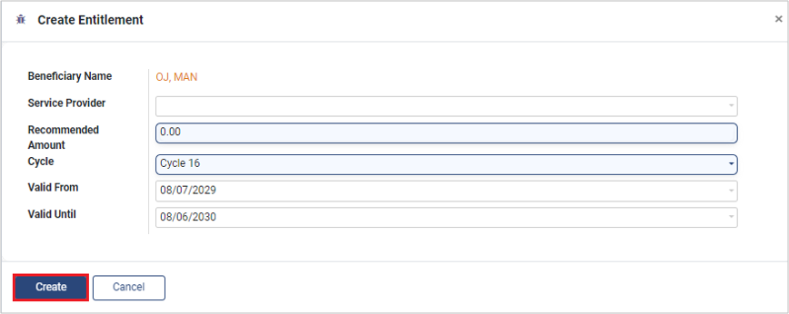

---
layout:
  title:
    visible: true
  description:
    visible: false
  tableOfContents:
    visible: true
  outline:
    visible: true
  pagination:
    visible: true
---

# 📔 Multi-Stage Approval

## Description

This guide provides steps for multiple stages of approving a beneficiary's entitlement. Each stage is assigned one entitlement manager to carry out the necessary approvals. The steps in this guide have to be carried out by each entitlement manager in the order of the stages.

## Prerequisites

The user is a Program Administrator and has configured multiple stages of entitlement and assigned an entitlement manager for each stage. Learn more about creating multiple stages of entitlement [here](https://github.com/OpenG2P/openg2p-documentation/blob/1.2.1/guides/user-guides/broken-reference/README.md).

## Steps

1. Navigate to _Programs_ using the menu bar.

<figure><figcaption></figcaption></figure>

2. Click on the desired program.

<figure><figcaption></figcaption></figure>

3. Click on the _Beneficiaries_. Clicking will show the list of applicants.

<figure><figcaption></figcaption></figure>

<figure><figcaption></figcaption></figure>

Note: Only the entitlement manager for the first stage can verify eligibility, enroll, and deduplicate the applicants. Go to the next step only if you are the entitlement manager for the first stage, or else skip the next step.

4. Click on _Verify Eligibility_, _Enroll,_ and _Deduplication_. Once the applicant is enrolled the beneficiary status changes to _Enrolled_.

<figure><figcaption></figcaption></figure>

<figure><figcaption></figcaption></figure>

5. Click on _Prepare Assessment._

<figure><figcaption></figcaption></figure>

6. A pop-up window appears. Click on _+ Add Assessment._

<figure><figcaption></figcaption></figure>

7. You can write an assessment in the new pop-up and click _Save_.

<figure><figcaption></figcaption></figure>

8. After creating an assessment, the _Create Entitlement_ and _Reject_ buttons appear. You can make a decision based on the authenticity of the application.

* Authentic Application: Create an entitlement by clicking on the _Create Entitlement_ button\_.\_
* Inauthentic Application: Reject the application by clicking on the _Reject_ button.

<figure><figcaption></figcaption></figure>

9. Click on _Create Entitlement_ to fill in the required details as described here.

* _Service Provider:_ Select the service provider from the drop-down list.
* _Recommended Amount:_ Enter the recommended amount as assessed.
* _Cycle:_ The latest cycle is selected by default. You can also select the cycle from the drop-down list.
* _Valid From:_ Select the date when you want to begin the entitlement.
* _Valid Until:_ Select the date when you want to end the entitlement.

<figure><figcaption></figcaption></figure>

10. Click on _Create_. The entitlement will be created for the beneficiary.
11. Click the _Entitlements_, and a pop-up window appears with an _Approve_ _Entitlement_ button. Click on _Approve_ _Entitlement._

<figure><figcaption></figcaption></figure>

12. All the steps above have to be repeated by each entitlement manager configured in the _Approval Settings_ in the _Entitlement Manager_. To learn more about _Approval Settings_, refer to the [Multi-Stage Configuration](https://github.com/OpenG2P/openg2p-documentation/blob/1.2.1/guides/user-guides/broken-reference/README.md) guide.

Note: The status of entitlement is set according to the approval stage.

* _Draft:_ After approval from the entitlement manager for the first stage

<figure><figcaption></figcaption></figure>

* _Pending Validation:_ After approval from the entitlement manager for any intermediate stage

<figure><figcaption></figcaption></figure>

* _Approved:_ After approval from the entitlement manager for the final stage

<figure><figcaption></figcaption></figure>

13. After the final approval, the action button _Print Voucher_ will be shown to the entitlement manager at the final stage.
