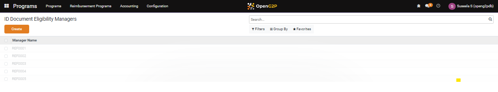
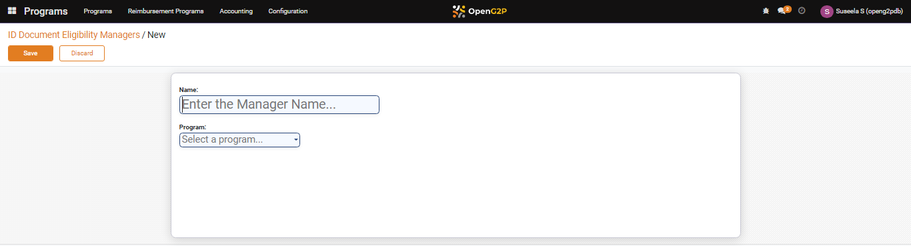
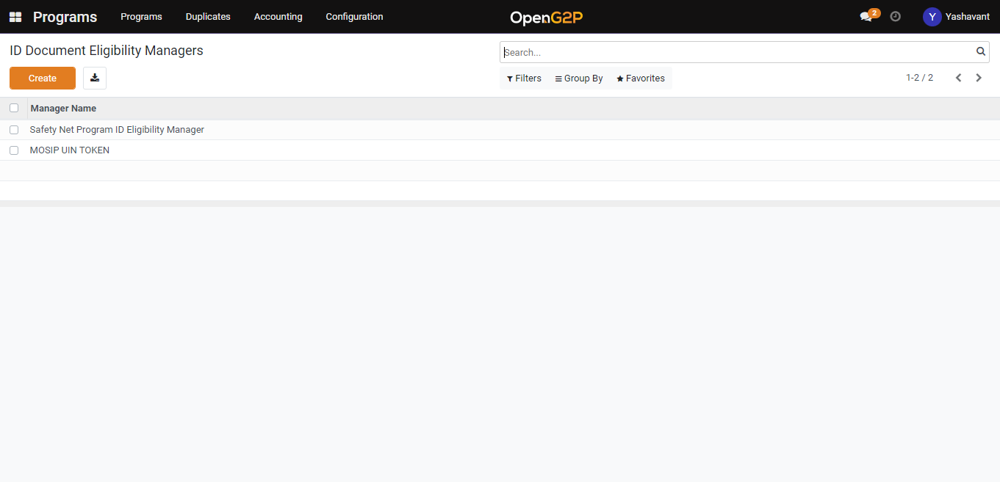

---
layout:
  title:
    visible: true
  description:
    visible: false
  tableOfContents:
    visible: true
  outline:
    visible: true
  pagination:
    visible: true
---

# Create ID Document Eligibility Manager

This guide provides the step-by-step instructions to create a ID Document  Eligibility Manager

## Pre-requisites

A user should have a Program Manager role to create a ID Document Eligibility Manager.

Note:

Refer _**Create User and Assign Role**_ user guide to know how to assign role for a User.

## Procedure

1. In the menu bar, click the icon .png>) and select _**Programs**_.
2. The _**Programs**_ screen is displayed.

<figure><figcaption>
Choose the programs module 
</figcaption></figure>

3. Click the _**Configuration**_ tab and then select the _**ID**_ _**Document Eligibility Managers**._

<figure><figcaption>
 Programs screen
</figcaption></figure>

4. _**ID Document Eligibility Managers**_ screen is displayed.

<figure><figcaption>
ID Document Eligibility Managers screen
</figcaption></figure>

_**ID Document Eligibility Managers**_ screen provides dashboard view which lists all the Manager Names and the Program list.

In  _**ID**_ _**Default Eligibility Managers**_ screen, the available features and their descriptions are:

<table><thead><tr><th width="130">Feature</th><th>Description</th></tr></thead><tbody><tr><td>Create</td><td>Click the <em><strong>Create</strong></em> button to create new ID default eligibility manager</td></tr><tr><td></td><td>Click the <em><strong>Export All</strong></em> button to download the details in excel format</td></tr><tr><td>&#x3C;</td><td>Click the <em><strong>Left</strong></em> arrow to go the previous screen</td></tr><tr><td>></td><td>Click the <em><strong>Right</strong></em> arrow to go the next screen</td></tr><tr><td>Filters</td><td>
Click the <em><strong>Filters</strong></em> link and then select Add Customer Filter.
<ul><li>Add Customer Filter</li></ul>
The advanced filter option allows you to define conditions and criteria to refine the search results.
<ul><li>Select the <em><strong>Add Customer filter</strong></em> and then select the appropriate option in the first drop-down to display the specific data based on the option selected.</li><li>Select the criteria in second and third drop-down to refine the search results. </li><li>Click the <em><strong>Apply</strong></em> button to display the data based on the search</li></ul>
<em>Note: To enhance the search, click the <strong>Add a condition</strong> button and follows the steps given in <strong>Add Customer Filter</strong> option</em>
</td></tr><tr><td>Group By</td><td><ul><li>Click the <em><strong>Group By</strong></em> link and select the option <strong>Program</strong></li><li>The Default Managers are grouped below each program</li><li>Click the <em><strong>Group By</strong></em> link, select <strong>Add Custom Group</strong> and then select the appropriate options in the drop-down to display the specific data based on the option selected.</li><li>Click the <em><strong>Apply</strong></em> button to display the data based on the search</li></ul></td></tr><tr><td>Favorites</td><td><ul><li>
Click the <em><strong>Favorites</strong></em> link, select <strong>Save current search</strong> and then check the appropriate options. The valid values are: 
<ul><li>Use by default</li><li>Share with all users</li></ul></li><li>Click the <em><strong>Save</strong></em> button to display the data based on the search</li><li>Click the <em><strong>Import records.</strong></em><strong> Import a file</strong> screen is displayed. </li><li>Click the <em><strong>Upload file</strong></em> button, navigate to the file, and import the file in excel or CSV format</li><li>Click the <em><strong>Cancel</strong></em> button to exit the screen</li></ul></td></tr><tr><td>Search</td><td>This field is filled when the available option are selected in Filers, Group By, Favorites</td></tr></tbody></table>

5. Click the _**Create**_ button. The _**ID Document Eligibility Managers/New**_ screen is displayed.

<figure><figcaption>
ID Document Eligibility Managers/New screen
</figcaption></figure>

In _**ID Document Eligibility Managers/New**_ screen, the features and their descriptions are:

<table><thead><tr><th width="185">Feature</th><th>Description</th></tr></thead><tbody><tr><td>Name</td><td>Enter the name of the eligibility manger</td></tr><tr><td>Program</td><td>Select the program name from the drop-down for which the eligibility manager is created</td></tr></tbody></table>

6. Click the **Save** button to save the eligibility manager and it will be listed under the eligibility manager list view page.
7. Click the _**Discard**_ button to discard the changes and go back to ID Document Eligibility Managers list view page.

<figure><figcaption>
New list of ID Document Eligibility Managers
</figcaption></figure>
