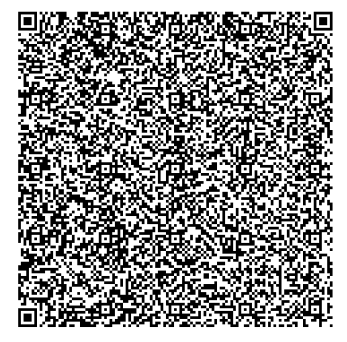
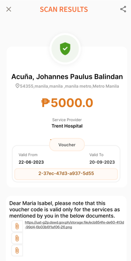

# Install SmartScanner App

## Description 

The guide here provides steps to install the SmartScanner app. This app allows users to scan the QR code in the entitlement voucher.

## Prerequisites 

The user must possess an Android Phone with [WireGuard tunnel](https://app.gitbook.com/o/bnTr6Kp4z4CXR4QVIPSa/s/yo3DQVnJdJ1Ym7dquuyV/guides/how-to-guides/install-wireguard-app-and-activate-tunnel) activated.

## Steps 

1. Download the SmartScanner APK file named _idpass-smart-scanner-untagged-\<version>.apk_ on your Android mobile from [here](https://drive.google.com/drive/folders/1FMQQtPcKeDnhM3vfR-\_EQHeEvzaPKhfq?usp=drive\_link).

<figure><figcaption></figcaption></figure>

2. Go to the Downloads folder in Android Mobile and click on the .apk file that you downloaded in the first step. A user prompt will appear with the options _CANCEL_ and _INSTALL._ Click on _INSTALL_.

<figure><figcaption></figcaption></figure>

3. For first-time installation, a user prompt may appear to allow unknown apps. Click on _Settings._ If no prompt appears and the application installs, then go to step#5.

<figure><figcaption></figcaption></figure>

4. Enable the option _Allow apps from this source,_ click on the downloaded file, and install the application as described in step#2.

<figure><figcaption></figcaption></figure>

5. If the SmartScanner app is successfully installed, then this icon will appear on the mobile screen.

<figure><figcaption></figcaption></figure>

6. Open the SmartScanner app. It should show the option _Voucher Code_.

<figure><figcaption></figcaption></figure>

7. Click on the _Voucher Code_ and scan the QR code shown here.

<figure><figcaption></figcaption></figure>

8. If the SmartScanner app is successfully installed, then the scan will show these details.

<figure><figcaption></figcaption></figure>
