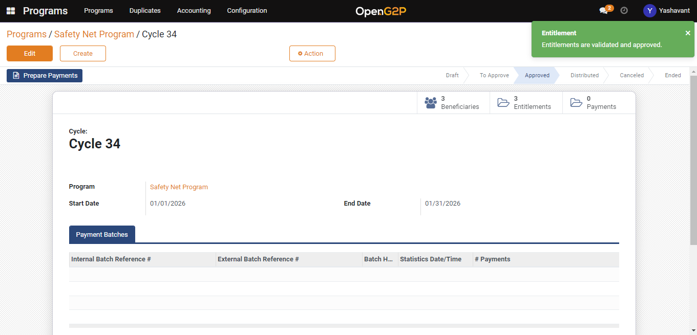
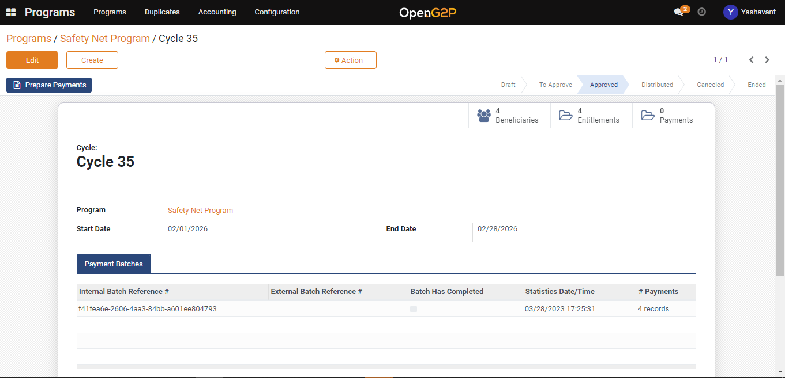
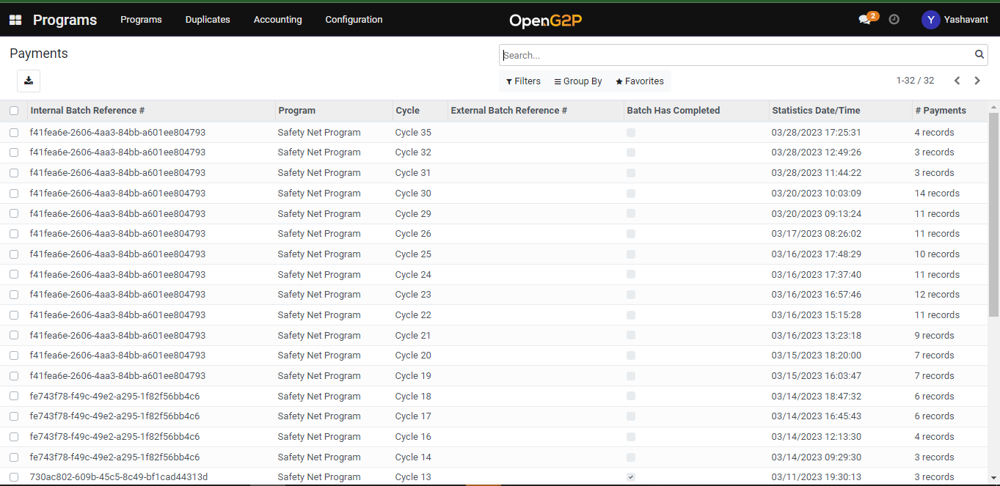
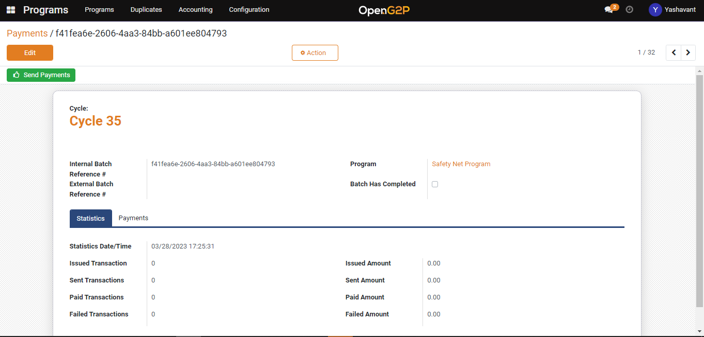
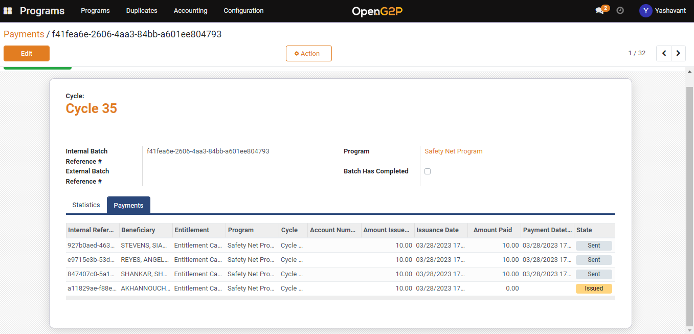

# Prepare and Send Payment

## Description

This guide provides the steps to prepare payment after approving the cycle of a program.

## Pre-requisites

The program cycle should be created for a program.

## Steps

1. Navigate to the program for which [cycle creation and approval](../../features/disbursement-cycles/user-guides/create-and-approve-disbursement-cycle.md) are done.

<figure><figcaption></figcaption></figure>

2. Click on the _Prepare Payment_ button to create a batch for the approved cycle entitlements.

<figure><figcaption></figcaption></figure>

3. Once the payment batch is created, navigate to _Accounting_.
4. Click on _Payment Batches_ to proceed further with payment.

<figure><figcaption></figcaption></figure>

5. Click on the payment batch to which payment needs to be done.

<figure><figcaption></figcaption></figure>

6. On the payment batch, detailed view page click on _Send Payment_ button to make the payment.

<figure><figcaption></figcaption></figure>

7. Check the payment status in the payments section of the payment batches detailed view page.

<figure><figcaption></figcaption></figure>
