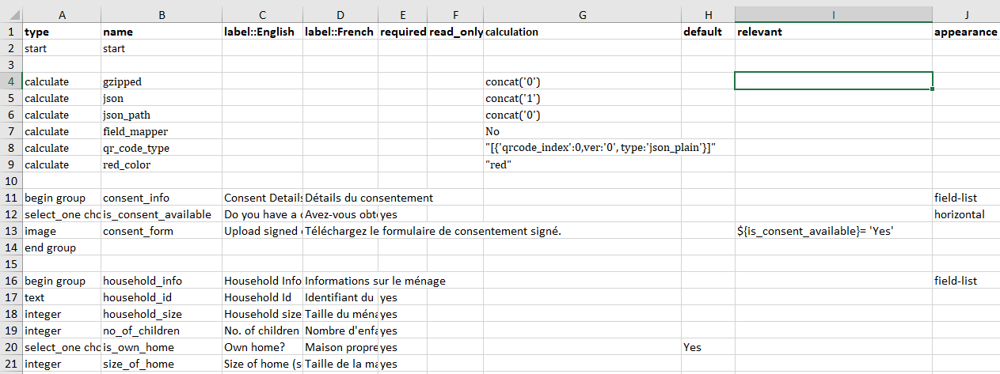
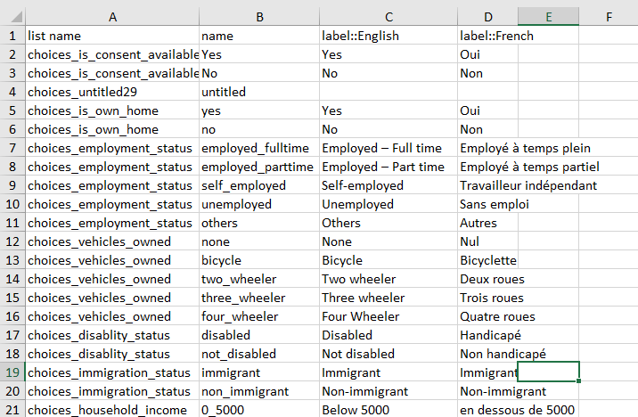
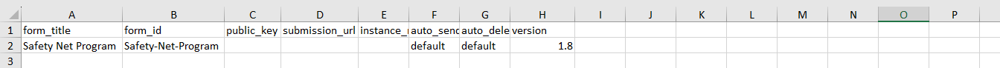

---
layout:
  title:
    visible: true
  description:
    visible: false
  tableOfContents:
    visible: true
  outline:
    visible: true
  pagination:
    visible: true
---

# Create a Form

## Description

This document provides instructions on how to create a form for a program.

## Pre-requisites

* A person must have installed any tool that has spreadsheet features in his/her machine
* A person must have basic knowledge of working with spreadsheets and Extended Mark-up Language (XML)

## Procedure

You can create a form for a program using any tool that has spreadsheet features and XML.

* Spreadsheet - for example, Microsoft Excel, Google sheet, and so on

&#x20;      Note:

&#x20;      For example, here Microsoft Excel is used to create a form for a program.

* XML

### Create a form using Microsoft Excel

You can use the existing template in XLS format to create a form for a program.

1. Open the template by using MS Excel.

The template to create a form for a program is displayed.

<figure><figcaption>
Template form
</figcaption></figure>

The columns and their descriptions are given below.

#### Survey worksheet

| Column         | Description                                                                                                                                                                                                                                                                                                                          |
| -------------- | ------------------------------------------------------------------------------------------------------------------------------------------------------------------------------------------------------------------------------------------------------------------------------------------------------------------------------------ |
| type           | This column contains the data type of the field value. For example, the data type can be integer, text, list, image and so on.                                                                                                                                                                                                       |
| name           | The name represents the variable name of the field mapped in back-end                                                                                                                                                                                                                                                                |
| label::English | 
The label is the field name appears in the user interface (front-end).

Note:

You can the added the column, if the field name to be displayed/translated in another languages in front-end. By default, the column name is label::English.

For example, you can add label::French, label::Germany and so on.
 |
| required       | In this column, enter Yes, if  the field value is mandatory.                                                                                                                                                                                                                                                                         |
| read-only      | Enter yes, if it is read-only field.                                                                                                                                                                                                                                                                                                 |
| calculation    | Enter the formula to calculate the field value, if required.                                                                                                                                                                                                                                                                         |
| default        | Enter yes, if any default value to be displayed in the field.                                                                                                                                                                                                                                                                        |
| relevant       | This column  determines whether a question to be displayed to a user or not. It allows you define branching or skip logic in your forms.                                                                                                                                                                                             |
| appearance     | Enter the element of the field. For example, the field element can be field-list, field-drop-down, horizontal and so on                                                                                                                                                                                                              |

#### Choices worksheet

This worksheet contains the data based on the field element.&#x20;

For example, here the below image represents the field which has value in list format.

<figure><figcaption>
Choices worksheet
</figcaption></figure>

The column and their descriptions are given below:

| Column Head    | Description                                                                                                                                                                                                                                                                                                                          |
| -------------- | ------------------------------------------------------------------------------------------------------------------------------------------------------------------------------------------------------------------------------------------------------------------------------------------------------------------------------------ |
| list           | Enter the field value in list format                                                                                                                                                                                                                                                                                                 |
| name           | The name represents the variable name of the field mapped in back-end                                                                                                                                                                                                                                                                |
| label::English | 
The label is the field name appears in the user interface (front-end).

Note:

You can the added the column, if the field name to be displayed/translated in another languages in front-end. By default, the column name is label::English.

For example, you can add label::French, label::Germany and so on.
 |

#### Settings worksheet

This worksheet contains the history of the form. It contains the title, form id, public key, submission url, instance name, and the version of the form.

<figure><figcaption>
Setting worksheet
</figcaption></figure>

The columns and their descriptions are given below.

| Column          | Description                                                                      |
| --------------- | -------------------------------------------------------------------------------- |
| form\_title     | The title of the form                                                            |
| form\_id        | The unique ID of the form                                                        |
| public\_key     | This is a key required for encrypted forms                                       |
| submission\_url | It is a specific URL for uploading data, overrides default                       |
| instance\_name  | It allows user to create a dynamic naming convention for each submitted instance |
| version         | The version history of the form                                                  |

### Create a form using XML

You can create a form using XML.

[Click here](https://docs.getodk.org/xlsform/), to learn about create a form using XML.

