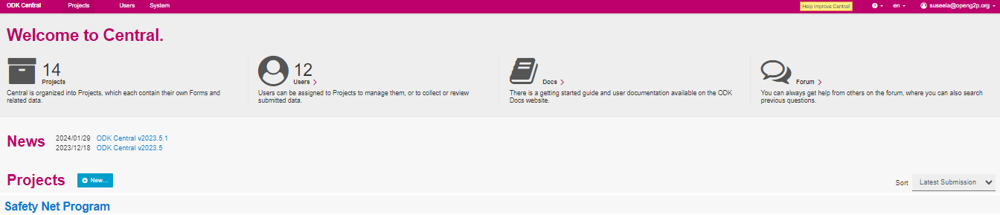

# Create a Project for a Program

## Description

This document provides instruction to create a new project for a program using ODK Central.

## Pre-requisites

* [ODK Central](https://docs.getodk.org/central-intro/) must be deployed and available
* The user must have valid credentials to login **ODK Central**
* The user must have an Administrator role in **ODK Central**. See [Create User and Assign Role](../../../features/administration/role-based-access-control/user-guides/assign-roles-to-users.md) guide.

## Procedure

1. Login to **ODK Central**.
2. In Projects, click the **+**_**New**_ button to create a new project.

<figure><figcaption></figcaption></figure>

3. _**Create Project**_ screen pops up.

<figure><figcaption>
Create Project screen
</figcaption></figure>

4. Enter the name of a new project of a program in the _**Name**_ field.
5. Click the _**Create**_ button to create a new project in a program.
6. Click the _**Cancel**_ button to exit from the _**Create Project**_ screen.

**Note:**

Provide the project name same as the program name for which the form is created.

For example, here a new project is created as Safety Net Program.

<figure><figcaption>
Safety Net Program
</figcaption></figure>

You can find the newly created project Safety Net Program listed in the _**ODK Central**_ home screen

<figure><figcaption>
ODK Central home screen
</figcaption></figure>

This completes the creation of new project for a program using ODK Central.
