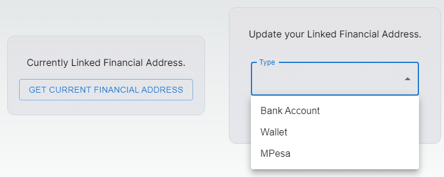
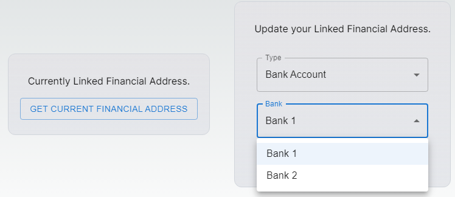
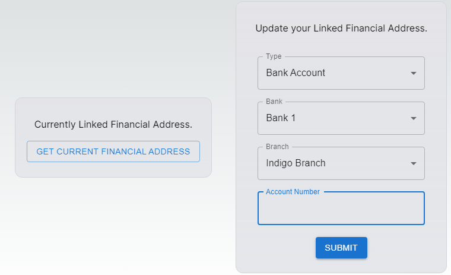
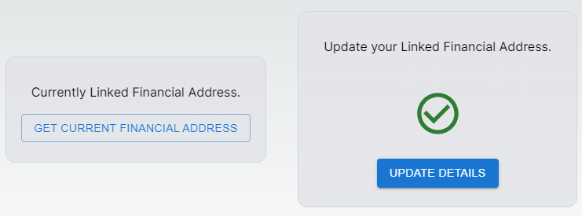
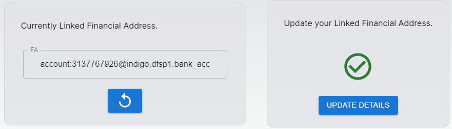
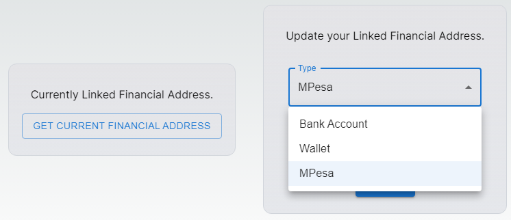
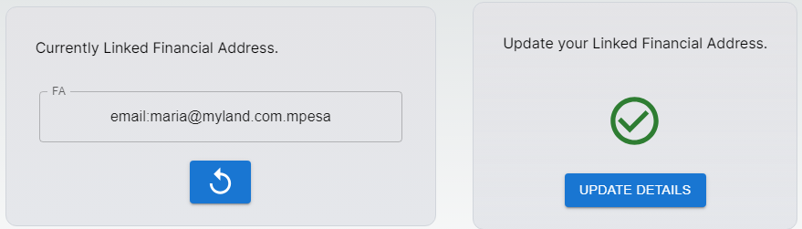

# Self Update ID with Financial Address information

## Introduction

This document contains step-by-step instructions for the beneficiaries to login self-service portal offered by SPAR and map his/her national ID with their respective bank account/mpesa account.

## Prerequisite

* The user must have knowledge to access [SPAR](../../../social-payments-account-registry-spar/spar-deployment/) which is available in public portal via internet
* The user must have his/her National ID,  bank account details and email ID

## Procedure

1. Open the SPAR URL on your browser,  for example, https://spar.openg2p.sandbox.net
2. \<Geo-specific portal> page is displayed.

<figure><figcaption>
Name of the portal.
</figcaption></figure>

There are two options available to login self-service portal.

* Login with your email or phone number&#x20;
* [Login with your National ID](self-update-id-with-financial-address-information.md#login-with-national-id)

### Login with National ID

3. Click the _**SIGNIN WITH NATIONAL ID**_ button.
4. Login with eSignet page is displayed.

<figure><figcaption>
eSignet login page.
</figcaption></figure>

You can select your preferred mode of login.

* [Login with OTP](self-update-id-with-financial-address-information.md#login-with-otp)
* Login with Biometrics
* Login with Inji Mobile App
* Login with Inji Mobile App1

#### Login with OTP

5. Click the _**Login with OTP**_ button.
6. _**Login with OTP**_ page pops up.

<figure><figcaption>
Login with OTP.
</figcaption></figure>

7. Enter the _**VID**_ number and click the _**Get OTP**_ button.

You receive the OTP number in your registered phone number.

8. Enter the OTP number and click the _**Verify**_ button.

<figure><figcaption>
OTP verification.
</figcaption></figure>

It redirects to the \<Geo-specific portal> Home page_**.**_

<figure><figcaption>
Home page.
</figcaption></figure>

In _**Home**_ page, the features and their descriptions are:

| Feature                                                                         | Description                                                                                                             |
| ------------------------------------------------------------------------------- | ----------------------------------------------------------------------------------------------------------------------- |
|  | It displays your name.                                                                                                  |
| Update your Linked Financial Address                                            | This tab is used to update the bank details/wallet/mpesa and map your national ID with your bank/wallet/mpesa account.  |
| Currently Linked Financial Address                                              | This tab populates the current list of linked financial address.                                                        |

### Update your Linked Financial Address

9. Click the _**UPDATE DETAILS**_ button.

<figure><figcaption>
Bank Account.
</figcaption></figure>

10. A drop-down field lists the type of the available account. The valid values are:

* [Bank Account](self-update-id-with-financial-address-information.md#bank-account)
* Wallet&#x20;
* [MPesa](self-update-id-with-financial-address-information.md#mpesa)

#### Bank Account

11. Select the _**Bank Account**_ in the drop-down.
12. Select  your _**Bank**_ in the drop-down.

<figure><figcaption>
Bank Name.
</figcaption></figure>

13. Select your **Bank Branch** in the drop-down.

<figure><figcaption>
Bank Branch.
</figcaption></figure>

14. Enter the _**Account number**_ and then click _**Submit**_.

<figure><figcaption>
Account Number.
</figcaption></figure>

Your National ID is successfully mapped to the bank account and the success notification message pops up.

<figure><figcaption>
A success notification message.
</figcaption></figure>

15. Click the _**GET CURRENT FINANCIAL ADDRESS**_ button.
16. The currently linked _**FA**_ (Financial Address) is displayed.

<figure><figcaption>
Display financial address - Bank Account.
</figcaption></figure>

#### Mpesa

17. Select _**MPesa**_ in the drop-down.

<figure><figcaption>
MPesa.
</figcaption></figure>

18. Enter your _**Email**_ address and click the _**Submit**_ button.

<figure><figcaption>
Email address.
</figcaption></figure>

Your National ID is successfully mapped to the Mpesa account and the success notification message pops up.

19. Click the _**GET CURRENT FINANCIAL ADDRESS**_ button.
20. &#x20;The currently linked _**FA**_ (Financial Address) is displayed.

<figure><figcaption>
Display financial address - MPesa.
</figcaption></figure>

