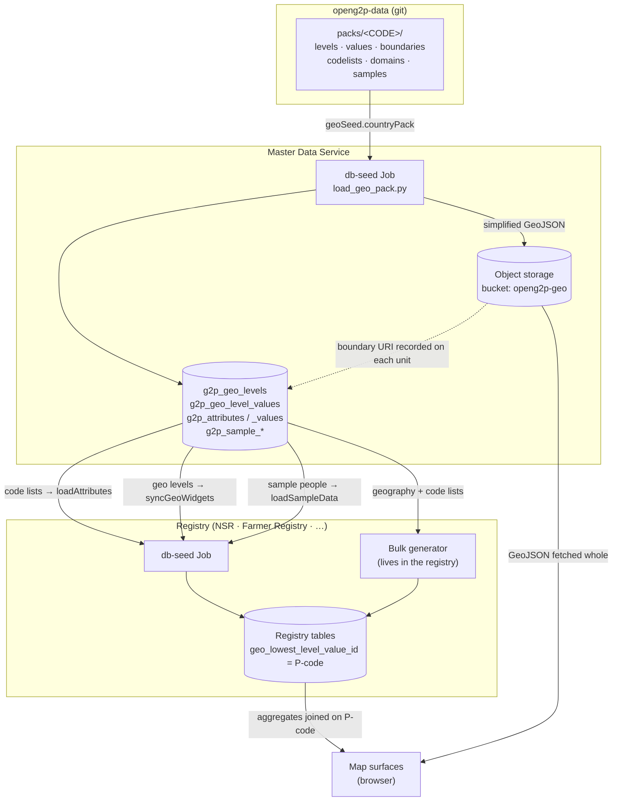

# Country Data Architecture

A registry's **structure** is part of the product: its tables, fields,
relationships, validation rules and reports are built into the registry's
extension and do not vary by country. Everything a registry **contains** that is
country-specific — the administrative hierarchy, the boundaries drawn on a map,
the list of genders or crops or water sources — comes from somewhere else.

That somewhere else is a **country pack**.

```
openg2p-data/packs/<CODE>  →  Master Data Service  →  registries seed from MDS at install
```

The consequence worth stating plainly: installing a registry for a different
country is a **values change, not a rebuild**. The same registry image serves
Ethiopia or Kamuntu depending only on which pack the Master Data Service beside
it was seeded with.

## Geography lives in Master Data Service

Master Data Service (MDS) is the runtime home of a country's geography, and it is
the only component that reads a pack directly. It holds three things that matter
downstream:

* **The hierarchy** — what the levels are called and how they nest
  (`g2p_geo_levels`). Ethiopia is `country → region → zone → woreda`; Kamuntu is
  `country → region → district → ward → village`. The number of levels is a
  property of the country, not of the platform.
* **The units** — every administrative unit with its **P-code**
  (`g2p_geo_level_values`).
* **A boundary URI per unit** — where the GeoJSON for that unit's outline can be
  fetched.

### Why this is what makes maps and drill-down work

Boundary geometry is bulk binary. It is fetched whole by the browser and drawn,
not queried row by row, so it does not belong in a database table or behind an
API. The pack's simplified GeoJSON is uploaded to object storage (MinIO, bucket
`openg2p-geo`) and **only the resulting URI is recorded against the geo rows**.

Drill-down then works because of one deliberate rule in the pack contract:


**The P-code _is_ the identifier.** In a pack, `level_value_id == pcode`. There is
one id space, so the code a registry stores against a person is the same code the
boundary file is keyed on — no reconciliation layer, and a natural join key for
analytics.

**P-codes nest**, two digits per level: `ET` → `ET01` → `ET0101` → `ET010101`.
Code that walks up or down the hierarchy is correct by construction rather than by
convention.


Because a registry stores the unit's P-code (`geo_lowest_level_value_id`), a map
can colour a region, a click can filter to its children, and a report can group by
any level — all without the registry knowing anything about geography beyond that
one code.

## What a country pack contains

A pack is a directory of plain files. Geography is mandatory; everything else is
optional, and a pack with geography alone is valid.

| File | What it holds |
|---|---|
| `levels.json` | The hierarchy — `level_id`, `level_mnemonic`, `parent_level_id` |
| `values.json` | Every unit — id, level, parent, `pcode`, display name |
| `boundaries/<level>.geojson` | One FeatureCollection per level, keyed on P-code |
| `manifest.json` | Provenance, licence, version, level names, unit counts |
| `codelists/<attribute>.json` | The country's code lists — gender, education, water source… |
| `domains/<domain>/*.json` | Lists that vary by domain **and** country, e.g. crops |
| `address.json` | How an address is written **below** the lowest level |
| `samples/individuals.json`, `samples/households.json` | A few dozen people, coherent with the country |

Two packs ship today:

| Pack | Country | Real? | Licence | Levels | Units |
|---|---|---|---|---|---|
| `XKM` | Kamuntu | **No — fictitious** | CC0-1.0 | country → region → district → ward → village | 884 |
| `ETH` | Ethiopia | Yes | CC BY-IGO (**attribution required**) | country → region → zone → woreda | 1,271 |


`XKM` is the **default**, and deliberately so. A fresh install gets a country that
does not exist, so invented poverty and enrolment figures are never attached to a
real place's name. Real packs are opt-in, per environment.


### Two tiers of data, with different obligations

**Sample data must be coherent with the pack.** A few dozen individuals and their
households, checked into the pack itself. Names, phone formats and addresses match
the country. This is what demos show and what smoke tests assert on — a person
actually reads these rows, so incoherence is visible.

**Bulk data need not be coherent.** See [Bulk data](#bulk-data-is-generated-by-the-registry) below.

## Where packs live: `openg2p-data`

Packs are kept in the [`openg2p-data`](https://github.com/OpenG2P/openg2p-data)
repository under `packs/<CODE>`, alongside `packs/roles.json` (see
[Semantic roles](#semantic-roles)) and the tooling that builds and checks them:

* `scripts/packs/fetch_country_pack.py` — builds a real pack from upstream
* `scripts/packs/generate_synthetic_pack.py` — builds a fictitious one
* `scripts/packs/validate_pack.py` — enforces the pack contract in CI

`openg2p-data` also holds the shared demography used by older seeders. The packs
subtree is the part that matters here, and it is the **only** supported route for
geography into the platform.

## Where the boundaries come from

Real packs are built from **OCHA COD-AB** (Common Operational Datasets —
Administrative Boundaries), fetched via **HDX**, the Humanitarian Data Exchange:

```
https://data.humdata.org/api/3/action/package_show?id=cod-ab-<iso3>
```

COD-AB is the humanitarian standard: UN-published, P-coded, and the same dataset
partner agencies already use, which means a registry's geography lines up with
everyone else's without a mapping exercise.


**COD-AB is CC BY-IGO — attribution is required.** Each pack records its source,
licence and upstream version in `manifest.json`, and that attribution must be
carried wherever the boundaries are shown. The licence note also states that the
boundaries are **operational**, not a statement on the legal or political status
of any territory.


Fetching also simplifies the geometry per level (coarser at the top, finer at the
bottom) so a national map is not megabytes of coastline detail, and repairs the
invalid rings that real-world boundary data routinely contains.

## How the data flows



The important property of this picture is the direction and the **timing**: a
registry reads Master Data **at install**, copies what it needs into its own
tables, and thereafter validates and serves from its own copy. MDS is an
install-time dependency, never a per-write one.

### Install sequence

1. MDS is seeded from the pack — geography, code lists, sample people.
2. The registry's db-seed waits for MDS geography to exist (`require-mds-geo`),
   then copies the code lists into its own attribute tables and loads the sample
   records.
3. The registry validates locally against its copy.
4. The registry generates bulk data, reading geography and code lists from MDS.

## Code lists: available, optional to consume

A pack may declare the country's code lists — `gender.json`,
`education_status.json`, `water_source_type.json` and so on — and MDS will hold
them. **Whether a registry consumes them is a separate decision**, and the default
is no.

Three independent switches, each defaulting off on the consuming side:

| Switch | Where | Default | Effect |
|---|---|---|---|
| `geoSeed.load.codelists` | `openg2p-master-data` | `true` | MDS loads the pack's lists |
| `dbSeed.loadAttributes` | registry chart | `false` | Registry copies MDS's lists into its own attribute tables |
| `registry_core_validate_attribute_values` | registry API config | `false` | Registry rejects writes whose values are not in its copy |

This staging is deliberate. An existing deployment that upgrades keeps getting its
lists from the extension's own SQL fixture exactly as before — nothing changes
underneath it. Turning `loadAttributes` on replaces those lists with the country's;
turning validation on then makes the copy authoritative for writes.

If `loadAttributes` is on but MDS holds no lists, the step logs that and moves on
rather than failing the install.

`dbSeed.attributeDomains` selects domain subtrees on top of the core lists —
`["agriculture"]` for a Farmer Registry, empty for a social registry that has no
use for crop types.

### Semantic roles

Reporting logic reasons about *meaning*, not literal values: "is this person the
head of the household?", "is this an improved water source?". With country-defined
lists, hardcoding `relationship_to_head = 'SELF'` breaks silently the moment a
country words it differently.

So a code-list value may carry **roles**, and platform logic asks for the role
rather than the literal. `packs/roles.json` is the closed vocabulary and the only
source of it: each role names the attribute expected to carry it and whether one
value holds it (`head_of_household`) or many may (`improved_water` — which sources
count as improved is a national definition). `validate_pack.py` rejects an unknown
role, a single-value role held twice, and a role that **no** value carries while
its list is present.

## Bulk data is generated by the registry

Dashboards and reports need volume — tens or hundreds of thousands of records — to
be worth looking at. That data is **not** in the pack and is **not** in
`openg2p-data`. Each registry generates its own at install.

The reasoning: nobody reads an individual bulk row, so the names and phone numbers
need not belong to the country. Only two things must be right, and both come from
MDS:

* **Geography** — every record must point at a real administrative unit, or maps
  and drill-downs break.
* **Code lists** — the values written must be ones the deployment recognises.

Because coherence is not required, **one generator serves every instantiation of a
given registry** — NSR's generator works for Ethiopia or Kamuntu unchanged.

Each registry keeps its own generator rather than sharing a base, because a
generator writes that registry's own extension tables and must move in lockstep
with its reporting views. NSR's lives at
`docker/db-seed/generate_nsr_bulk_sample.py`.


Bulk seeding is a demo and reporting aid. A production install should turn it off —
it exists so a freshly installed environment has something to show.


## Configuring the platform for a new country

### 1. Build the pack

For a country with a published COD-AB dataset:

```bash
cd openg2p-data/scripts/packs
python3 fetch_country_pack.py --country ETH \
    --level-names region,zone,woreda --out ../../packs/ETH
```

This downloads the boundary bundle from HDX, derives `levels.json` and
`values.json` from the P-codes, simplifies and repairs the geometry, writes
`boundaries/<level>.geojson`, and records provenance and licence in
`manifest.json`.

`--level-names` supplies the country's own words for the levels below `country`
(defaulting to `adm1`, `adm2`, …). These are cosmetic labels — the hierarchy
itself comes from the data. `--max-depth` (default `3`) sets the deepest admin
level to include.

### 2. Add the country-specific content

Geography alone is a valid pack, but a useful one also carries:

* `codelists/*.json` — the country's lists. Tag values with `roles` where platform
  logic needs meaning rather than a literal.
* `domains/<domain>/*.json` — only if a domain registry will be installed.
* `address.json` — what is written below the lowest administrative level.
* `samples/*.json` — a few dozen coherent people and households.

### 3. Validate and commit

```bash
python3 validate_pack.py ../../packs/<ISO3>
```

The validator enforces the whole contract: hierarchy integrity, P-code nesting,
ring validity, `unit_counts`, roles against `roles.json`, that a sample's
latitude/longitude falls inside the unit its P-code names, and the two invariants
drill-down actually depends on — **every child lies inside its parent**, and **a
parent's children account for its area**. CI runs it on every pack.

This matters because the pack contract binds three things that never run in the
same process: a generator writes it, MDS seeds a database from it, and the map
surface draws it. A subtly wrong pack does not fail loudly — it seeds a hierarchy
with orphans, or draws a choropleth with holes, and the damage surfaces days later
as figures that do not add up.

### 4. Point Master Data Service at it

In the `openg2p-master-data` chart:

```yaml
geoSeed:
  countryPack: <ISO3>      # the single place a deployment declares its country
  load:
    geo: true
    codelists: true
    samples: true
  domains: []              # e.g. ["agriculture"]
```

This is the one declaration of country for the whole environment.

### 5. Turn on what each registry should consume

In the registry chart (NSR, Farmer Registry, …):

```yaml
registry:
  dbSeed:
    loadGeoData: false     # legacy slug-path loader — must stay off
    loadAttributes: true   # copy the country's code lists
    attributeDomains: []   # e.g. ["agriculture"] for a Farmer Registry
    syncGeoWidgets: true   # match geo dropdowns to the pack's levels
    loadSampleData: true   # load the pack's sample people
```


`loadGeoData` is a **legacy** loader that writes a second, slug-keyed hierarchy
into the master-data database from `openg2p-data/geo/geo.csv`, with a fixed depth
of five levels that only describes Kamuntu. Leaving it on alongside a country pack
produces two hierarchies in different id spaces, one of which joins to nothing.
Keep it `false`.


`syncGeoWidgets` matters more than it looks: an extension's UI metadata names its
geo levels and fixes how many there are. A country whose pack disagrees — four
levels where the metadata expects five — gets dropdowns that silently return
nothing. Syncing rewrites those widgets from the hierarchy MDS actually holds.

### 6. Verify

* MDS holds the units: `select count(*) from g2p_geo_level_values` matches the
  pack's `manifest.json` `unit_counts`.
* The registry's attribute tables carry the country's values.
* The geo dropdowns in the staff portal populate at every level.
* A map surface renders boundaries and drills down.

---


**Reporting and dashboards.** How this data is turned into reports, dashboards and
map visualisations is covered under
[Reporting & Analytics](platform-services/reporting-and-analytics/README.md), not
here. This page is about where the data comes from and how it reaches each service.

