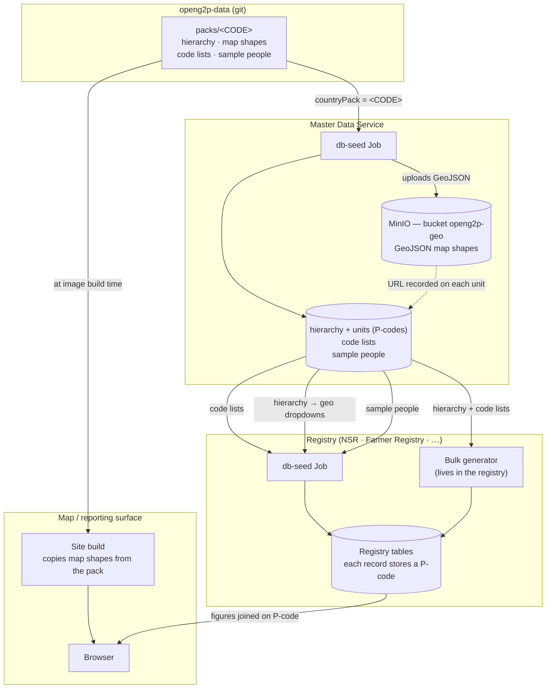

# Country Data Architecture

A registry's **structure** is part of the product. Its tables, fields,
relationships, validation rules and reports are built into the registry's
extension and do not vary by country. Everything a registry **contains** that is
country-specific comes from somewhere else — and that somewhere else is a
**country pack**.

```
openg2p-data/packs/<CODE>  →  Master Data Service  →  registries seed from MDS at install
```

The consequence worth stating plainly: installing a registry for a different
country is a **configuration change, not a rebuild**. The same registry image
serves Ethiopia or Kamuntu depending only on which pack the Master Data Service
beside it was seeded with.

## What a country pack contains

A country pack is one folder describing everything about a country that the
platform needs. It holds four kinds of thing:

* **The administrative hierarchy** — what a country's levels are called and how
  they nest. Ethiopia is _country → region → zone → woreda_; Kamuntu is
  _country → region → district → ward → village_. The number of levels is a
  property of the country, not of the platform.
* **The map shapes** — the outline of every region, district and village, so a
  map can be drawn and clicked into.
* **The code lists** — the country's own vocabularies: its genders, education
  levels, water sources, crops, and so on.
* **A small set of sample people** — a few dozen individuals and households that
  belong to this country, used for demos and smoke tests.

Only the first two are required. A pack carrying nothing but geography is
perfectly valid.

Two packs ship today:

| Pack | Country | Real? | Licence | Levels | Units |
|---|---|---|---|---|---|
| `XKM` | Kamuntu | **No — fictitious** | CC0-1.0 | country → region → district → ward → village | 884 |
| `ETH` | Ethiopia | Yes | CC BY-IGO (**attribution required**) | country → region → zone → woreda | 1,271 |


`XKM` is the **default**, deliberately. A fresh install gets a country that does
not exist, so invented poverty and enrolment figures are never attached to a real
place's name. Real countries are opt-in, chosen per environment.


## Where packs live

Packs live in the **[`openg2p-data`](https://github.com/OpenG2P/openg2p-data)**
repository, under `packs/<COUNTRY-CODE>`. That repository is the single home for
them; there is no second route by which country data enters the platform.

Details of the file layout are in [Pack file layout](#pack-file-layout) below —
you do not need them to understand the rest of this page.

## Understanding P-codes

Everything here hangs together because of **P-codes**, so it is worth
understanding them first.

A P-code (_place code_) is a short identifier for an administrative area —
`ET0101` is a specific Ethiopian zone. They are the standard identifier used
across humanitarian and development data, published by OCHA so that different
organisations describing the same district all use the same code for it.

Two properties matter for us:

* **P-codes nest.** A child's code begins with its parent's: `ET` → `ET01` →
  `ET0101` → `ET010101`. You can tell a unit's parent from its code alone.
* **P-codes are stable and shared.** Because they are published rather than
  invented by us, our geography lines up with everyone else's without a mapping
  exercise.


P-codes are an external standard, not an OpenG2P invention. For background see
OCHA's guidance on
[Common Operational Datasets and P-codes](https://cod.unocha.org/).


In our packs there is one further rule, and it is the reason drill-down works at
all:

> **The P-code _is_ the identifier.** A unit's id in the pack is its P-code — we
> do not mint a separate internal id alongside it.

So the code a registry stores against a person is the same code the map shapes are
keyed on, and the same code a report groups by. One id space, no translation
layer.

## Geography lives in Master Data Service

[Master Data Service](https://docs.openg2p.org/platform/platform-services/master-data-service#versions)
(MDS) is the runtime home of a country pack, and the only component that reads a
pack directly. Registries never see the pack; they ask MDS.

Seeded from a pack, MDS holds:

* **The hierarchy** — the levels and how they nest (`g2p_geo_levels`).
* **The units** — every administrative unit with its P-code
  (`g2p_geo_level_values`), plus a link to where its map shape can be fetched.
* **The code lists** — the country's vocabularies (`g2p_attributes`,
  `g2p_attribute_values`).
* **The sample people** — the pack's few dozen individuals and households
  (`g2p_sample_individuals`, `g2p_sample_households`).

Each of the last three can be loaded or skipped independently.

### Map shapes are stored in MinIO, not in the database

This is the part that is not obvious, so it is worth being explicit about.

The outlines that get drawn on a map are **GeoJSON** files — one per level,
sometimes several megabytes each. They are never queried piece by piece; a map
loads a whole level's file at once and draws it. Storing that in database rows
would be the wrong shape entirely.

So during seeding:

1. MDS uploads the pack's GeoJSON files to **MinIO** (the platform's object
   storage), into the bucket **`openg2p-geo`**.
2. It records **only the resulting URL** on each geo row, in the column
   `boundary_simplified_uri`.

The database therefore holds the *reference*; MinIO holds the *file*.


**Who reads this copy: the map build.** It fetches the boundary files for this
deployment's country from MinIO and publishes them with the figures it extracts
from the reporting views — which is what keeps a deployment's shapes following
its country pack rather than an image. See
[Map drill-down](platform-services/reporting-and-analytics/map-drill-down.md).



The GeoJSON is also **simplified** before upload — coarser at national level,
finer further down. Full-resolution administrative boundaries are far too large to
send to a browser (a simplified national ADM3 layer was still ~2.6 MB in testing).


## Where the real-world geography comes from

The hierarchy, the P-codes and the map shapes in a real pack all come from a
single upstream source: **OCHA COD-AB** (Common Operational Datasets —
Administrative Boundaries), fetched from **HDX**, the Humanitarian Data Exchange:

```
https://data.humdata.org/api/3/action/package_show?id=cod-ab-<iso3>
```

COD-AB is the humanitarian standard — UN-published, P-coded, and already the
reference dataset for partner agencies.


**COD-AB is CC BY-IGO — attribution is required.** Each pack records its source,
licence and upstream version in its manifest, and that attribution must be carried
wherever the map is shown. The licence also notes that these boundaries are
**operational**, and not a statement on the legal or political status of any
territory.


Kamuntu (`XKM`) has no upstream — it is generated, with a fictitious coastline and
invented place names, precisely so that a default install shows a country that
cannot be mistaken for a real one.

## How the data flows



Two things in that picture are easy to get wrong:

**Registries read MDS at install, not at runtime.** A registry copies what it
needs into its own tables and thereafter validates and serves from its own copy.
MDS is an install-time dependency, never a per-write one.

**Map shapes reach a map from MinIO, at build time.**

Master Data uploads the pack's GeoJSON to MinIO during seeding and exposes each
unit's URL on its geo API. The map build fetches the boundary files for this
deployment's country from there and publishes them alongside the figures it
extracts from the reporting views.

So a deployment's shapes follow its country pack: reseeding Master Data with a
different pack, and rebuilding the map, is enough — nothing is baked into an
image and no image is rebuilt to change country.


**Shapes and figures must come from the same pack.** The map joins its figures to
its shapes on **P-code**. A map built against one country's boundaries beside a
Master Data seeded with another renders empty rather than raising an error —
every join simply misses. This is the failure mode P-codes exist to make
detectable, and it is still worth checking after any pack change.


### Install sequence

1. MDS is seeded from the pack — geography, code lists, sample people.
2. The registry's db-seed waits for MDS geography to exist, then copies the code
   lists into its own tables and loads the sample records.
3. The registry validates locally against its copy.
4. The registry generates bulk data, reading the hierarchy and code lists from
   MDS.

## Code lists: available, optional to consume

A pack may declare the country's code lists — gender, education status, water
source and so on — and MDS will hold them. **Whether a registry uses them is a
separate decision**, and the default is no.

Three independent switches, each defaulting off on the consuming side:

| Switch | Where | Default | Effect |
|---|---|---|---|
| `geoSeed.load.codelists` | `openg2p-master-data` chart | `true` | MDS loads the pack's lists |
| `dbSeed.loadAttributes` | registry chart | `false` | Registry copies MDS's lists into its own tables |
| `registry_core_validate_attribute_values` | registry API config | `false` | Registry rejects writes whose values are not in its copy |

The staging is deliberate. An existing deployment that upgrades keeps getting its
lists from its own extension exactly as before — nothing changes underneath it.
Turning on `loadAttributes` replaces those with the country's; turning on
validation then makes that copy authoritative for what may be written.

If `loadAttributes` is on but MDS holds no lists, the step says so and moves on
rather than failing the install.

`dbSeed.attributeDomains` selects extra subject-specific lists on top of the core
ones — `["agriculture"]` for a Farmer Registry, empty for a social registry that
has no use for crop types.

### Semantic roles

Reporting logic reasons about *meaning*, not literal values: "is this person the
head of the household?", "is this an improved water source?". With country-defined
lists, hardcoding a literal like `'SELF'` breaks silently the moment a country
words it differently.

So a code-list value may carry **roles**, and platform logic asks for the role
rather than the literal. `packs/roles.json` is the closed vocabulary and the only
source of it: each role names the attribute expected to carry it and whether one
value holds it (`head_of_household`) or many may (`improved_water` — which sources
count as improved is a national definition).

## Bulk data is generated by the registry

Dashboards and reports need volume — tens or hundreds of thousands of records — to
be worth looking at. That data is **not** in the pack and **not** in
`openg2p-data`. Each registry generates its own at install.

The reasoning: nobody reads an individual bulk row, so its names and phone numbers
need not belong to the country. Only two things must be right, and both come from
MDS:

* **Geography** — every record must point at a real administrative unit, or maps
  and drill-downs break.
* **Code lists** — the values written must be ones the deployment recognises.

Because coherence is not required, **one generator serves every country** for a
given registry — NSR's generator works for Ethiopia or Kamuntu unchanged.

Each registry keeps its own generator rather than sharing a common one, because a
generator writes that registry's own tables and has to move in step with its
reporting views.


Bulk seeding is a demo and reporting aid. A production install should turn it off —
it exists so that a freshly installed environment has something to show.

Note that turning it off does **not** affect whether reporting views exist: they
are built from the registry's schema, not its data, so a production install still
gets the full set — they simply return nothing until real registration begins. See
[Setting up reporting](platform-services/reporting-and-analytics/setting-up-reporting.md).


## Configuring the platform for a new country

### 1. Build the pack

For a country with a published COD-AB dataset:

```bash
cd openg2p-data/scripts/packs
python3 fetch_country_pack.py --country ETH \
    --level-names region,zone,woreda --out ../../packs/ETH
```

This downloads the boundary bundle from HDX, derives the hierarchy from the
P-codes, simplifies and repairs the geometry, and records provenance and licence
in the manifest.

`--level-names` supplies the country's own words for the levels below `country`
(defaulting to `adm1`, `adm2`, …); these are cosmetic labels, the hierarchy itself
comes from the data. `--max-depth` (default `3`) sets the deepest level to
include.

### 2. Add the country-specific content

Geography alone is a valid pack, but a useful one also carries its code lists,
its address format, and a few dozen coherent sample people. See
[Pack file layout](#pack-file-layout) for where each goes.

### 3. Validate

```bash
python3 validate_pack.py ../../packs/<ISO3>
```

The validator enforces the whole contract: hierarchy integrity, P-code nesting,
valid geometry, unit counts, roles, that a sample's coordinates fall inside the
unit its P-code names, and the two invariants drill-down depends on — **every
child lies inside its parent**, and **a parent's children account for its area**.
CI runs it on every pack.

This matters because the pack contract binds three things that never run in the
same process: a generator writes it, MDS seeds a database from it, and a map draws
it. A subtly wrong pack does not fail loudly — it seeds a hierarchy with orphans,
or draws a map with holes, and the damage surfaces days later as figures that do
not add up.

### 4. Point Master Data Service at it

In the `openg2p-master-data` chart:

```yaml
geoSeed:
  countryPack: <ISO3>      # the single place a deployment declares its country
  load:
    geo: true
    codelists: true
    samples: true
  domains: []              # e.g. ["agriculture"]
```

### 5. Turn on what each registry should consume

In the registry chart (NSR, Farmer Registry, …):

```yaml
registry:
  dbSeed:
    loadGeoData: false     # legacy loader — must stay off
    loadAttributes: true   # copy the country's code lists
    attributeDomains: []   # e.g. ["agriculture"] for a Farmer Registry
    syncGeoWidgets: true   # match geo dropdowns to the country's levels
    loadSampleData: true   # load the pack's sample people
```


`loadGeoData` is a **legacy** loader that writes a second, differently-keyed
hierarchy into the master-data database, with a fixed depth of five levels that
only ever described Kamuntu. Left on alongside a country pack it produces two
hierarchies in two id spaces, one of which joins to nothing. Keep it `false`.


`syncGeoWidgets` matters more than it looks. A registry's screens name their geo
dropdowns and fix how many there are; a country whose pack disagrees — four levels
where the screens expect five — gets dropdowns that silently return nothing.
Syncing rewrites them from the hierarchy MDS actually holds.

### 6. Verify

* MDS holds the expected number of units for the pack.
* The registry's own tables carry the country's code-list values.
* The geo dropdowns in the staff portal populate at every level.
* A map renders and drills down.

## Pack file layout

For reference, a pack directory contains:

| File | What it holds |
|---|---|
| `levels.json` | The hierarchy — level id, name, parent level |
| `values.json` | Every unit — id, level, parent, P-code, display name |
| `boundaries/<level>.geojson` | One file of map shapes per level, keyed on P-code |
| `manifest.json` | Provenance, licence, version, level names, unit counts |
| `codelists/<attribute>.json` | The country's code lists |
| `domains/<domain>/*.json` | Lists that vary by subject **and** country, e.g. crops |
| `address.json` | How an address is written **below** the lowest level |
| `samples/individuals.json`, `samples/households.json` | A few dozen people and the households they form |

Alongside the packs, `openg2p-data` holds `packs/roles.json` (the closed role
vocabulary) and the tooling: `scripts/packs/fetch_country_pack.py` builds a real
pack, `generate_synthetic_pack.py` builds a fictitious one, and
`validate_pack.py` enforces the contract.


**An address is a P-code plus what is written below it — never both.** The P-code
already resolves the whole administrative chain, so nothing repeats it as text.
`address.json` declares only the part beneath the lowest level (for Ethiopia:
kebele, house number). A pack that stored `"Tahtay Adiyabo, North Western, Tigray"`
beside `ET010101` would hold the same fact twice, one copy of which stops being
true the day a woreda is renamed.


---


**Reporting and dashboards.** How this data is turned into reports is covered
under [Reporting & Analytics](platform-services/reporting-and-analytics/README.md):

* [Reporting views](platform-services/reporting-and-analytics/reporting-views.md)
  — generated from each registry's schema and this country's hierarchy
* [Dashboards](platform-services/reporting-and-analytics/dashboards.md) — shipped
  and imported by each registry
* [Map drill-down](platform-services/reporting-and-analytics/map-drill-down.md) —
  figures joined to the boundary shapes above, on P-code
* [Setting up reporting](platform-services/reporting-and-analytics/setting-up-reporting.md)
  — the path for a new deployment

This page is about where the data comes from and how it reaches each service.

