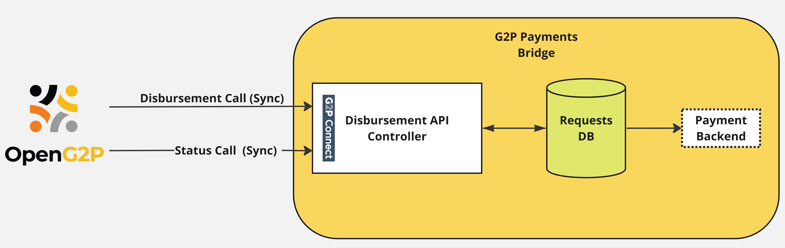

# G2P Cash Transfer Bridge

## Concept

The G2P Cash Transfer Bridge (GCTB) fits in the payment chain as shown below.

<figure><figcaption></figcaption></figure>

The module is envisaged to exist as an independent module in bridging the gap between a G2P system and a bank to initiate large-scale G2P cash transfers. Being specific to G2P transfers, (and not P2G, P2P, P2M, etc), the module promises to be low cost, simple in design, easy to install, and highly performant as real-time fast transfers are not a requirement in most social benefit transfer scenarios. However, the volume of transfers is expected to be large.

The module will support the following functionalities at a high level

1. Upstream interface layer compliant with G2P Connect or any other standard
2. Downstream interface layer to connect to bank with specific/proprietary interfaces
3. Query ID Account Mapper to fetch individual bank account information (optional)
4. History of past transactions
5. Reporting

## Architecture

<figure><figcaption><p>G2P cash transfer bridge</p></figcaption></figure>

## Concepts

### Disbursement API Controller

This functional block receives cash transfer requests from upstream systems like OpenG2P via the G2P Connect Disbursement APIs. The block parses the incoming request and writes in the DB. The Disbursement API is assumed to be Synchronous such that after DB writes, 200 OK is returned to the caller. The disbursement request is expected to be split into batches by the upstream system depending on the system's optimum performance in terms of CPU and Memory.

When a Status API is called by the upstream system, this block reads the data from DB and returns the status of requested transactions. The output may need to be 'paginated' depending on the volume of data returned.

### Requests DB

All the requests are persisted in a DB like Postgres along with the status of each transfer request. The DB has the following tables:

#### 1. Payment Instructions

<table><thead><tr><th width="217">Column</th><th>Description</th></tr></thead><tbody><tr><td>batch_id</td><td>ID of the requested batch</td></tr><tr><td>request_id</td><td>ID of the request (this may be assigned by the Disbursement Controller in case not available in the Disbursement request)</td></tr><tr><td>request_timestamp</td><td></td></tr><tr><td>from_fa</td><td>Financial Address of the sender. If there is only one sender, then this may be not be populated here, but configured in the system</td></tr><tr><td>to_fa</td><td>This may be an ID or contain account details (TBD)</td></tr><tr><td>amount</td><td></td></tr><tr><td>currency</td><td></td></tr><tr><td>status</td><td>Status of the request. This will be updated by multiple entities. The status enumeration may be NEW, FILED, PAID/FAILED</td></tr><tr><td>file</td><td>The file name in which the instruction has been written</td></tr><tr><td>error_code</td><td>Any error code if the status is FAILED. This will be used by the upsteam system to take necessary action like retry or giveup.</td></tr><tr><td>error_msg</td><td>Text error message</td></tr></tbody></table>

The table is expected to contain millions of records and a history of past transactions. Indexing of columns will be critical for performance. Besides, the previous records may be 'archived'. This could be achieved via horizontal partitioning. The management of DB in this regard needs to be worked out during implementation.

### Payment Backends

TODO - Describe what is a payment backend and what it does.

Currently available payment backends:

* Simple Mpesa Payment Backend
  * Description - TODO
* Mojaloop Payment Backend
  * Description - TODO
* [File-based Payment Backend](https://github.com/OpenG2P/openg2p-documentation/blob/1.2.1/platform/modules/g2p-payments-bridge.md)

## Configuration & Deployment Guide

Configuration Guide - TODO Link

[GCTB Kubernetes Deployment guide](../../../deployment/openg2p-modules-deployment/#g2p-cash-transfer-bridge-deployment)

GCTB Local Installation Guide - TODO

## Usage Guide

GCTB API Usage Guide - TODO: (Call Disburse API. Note down Txn ID. Call Disburse Status API with Txn ID)

## Technical Concepts

[Technical Concepts of GCTB](../../../developer-zone/repositories/g2p-cash-transfer-bridge.md)

## API Docs

### REST API

* Stoplight Link for [G2P Cash Transfer Bridge](https://openg2p.stoplight.io/docs/g2p-cash-transfer-bridge).
* Swagger UI using [OpenAPI for GCTB](https://validator.swagger.io/?url=https://raw.githubusercontent.com/OpenG2P/g2p-cash-transfer-bridge/develop/api-docs/generated/openapi.json).
* Swagger UI for [G2P-Connect Disbursement](https://validator.swagger.io/?url=https://raw.githubusercontent.com/g2p-connect/specs/draft/release/yaml/disburse\_core\_api\_v1.0.0.yaml) (which GCTB implements.)

### Status codes

Mapping of status codes returned by the bank and as expected by upstream G2P systems need to be worked out. At the moment, the following codes are defined by G2P Connect:

```
rjct.reference_id.invalid
rjct.reference_id.duplicate 
rjct.timestamp.invalid
rjct.payer_fa.invalid
rjct.payee_fa.invalid
rjct.amount.invalid
rjct.schedule_ts.invalid 
rjct.currency_code.invalid 
```

## Source Code

* GCTB Source Code - [https://github.com/OpenG2P/g2p-cash-transfer-bridge](https://github.com/OpenG2P/g2p-cash-transfer-bridge).
