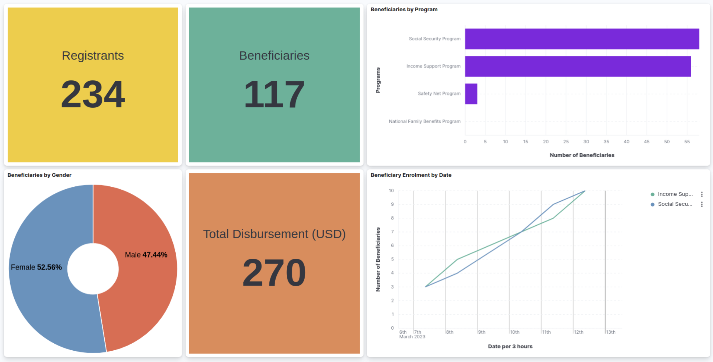

# Monitoring and Reporting

## Introduction

Monitoring the status of programs and registries is vital for program administrators. OpenG2P integrates a [reporting framework](https://github.com/mosip/reporting) that lets users create dashboards of their choice to visualise data. The framework uses open-source technology components to create a pipeline of data flowing from the databases to visualisation tools. A sample dashboard is given below:

<figure><figcaption></figcaption></figure>

## Reporting infra

<figure><figcaption></figcaption></figure>

Details of this infrastructure may be found [here](https://github.com/mosip/reporting).
