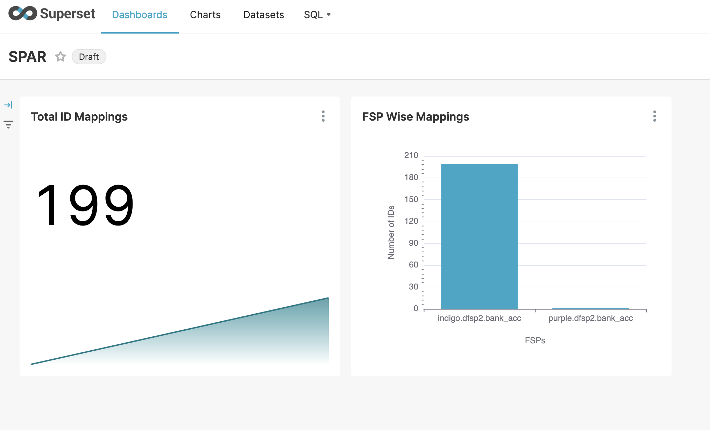

# SPAR

## Introduction

The Social Payments Account Registry (SPAR) is an extension of the ID Account Mapper that maintains a mapping of a user ID and [Financial Address](https://docs.cdpi.dev/technical-notes/digital-payment-networks/financial-address) (FA) like bank code, account details, mobile wallet number, etc., primarily aimed at cash transfers in a social benefit delivery system. SPAR implements the functionality of an ID Account Mapper with additional feature of offering a self service portal for a beneficiary to add/update his/her FA. While in countries like India, the ID Account Mapper is updated by a bank (after authenticating a beneficiary), this may not be  immediately feasible in many countries as all FSPs need to integrate with ID Account Mapper. In such situations, social welfare department can install SPAR and offer self service update, or via an agent. Of course, one important assumption is that online ID authentication mechanism is available in the country via APIs. For example, in MOSIP adopting countries both biometric and OTP based authentication is available.&#x20;

SPAR is powerful **inclusion** tool as it gives end users ability to choose how they would like to receive the benefits. &#x20;

SPAR may be housed centrally in a country as a building block of the Digital Public Infrastructure (DPI). Alternatively, a social welfare department can house it and enable other departments to use the same for cash disbursements.

The following picture represents how SPAR fits into the overall OpenG2P Project Landscape

<figure><figcaption>
SPAR in the OpenG2P Landscape
</figcaption></figure>

The Government Department administers its benefit program in the OpenG2P PBMS platform. The PBMS platform manages benefit programs, beneficiaries under the programs, disbursement cycles and entitlements (rules & definitions).

At the end of every disbursement cycle of a given benefit program, the PBMS platform produces a list that contains all the beneficiaries and their individual disbursements. The beneficiaries in that list are identified by a Beneficiary ID. This ID might be a National ID, that uniquely identifies a beneficiary in the country or depending on the National ID implementation in the country can also be a proxy or a token that has been issued by the National ID Registry.

This List has to be presented to the Sponsor Bank, where the Government Department has its Money Account (Financial Account) that contains the funds required to fund these disbursements.

The Sponsor Bank in turn has to present this List to the National Clearing System. The National Clearing List will in turn split this list into multiple lists that will be presented to multiple destination banks in the country.

Somewhere in this G2P Disbursement Chain, the Beneficiary ID needs to be translated to the Beneficiary's Financial Address&#x20;

1. Beneficiary Account Number + Bank/Branch Address - in case of Bank Accounts
2. Beneficiary Mobile Number + Mobile Service Provider - in case of Wallets

This mapping between the Beneficiary ID and his Financial Address is maintained by SPAR. SPAR provides a lookup referral service by which any participant in the G2P chain can perform a lookup into SPAR and obtain the financial address for a given beneficiary ID. The three blue dotted arrows (1, 2 & 3) in the above picture represents this lookup.&#x20;

Depending on the implementation, we can decide which layer in the G2P chain performs this lookup and enriches the disbursement list that was originally produced by the PBMS  system.

The following figure provides a Functional Architecture of the SPAR Subsystem.


SPAR Functional Architecture


The SPAR subsystem consists of 2 functional components

* ID-Account Mapper
* Self-Service-Portal

The ID-Account Mapper contains the actual mapping between beneficiary IDs and their respective accounts.

The Self-Service-Portal provides a Self Service to the beneficiaries who can log in into SPAR and update their own account information into the registry. The Self Service portal facilitates an easy to use interface like searching for a beneficiary's bank, his branch, her mobile service provider so that the beneficiary is able to provide the full financial address, where he/she wishes to receive the cash credits for the benefit programs.

## Functionality and features

* **ID-Account Mapper**
  * Mapping of ID to FA.
  * Many-to-one and one-to-one mapping of ID to FA.
  * Multiple IDs may be added for the same user
  * Bulk upload by Admin or FSPs like bank, or Govt Department after authentication
  * [G2P Connect Compliant APIs](https://g2pconnect.cdpi.dev/protocol/interfaces/beneficiary-management/mapper-specs) to query and update Financial Address
  * Signature verification for clients (partners)  via integrations with MOSIOP's Partnermanager & Keymanager (TBD)
* **Self Service Portal**
  * Login via National ID (using [eSignet](https://docs.esignet.io/))
  * Easy to use User Interface - Search for Banks, Search for Branches, Search for Mobile Service Providers to facilitate definition of the complete Financial Address of a Beneficiary

## Concepts

### ID Account Mapper

* Database of ID and FA. The IDs may be tokens like [PSUT in MOSIP](https://docs.mosip.io/1.2.0/id-lifecycle-management/identifiers#token-id-psut-partner-specific-user-token)
* Can host multiple IDs associated with the same account. Eg.

| ID                                  | Account Number       |
| ----------------------------------- | -------------------- |
| 234AFBC@mosip.openg2p               | 45678756456@ABC-Bank |
| DBCF34A@mosip.socialaccountregistry | 45678756456@ABC-Bank |

* If relationships between entries are supported in the DB, then the same can be used to show linkages between different IDs for a user (TBD)

### Self Service Portal

Service to enable beneficiaries login into SPAR and update their respective Financial Address (Account Details).

To enable this, the self service portal provides the following features via. its authentication services.

#### Authentication

* Authentication through eSignet via the [OIDC interface](https://openid.net/developers/how-connect-works/)
* Display the current FA of the beneficiary (logged-in user)
* Option to modify the Financial Address
* Notification to users via email/SMS

## Technical concepts

[Technical Concepts of SPAR](../../developer-zone/repositories/social-payments-account-registry.md)

## Configuration & deployment&#x20;

Configuration Guide - TODO Link

[SPAR Kubernetes Deployment Guide](../../deployment/openg2p-modules-deployment/spar-deployment/)

## Monitoring & Reporting

SPAR uses the Apache Superset for visualisation of data. Refer to [Monitoring and Reporting](../monitoring-and-reporting.md) for deployment and loading pre-configured dashboards.

<figure><figcaption></figcaption></figure>

## User guides

[Self-Service Portal Usage Guide](https://app.gitbook.com/o/bnTr6Kp4z4CXR4QVIPSa/s/CwMntokukpQZjoCcqMwL/\~/changes/168/guides/user-guides/spar/spar-user-guide-for-end-user/link-id-with-financial-address-information-by-beneficiary)

SPAR API Usage - TODO

## API docs

* Stoplight Link for [Social Payments Account Registry](https://openg2p.stoplight.io/docs/social-payments-account-registry)
* Swagger UI using [OpenAPI for SPAR](https://validator.swagger.io/?url=https://raw.githubusercontent.com/OpenG2P/social-payments-account-registry/develop/api-docs/generated/openapi.json)
* Swagger UI for [SPAR G2PConnect ID Mapper](https://validator.swagger.io/?url=https://raw.githubusercontent.com/OpenG2P/social-payments-account-registry/develop/spar-g2pconnect-id-mapper/api-docs/generated/openapi.json) (which is used by SPAR, by default unless configured otherwise)
* Swagger UI for [G2P-Connect Financial Address Mapper](https://validator.swagger.io/?url=https://raw.githubusercontent.com/g2p-connect/specs/draft/release/yaml/mapper\_core\_api\_v1.0.0.yaml)
* Swagger UI for [Sunbird-RC's Financial Address Mapper](https://validator.swagger.io/?url=https://raw.githubusercontent.com/Sunbird-RC/g2p-mapper-registry/main/services/mapper-service/swagger.yml) (Alternative impl of G2P Connect ID Mapper)

## Source code

* Social Payments Account Registry Source Code - [https://github.com/OpenG2P/social-payments-account-registry](https://github.com/OpenG2P/social-payments-account-registry)
* SPAR UI Components Source Code - [https://github.com/OpenG2P/spar-ui](https://github.com/OpenG2P/spar-ui)
* SPAR G2P Connect ID Mapper Source Code - [https://github.com/OpenG2P/social-payments-account-registry/tree/develop/spar-g2pconnect-id-mapper](https://github.com/OpenG2P/social-payments-account-registry/tree/develop/spar-g2pconnect-id-mapper)
* Sunbird-RC's Financial Address Mapper Source code - [https://github.com/Sunbird-RC/g2p-mapper-registry](https://github.com/Sunbird-RC/g2p-mapper-registry). Alternative impl of ID Mapper, which can be switched with SPAR G2P Connect ID Mapper

## Roadmap

Components under development:

<table><thead><tr><th width="192">Feature</th><th>Description</th></tr></thead><tbody><tr><td><h4>Onboarding</h4></td><td>Onboarding of consumer apps (like OpenG2P)</td></tr><tr><td><h4>ID linking</h4></td><td><ul><li>Linking of SPAR PSUT with Application PSUT.</li><li>Consent page for users to map token for a time period specifically for an app (like OpenG2P)</li><li>Automatic deletion of records based on expiry set</li><li>Maintaining linkage status (reflected on the portal for the user)</li></ul></td></tr><tr><td><h4>Expiry handling</h4></td><td>TBD</td></tr><tr><td><h4>Account validation</h4></td><td>SPAR does not keep any status of account validation.  Primarily, the financial account validation must be performed at the upstream system like OpenG2P etc. The suggested way in which the upstream system can do the validation is by performing a small amount or a zero amount transfer if supported by banks. And the upstream system can maintain the status and inform the user appropriately so that he/she or the bank can update it accordingly.</td></tr></tbody></table>

