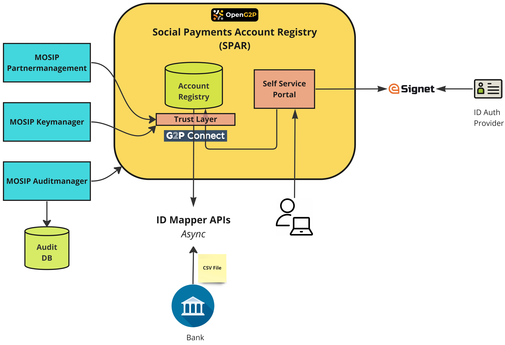

# Social Payments Account Registry (SPAR)

## Introduction

The Social Payments Account Registry (SPAR) maintains a mapping of a user ID and Financial Address (FA) like bank code, account details, mobile wallet number, etc., primarily aimed at cash transfers in a social benefit delivery system. The SPAR offers a user-facing portal for adding/updating FSP account details after authentication.

<figure><figcaption>
Social payments account registry (SPAR)
</figcaption></figure>


The SPAR is compliant with [G2P Connect interfaces](https://github.com/G2P-Connect/specs/blob/draft/api/g2p-mapper.yaml) and will eventually evolve into [ID Account Mapper](https://g2pconnect.cdpi.dev/protocol/interfaces/beneficiary-management/mapper-architecture) as envisaged by CDPI.


## Functionality and features

* Self service portal for update of account information
* User login via National ID (using e-Signet)
* One ID mapped to 1 FA
* Multiple IDs may be added for the same user\*
* G2P Connect APIs to query and update FA
* Bulk upload by Admin or Financial Service Providers (FSPs) like bank, or Govt Department after authentication
* Notification to the user via SMS/email - Planned
* Change log - TBD
* Transaction log - Planned
* Signature verification for clients (partners) - Planned, via integrations with Partnermanager & Keymanager with a common library in OpenG2P.

## Concepts

### ID Account Mapper

* Account mapper compliant with the G2P Connect interface
* Database of ID and Account Numbers. The IDs may be tokens like [PSUT in MOSIP.](https://docs.mosip.io/1.2.0/id-lifecycle-management/identifiers#token-id-psut-partner-specific-user-token)
* Can host multiple IDs associated with the same account. Eg.

| ID                                  | Account Number |
| ----------------------------------- | -------------- |
| 234AFBC@mosip.openg2p               | 45678756456    |
| DBCF34A@mosip.socialaccountregistry | 45678756456    |

* If relationships between entries are supported in the DB, then the same can be used to show linkages between different IDs for a user. (TBD)

### SPAR Service

Service to manage several mapping-related tasks and provide APIs for users to connect and update their account numbers.

#### Authentication

* Authentication page leading to the e-Signet interface.
* Display the current Financial Address of the user.
* Option to add/update the account number and account details.
* Notification to users via email/SMS.
* Onboarding of authenticators like e-Signet.

#### Mojaloop Oracle

Along with implementing G2P Connect ID Mapper APIs, SPAR implements Mojaloop Oracle API as well (Mojaloop Participant API - sync). This means SPAR can be replaced with a Mojaloop Oracle. (Internally SPAR communicates with ID Account Mapper using G2P Connect Specs.)

This is useful for integrating with Mojaloop Payment Switch.

For example, in the case given [above](social-payments-account-registry-spar.md#id-account-mapper), we can query SPAR with the account number using Mojaloop Participant API, and it will return the ID of the selected DFSP.

TODO - Configuration links.

TODO - Technical Concept links.

### SPAR Self-Service Portal UI

* Front-end service for Web-based user interface to carry out above functions.

## Technical Concepts

[Technical Concepts of SPAR](../../developer-zone/repositories/social-payments-account-registry.md)

## Configuration & Deployment Guide

Configuration Guide - TODO Link

[SPAR Kubernetes Deployment Guide](../../deployment/openg2p-modules-deployment/spar-deployment/)

## How-To Guides

Self-Service Portal Usage Guide - TODO

SPAR API Usage Guide - TODO

## API Docs

### SPAR Service REST API Docs

* Stoplight Link for [Social Payments Account Registry](https://openg2p.stoplight.io/docs/social-payments-account-registry).
* Swagger UI using [OpenAPI for SPAR](https://validator.swagger.io/?url=https://raw.githubusercontent.com/OpenG2P/social-payments-account-registry/develop/api-docs/generated/openapi.json).
* Swagger UI for [SPAR G2PConnect ID Mapper](https://validator.swagger.io/?url=https://raw.githubusercontent.com/OpenG2P/social-payments-account-registry/develop/spar-g2pconnect-id-mapper/api-docs/generated/openapi.json) (which is used by SPAR, by default unless configured otherwise)
* Swagger UI for [G2P-Connect Financial Address Mapper](https://validator.swagger.io/?url=https://raw.githubusercontent.com/g2p-connect/specs/draft/release/yaml/mapper\_core\_api\_v1.0.0.yaml).
* Swagger UI for [Sunbird-RC's Financial Address Mapper](https://validator.swagger.io/?url=https://raw.githubusercontent.com/Sunbird-RC/g2p-mapper-registry/main/services/mapper-service/swagger.yml) (Alternative impl of G2P Connect ID Mapper)

## Source Code

* Social Payments Account Registry Source Code - [https://github.com/OpenG2P/social-payments-account-registry](https://github.com/OpenG2P/social-payments-account-registry).
* SPAR UI Components Source Code - [https://github.com/OpenG2P/spar-ui](https://github.com/OpenG2P/spar-ui).
* SPAR G2P Connect ID Mapper Source Code - [https://github.com/OpenG2P/social-payments-account-registry/tree/develop/spar-g2pconnect-id-mapper](https://github.com/OpenG2P/social-payments-account-registry/tree/develop/spar-g2pconnect-id-mapper).
* Sunbird-RC's Financial Address Mapper Source code - [https://github.com/Sunbird-RC/g2p-mapper-registry](https://github.com/Sunbird-RC/g2p-mapper-registry). Alternative impl of ID Mapper, which can be switched with SPAR G2P Connect ID Mapper.

## Roadmap

### Components in SPAR Service planned for the future

#### Onboarding

Onboarding of consumer apps (like OpenG2P)

#### ID linking

* Linking of SPAR PSUT with Application PSUT.
* Consent page for users to map token for a time period specifically for an app (like OpenG2P)
* Automatic deletion of records based on expiry set
* Maintaining linkage status (reflected on the portal for the user)

#### Expiry handling

* TBD

#### Account validation

A suggested way to validate the user account number is to initiate a small cash transfer from the treasury account to the person's account. Upon successful transfer (as communicated by the bank) consider the account mapper entry valid. This could take several minutes to hours as it depending on the response from the bank.

Configuration: Treasury account details
