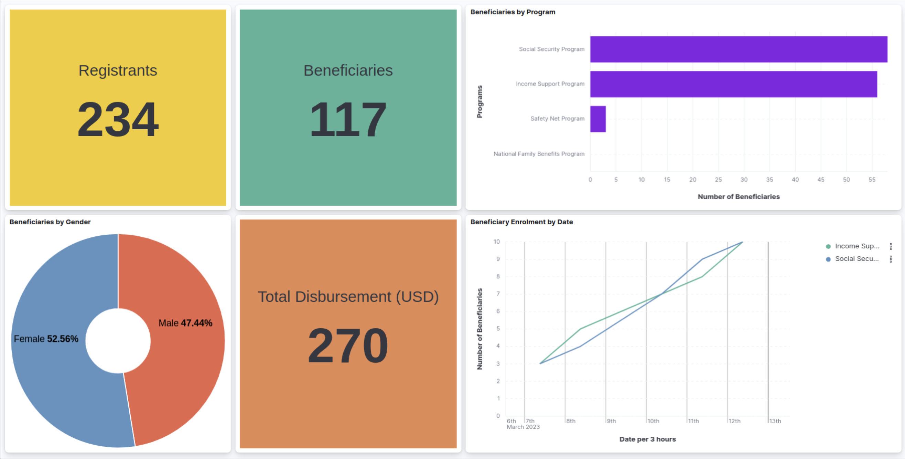

# Monitoring and Reporting

## Introduction

Monitoring the status of programs and registries is vital for program administrators. With OpenG2P's monitoring and logging tools, program administrators can&#x20;

1. Monitor programs via visual dashboards
2. Generate reports from the PBMS
3. Monitor system health in real-time&#x20;

The following tools are provided

* Integration of [Apache Superset](https://superset.apache.org/) for visual pre-canned **dashboards**
* Reporting Framework for real-time updates and **slicing and dicing of data**
* Prometheus and Grafana for **system health** monitoring
* Rancher, Fluentd, OpenSearch integration for **system logs** monitoring

<figure><figcaption>
Dashboard view
</figcaption></figure>

##

## Apache Superset&#x20;

## Prometheus and Grafana

## Logs monitoring via Fluentd and OpenSearch

## Real-time reporting infra

<figure><figcaption>
Reporting infrastructure
</figcaption></figure>

Details of this infrastructure may be found [here](https://github.com/mosip/reporting).&#x20;

##
