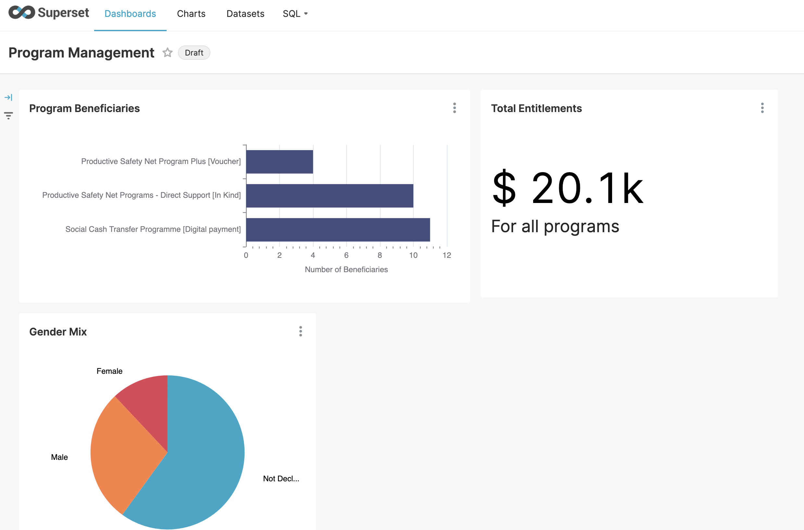
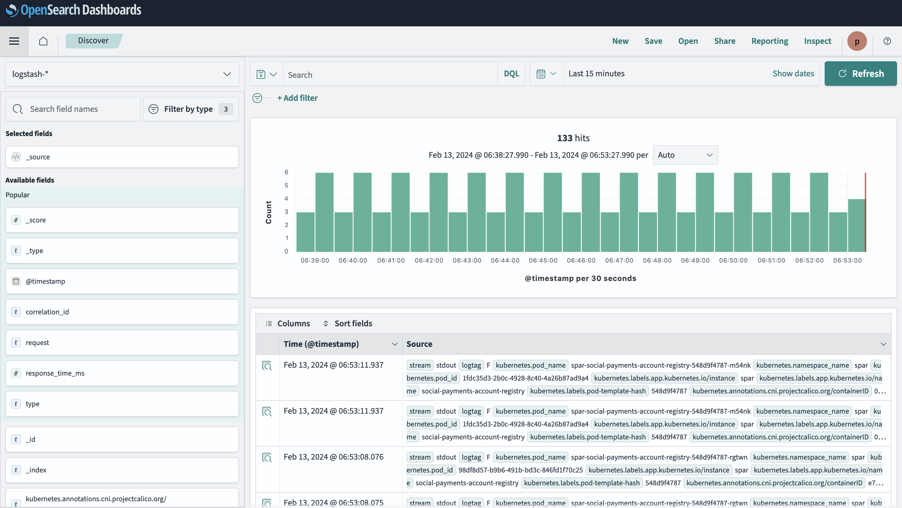

# Monitoring and Reporting

## Introduction

Monitoring the status of programs and registries is vital for program administrators. With OpenG2P's monitoring and logging tools, program administrators can&#x20;

1. Monitor programs via visual dashboards
2. Generate reports from the PBMS
3. Monitor system health in real-time&#x20;

The following tools are provided

* Integration of [Apache Superset](https://superset.apache.org/) for visual pre-configured **dashboards**
* Reporting Framework for real-time updates and **slicing and dicing of data**
* Prometheus and Grafana for **system health** monitoring
* Rancher, Fluentd, OpenSearch integration for **system logs** monitoring

## Apache Superset&#x20;

Apache Superset offers SQL query based datasets and charts for visualisation of data. OpenG2P offers pre-configured dashboards for visualisation. Refer to the [deployment instructions](../deployment/openg2p-modules-deployment/reporting-deployment.md).

<figure><figcaption></figcaption></figure>

## Real-time reporting framework

<figure><figcaption></figcaption></figure>

Details of this infrastructure may be found [here](https://github.com/mosip/reporting).&#x20;

## Prometheus and Grafana

<figure><figcaption></figcaption></figure>

## Logs monitoring via Fluentd and OpenSearch

<figure><figcaption></figcaption></figure>

Refer to [Logging architecture](monitoring-and-reporting.md#https-github.com-mosip-k8s-infra-tree-main-loggingintroduction) for technical details.
