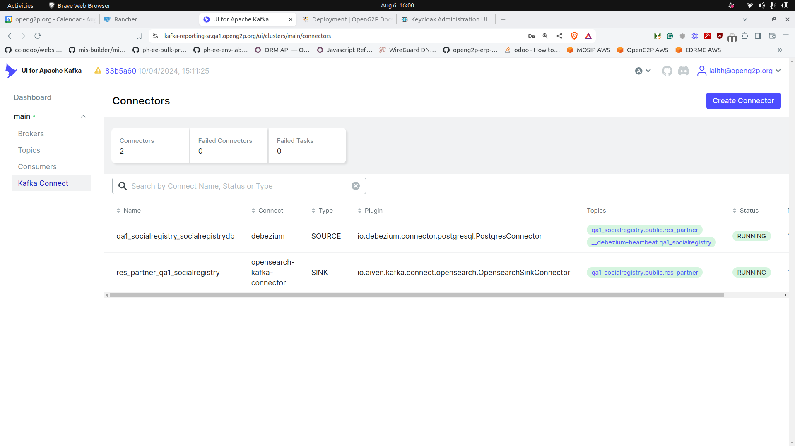

# 📔 Installation & Troubleshooting

## Installation

Reporting framework is installed as part of the modules' installation via the Helm chart that installs the respective module. Note that during installation you need to specify the GitHub Repository URL and branch and directory that contains the Debezium and OpenSearch connectors. For example:

[https://github.com/OpenG2P/openg2p-reporting/tree/develop/scripts/social-registry](https://github.com/OpenG2P/openg2p-reporting/tree/develop/scripts/social-registry)

Follow this guide to [creating/updating connectors](connector-creation-guide.md).

#### Assigning roles to users

Create[ Keycloak client roles](https://www.keycloak.org/docs/latest/server_admin/#con-client-roles_server_administration_guide) for the following components and assign them to users:

<table><thead><tr><th width="336">Component</th><th>Role name</th></tr></thead><tbody><tr><td>OpenSearch Dashboards for <a href="../">Reporting</a></td><td><code>admin</code></td></tr><tr><td>Kafka UI for <a href="../">Reporting</a></td><td><code>Admin</code></td></tr></tbody></table>

## Post-installation check

To ensure that all Kafka connectors are working login into Kafka UI (domain name is set during installation) and check the connectors' status.

<figure><figcaption></figcaption></figure>

## Update Connectors

This procedure doesn't update the data present in OpenSearch, it only updates the connector configs, so only the new and incoming data is affected. (If you need the data in OpenSearch/Kafka to be refreshed, then follow the [Cleanup](installation-and-troubleshooting.md#cleanup-and-uninstall) guide. And then continue with this guide.)

### Upgrade base method

Follow this method if you wish to upgrade to the latest version of reporting (and reporting-init scripts) and to upgrade connector configs.

* After making changes to connectors/dashboards in your GitHub Repo, go to the Installed Apps section on Rancher and upgrade your module, SR/PBMS, etc. (without changing any helm values).
* When the upgrade finishes the new reporting connector changes are automatically applied to the connectors. Log in to Kafka UI and check whether the connector config has been updated.

### Rerun initialize method

Follow this method if you don't wish to upgrade the reporting version, but only want to update connector configurations, etc. (Useful mainly during development and testing.)

* Copy your OpenG2P module installation name on Kubernetes. (For example, say `social-registry`).
*   Copy the reporting-init Job yaml from the output of this command into a temporary file, say `reporting-init.yaml` .

    ```bash
    helm -n namespace get hooks social-registry
    ```
*   Delete the reporting-init job. (Can also be done from Rancher UI)

    ```bash
    kubectl -n namespace delete job social-registry-reporting-init
    ```
*   Apply the above reporting-init.yaml after deletion.

    ```bash
    kubectl -n namespace apply -f reporting-init.yaml
    ```

## Cleanup and uninstall


Warning: All data on OpenSearch will be lost. This is especially important if you are capturing [the history of the records](connector-creation-guide.md#capturing-record-history) as you will not get that history back.


This describes steps to clean up the connectors and the data so fresh connectors can be installed again.

* Log in to Kafka UI -> Kafka Connect Section, and delete all the connectors.
* Delete all the topics related to the connectors as well. Also, delete Kafka _consumer offsets_ (IMPORTANT). TODO: give a guide on how to clear Kafka consumer offsets.
* Log in to OpenSearch -> Index Management, and delete all the relevant indices.
* Delete _replication slots_ and _publication_ on Postgres, using the following commands.
  *   List all replication slots:

      ```sql
      select * from pg_replication_slots;
      ```
  *   Delete a replication slot:

      ```sql
      select pg_drop_replication_slot('replication_slot_name_from_above');
      ```
  *   List all publications:

      ```sql
      select * from pg_publication;
      ```
  *   Delete a publication:

      ```sql
      drop publication publication_name_from_above;
      ```

If you want to install the connectors again, follow the [Update](installation-and-troubleshooting.md#update-connectors) guide.
