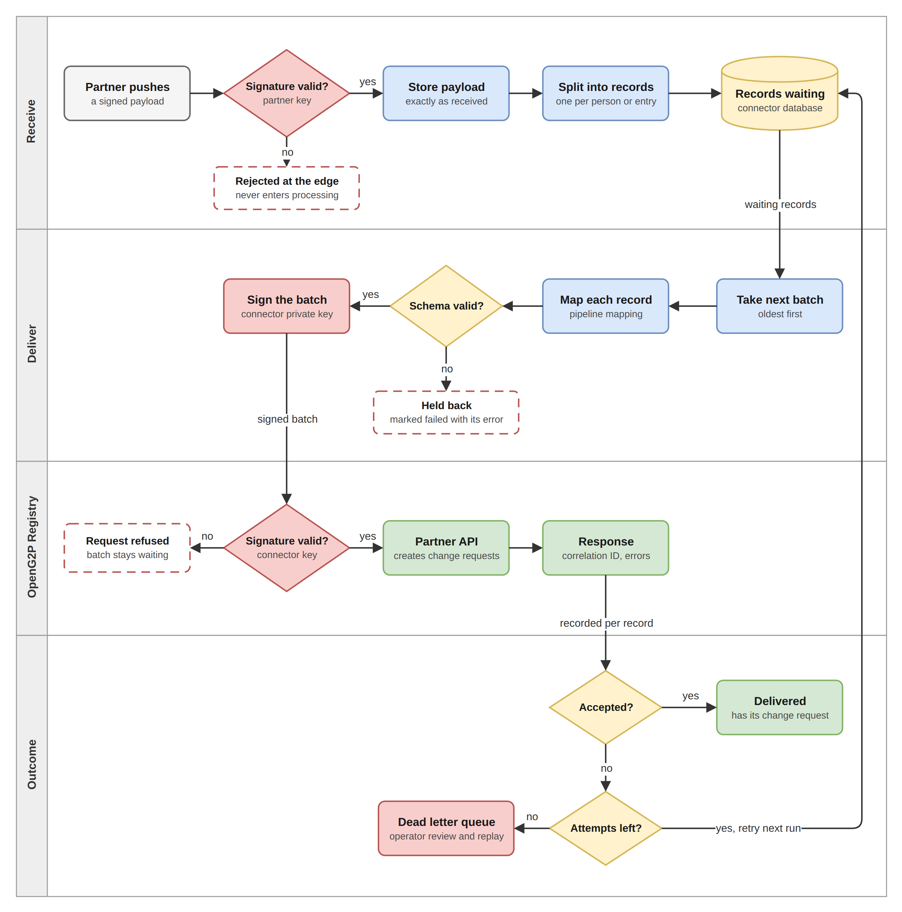
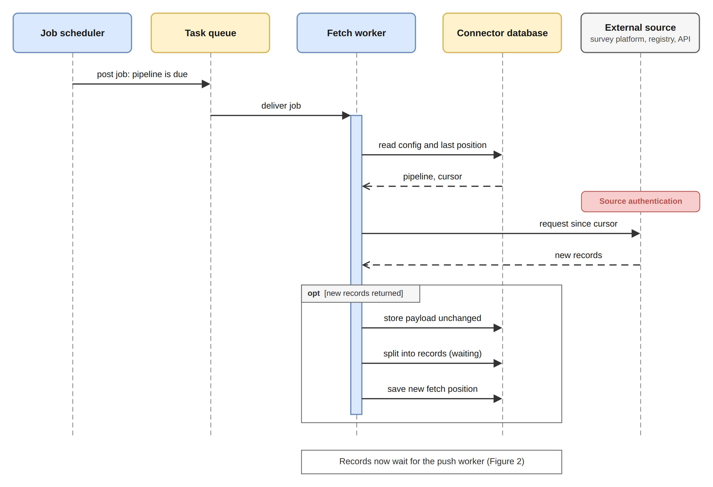

# Functional Specifications

## Pipelines

A pipeline is the unit of configuration. Everything the connector needs to handle one source is held on the pipeline record.

| Setting              | Description                                                                                                                                                                  |
| -------------------- | ---------------------------------------------------------------------------------------------------------------------------------------------------------------------------- |
| Name                 | Label shown in the Admin UI.                                                                                                                                                 |
| Platform             | The kind of system the data comes from.                                                                                                                                      |
| Transport            | How data arrives: pushed to a URL, or fetched on a schedule.                                                                                                                 |
| Authentication       | How the connector authenticates to the source, and the secrets it uses.                                                                                                      |
| Source configuration | Connection details for the source, such as base address, project, form, and page size.                                                                                       |
| Fetch cursor         | For scheduled fetch: which field marks progress, and whether progress is by time or by sequence.                                                                             |
| Timeouts             | How long the connector waits when talking to the source, and how long it waits when delivering to the registry. Set per pipeline so a slow source does not share the same budget as a fast one. |
| Sender               | The partner the data is attributed to. Must match a partner registered with the registry.                                                                                    |
| Target register      | The register the records are delivered into.                                                                                                                                 |
| Mapping expression   | Reshapes each record before delivery. Left empty, the record is delivered as received.                                                                                       |
| Validation schema    | Optional schema each mapped record is checked against before delivery.                                                                                                       |
| Fetch interval       | How often the fetch worker reads from the source.                                                                                                                            |
| Batch size           | How many records the push worker sends to the registry in one call.                                                                                                          |
| Enabled and paused   | Control whether the pipeline accepts data and whether processing is running.                                                                                                 |

Pausing a pipeline stops processing without discarding its configuration or its history, which makes it a safe way to hold a source while a mapping or a credential is corrected.

## How data arrives

Two transports cover the ways external systems make data available.

| Transport       | Pattern | Description                                                                                                                                 |
| --------------- | ------- | ------------------------------------------------------------------------------------------------------------------------------------------- |
| Webhook         | Push    | The source posts to a connector address reserved for that pipeline. The partner's signature is validated before the payload is accepted.   |
| Scheduled fetch | Pull    | The fetch worker reads from the source at a set interval, picking up only what is new since the last run.                                  |

Pushed payloads reach a pipeline either by its identifier or by a readable slug, so an external system can be given a stable address that does not expose internal identifiers.

## Authentication and partner trust

Trust runs in both directions: the connector must know that a push really came from the partner, and the registry must be able to know that a delivery really came from the connector.

**Authenticating to a source.** Pipelines that read from a source hold the credentials for it. The supported methods cover the cases found across partner systems.

| Method                    | Used for                                                           |
| ------------------------- | ------------------------------------------------------------------ |
| None                      | Open endpoints.                                                    |
| Static token              | Sources issuing a fixed bearer token.                              |
| Session                   | Sources that exchange a user name and password for a session token. |
| OAuth2 client credentials | Sources behind a standard client credentials flow.                 |
| OAuth2 password           | Sources that require a user grant.                                 |

**Verifying partners on the way in.** Anything pushed to the connector is verified before it is accepted. The preferred method is a digital signature from the partner: the connector obtains the partner's public key (published by the partner, or held on the pipeline) and checks that the signature matches the body that arrived. Shared secrets remain available for simpler sources that cannot sign. A payload that fails verification is rejected at the edge and never enters processing.

**Identifying the connector on the way out.** When the connector delivers a batch to the registry, it signs the request with the connector's own private key. The matching public key is what the registry uses to confirm the delivery came from this connector. Signing is a connector responsibility; whether a given registry deployment enforces that check is a registry-side policy.


Secrets are write-only. Once saved they are used but never displayed again, and leaving a secret field empty while editing a pipeline keeps the stored value rather than clearing it.


## Receiving and storing

Receiving is kept short. Storing the payload and breaking it into records is quick work, so it happens as the payload comes in, and the source gets its acknowledgement as soon as the records are safely written. What the source does not wait for is delivery, which the push worker handles later on its own schedule.

<figure><figcaption>
Receiving, storing, and delivering a payload
</figcaption></figure>

**Receipt.** The transport confirms the payload came from the expected sender by validating the partner's key, then hands it on. Nothing else is interpreted at this point.

**Storage.** The payload is written exactly as it arrived and given a reference. Because the copy is stored before anything is changed, the original is always available for tracing or for replay after a mapping correction.

**Splitting into records.** A payload is rarely one thing. A survey export or a partner push commonly carries many people in a single body, and the registry works in terms of individual records. The connector therefore breaks the payload into the records it contains, one per person or entry, and stores each one separately with a reference back to the payload it came from.

Each record then carries its own state, its own attempt count, and its own outcome. That is what allows a problem with one record to be resolved on its own, without holding back the rest of the payload it arrived in, and it is what gives the push worker something countable to build batches from.

**Waiting.** Stored records wait in the database until the push worker collects them. Nothing is sent at the moment of receipt.

## Fetching from a source

A pipeline whose source has to be asked rather than pushed is read by the fetch worker on the interval set for that pipeline.

<figure><figcaption>
Scheduled fetch run
</figcaption></figure>

Each pipeline keeps the position of its last fetch. That position is driven by a cursor: the operator chooses which attribute on the source marks progress, and whether progress advances by time or by sequence. The next run resumes from that position, so runs stay incremental and a source is not asked for the same records repeatedly. An operator can reset the position to collect a source's history again, for instance after correcting a mapping that was wrong for earlier records.

What the fetch worker collects is stored the same way a pushed payload is stored, and from that point the two paths are identical. A record does not carry any trace of whether it was pushed or fetched once it is waiting to be sent.

## Delivering to the registry

The push worker runs on its own interval. On each run it takes the records that are waiting, in the order they were received, up to the batch size configured for the pipeline, maps each one, and sends the batch to the registry Partner API in a single call.

**Batch size** is the main control over the load the connector places on the registry. Fifty records to a batch is a reasonable starting point. A smaller batch spreads the same work over more calls and keeps each one short; a larger batch clears a backlog faster at the cost of a heavier call. The setting belongs to the pipeline, so a source known to produce bulk imports can be tuned separately from one that trickles.

**Mapping** happens as the batch is assembled. The mapping expression on the pipeline reshapes each record into the registry's format, and where a validation schema is configured the mapped record is checked against it. A record that fails validation is held back and does not travel with the batch.

**The envelope** carries the sender and the target register from the pipeline, which is how the registry resolves the partner the data is attributed to.

**Trust on delivery.** Every delivery carries the connector's signature, as described under [Authentication and partner trust](#authentication-and-partner-trust), so the registry can treat the connector as a known sender when it chooses to enforce that check.

**The response** is recorded against every record in the batch: the correlation identifier the registry returns, and, where the registry reports a problem with a particular record, the error against that record. The correlation identifier is what links a record in the connector to the change request it became in the registry, and it is the first thing to reach for when someone asks what happened to a particular submission.

A rejection from the registry is kept distinct from a failure to reach it. The two call for different responses: one needs the data or the configuration corrected, the other usually only needs another attempt.

## Failure handling

Failures are handled per record, even though delivery happens in batches.

A call that does not reach the registry leaves every record in that batch untouched and waiting. They are picked up again on the next run, so a registry outage costs time rather than data. A record the registry rejects is marked failed on its own; the rest of the batch is unaffected and stays delivered.

A record that fails is retried up to a configured number of attempts. One that exhausts them moves to the dead letter queue, where it waits with its error and its stored payload until an operator deals with it. Nothing is discarded silently.

| Category      | Typical cause                                                  | Resolution                                      |
| ------------- | -------------------------------------------------------------- | ----------------------------------------------- |
| Transient     | The source or the registry was briefly unreachable.            | Replay. It usually succeeds.                    |
| Permanent     | The registry rejected the record outright.                     | Correct the data, then replay.                  |
| Validation    | The mapped record did not satisfy the configured schema.       | Correct the mapping or the schema, then replay. |
| Configuration | The sender, target register, or mapping expression is wrong.   | Correct the pipeline, then replay.              |

Replay starts from the stored payload, so a record can be reprocessed after a fix without asking the source for it again.

## Operating the connector

The Admin UI is where day-to-day work happens. From it an operator can:

* create and edit pipelines, and pause or resume them
* see activity across every pipeline in one place, or narrow to a single one
* trigger a fetch immediately rather than waiting for the next scheduled run
* see how many records are waiting to be sent, which is the clearest sign of a backlog building
* adjust batch size, fetch interval, and timeouts when delivery needs to speed up or ease off
* set the fetch cursor so each run asks only for what is new
* inspect a failed record, read its error, and replay it
* reset a fetch position to collect a source's history again

The views are built around the questions that actually get asked: whether anything failed recently, what happened to one particular submission, and whether a source has gone quiet. Records carry both the connector's own identifiers and the registry correlation identifier, so a question can be followed from either end.
