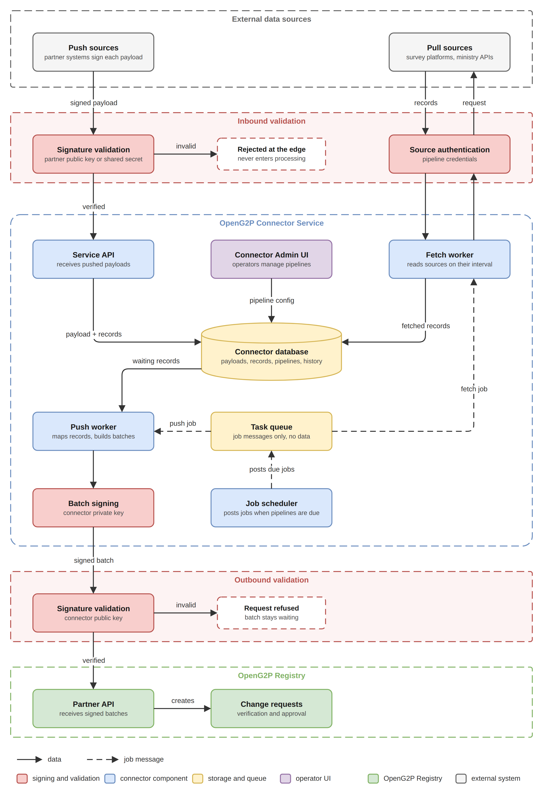

# Technical Architecture

## Components

<figure><figcaption>
Connector Service architecture
</figcaption></figure>

| Component          | Responsibility                                                                                                                                  |
| ------------------ | ----------------------------------------------------------------------------------------------------------------------------------------------- |
| Connector Admin UI | Web application where operators create pipelines, adjust configuration, and monitor activity.                                                   |
| Service API        | Receives pushed payloads after partner key validation, serves the Admin UI, and exposes pipeline and monitoring endpoints.                      |
| Fetch worker       | Reads from sources that have to be asked, and writes what it collects to the database.                                                          |
| Push worker        | Reads records waiting in the database, signs each batch with the connector key, and sends it to the registry.                                   |
| Job scheduler      | Starts both workers at their configured intervals.                                                                                              |
| Connector database | Holds pipeline configuration, received payloads, records and their state, and run history.                                                      |
| Task queue         | Holds short job messages such as "fetch this pipeline now" or "send the next batch". A worker takes the next job whenever it is free.            |

Everything that receives data writes to the connector database: the Service API for pushed payloads, and the fetch worker for anything it collects. The database is the single place where data waits, which is what allows receiving and sending to run at their own speeds.

## The database and the task queue

The database and the task queue hold different things, and it is worth being precise about the difference. The database holds the data itself: payloads, records, and their state. The task queue holds nothing but instructions, each one a few words telling a worker to go and do a piece of work. A job message says which pipeline to act on; the worker that picks it up reads the actual data from the database.

The queue exists so that the scheduler does not have to know anything about the workers. It posts a job and moves on. Whichever worker instance is free takes it, which is what makes it possible to run several of them at once, restart one without losing work, and add more when volume grows.

## Background workers

Two workers do the background work. Both are started by the job scheduler and take their jobs from the task queue, and they are deliberately kept separate.

| Worker       | Started by                                 | What it does                                                                                                                       |
| ------------ | ------------------------------------------ | ---------------------------------------------------------------------------------------------------------------------------------- |
| Fetch worker | The scheduler, at each pipeline's interval | Reads from a configured source and writes what it collects into the database as records. It never contacts the registry.          |
| Push worker  | The scheduler, at its own interval         | Takes records waiting in the database, groups them into a batch, and sends the batch to the registry. It never contacts a source.  |

Keeping them apart matters in both directions. The fetch worker keeps collecting on its interval whether or not the registry is reachable, so a registry outage delays delivery but never causes a source to be missed. The push worker sets the pace of delivery on its own terms, so a large import arriving at once does not turn into a burst of traffic at the registry.

Neither worker is called directly. When a pipeline's fetch interval comes round, the scheduler posts a job to the task queue saying that pipeline is due; a free fetch worker takes the job, reads the pipeline's configuration from the database, and does the work. The push worker is started the same way. Because both take their work from the same queue, either can be scaled on its own: a deployment pulling from many sources runs more fetch workers, one with a delivery backlog runs more push workers, and nothing else has to change.

## What the connector stores

| Held                   | Purpose                                                                                                              |
| ---------------------- | -------------------------------------------------------------------------------------------------------------------- |
| Pipeline configuration | Source, transport, authentication, mapping, sender, target register, intervals, timeouts, cursor, and batch size.    |
| Received payloads      | The unaltered copy of everything received, kept for tracing and replay.                                              |
| Records                | The individual records a payload was broken into, each with its state, attempt count, and outcome.                   |
| Run history            | What was attempted, when, and how it ended, including the registry correlation identifier.                           |
| Duplicate keys         | Keys of records already processed, so the same record is not sent twice.                                             |
| Fetch positions        | The point each fetched pipeline resumes from.                                                                        |
| Dead letter entries    | Records that exhausted their attempts, held with their error for review and replay.                                  |

Storage of received payloads is configurable, since payloads may carry personal data and retention is a decision for the deployment rather than for the connector.


The diagrams on these pages are maintained as draw.io sources in `.gitbook/assets` (`connector-service-architecture.drawio`, `connector-payload-lifecycle.drawio`, `connector-fetch-run.drawio`) alongside their PNG exports.

