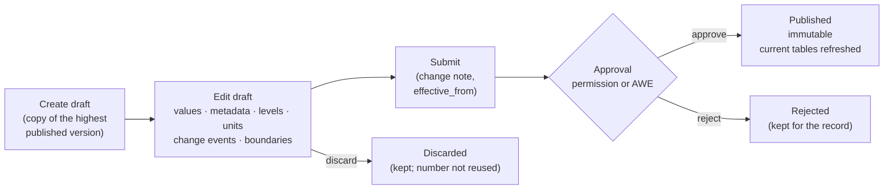

# Change Control and Approvals

In MDS as Catalogue, **published data is never edited**. Every change, to a list or
to the geography, follows the same path:

## Drafts

* A list has **at most one open draft** (`DRAFT` or `SUBMITTED`) at a time; so does
  the geography. A second `create_list_draft` fails with `G2P-CAT-409`.
* A draft starts as a copy of the **highest published version** (its base). Any
  edit endpoint creates the draft if none is open, so an explicit
  `create_list_draft` is needed only to set a change note or effective date up
  front, or to copy an older version's content (`copy_from_version`).
* Anyone with the edit permission can change a draft: add, change or retire values
  (`upsert_draft_values`, `retire_draft_values`); change the list's code, labels,
  hierarchy flag or attribute schema (`update_list`); set its change note and
  effective date (`update_list_draft`). For geography: levels, units, change
  events, boundaries, note, effective date and owner.
* `description` and `owner_org` of a list are administrative: `update_list`
  applies them at once, outside the draft.
* Values are validated against the list's attribute schema as they are written, so
  errors surface while editing rather than at approval.
* Consumers do not see a draft unless they ask for it (`version: "draft"` or its
  number).
* A draft can be **discarded**: nothing it contained is published. The version is
  kept with status `DISCARDED` (with its content, and who discarded it in
  `decided_by`), so its number is never handed out again. In `permission` mode a
  submitted draft can also be discarded; in `awe` mode it cannot (cancel the AWE
  request instead).

## Submit

Submitting freezes the draft (status `SUBMITTED`) and asks for approval. The
submitter may give:

* a **change note** saying what changed and why;
* an **`effective_from`**, if the version should take effect later than its
  approval. It may not be earlier than the latest published version's.

On submit, MDS validates the whole draft again: labels, the value hierarchy (no
missing parents, no cycles), every value against the attribute schema and every
`x-list-ref` against the referenced list's version in effect (on the draft's
`effective_from`, when that is in the future; never a draft: see
[Typed attributes](concepts.md#typed-attributes)); for geography, levels, units and every
recorded change event. A draft with **no changes** from its base is refused
(`G2P-CAT-400`). A geography draft also gets its lineage completed: units created,
retired, renamed or moved without a recorded event, and units whose boundary
geometry changed, get automatic change events (`is_auto: true`); see
[Change events](geography.md#change-events).

## Approval modes

How a submitted draft is approved is a deployment setting: the chart value
`masterDataAPI.catalogue.approvalMode` (environment variable
`MASTER_DATA_API_CATALOGUE_APPROVAL_MODE`), `permission` (the default) or `awe`.
`get_catalogue_config` tells a client which mode is in effect.

### `permission`: maker-checker within MDS

A user holding the publish permission (`referenceData:publish` for lists,
`geo:publish` for geography) approves or rejects the draft with `approve_draft` /
`reject_draft` (`approve_geo_draft` / `reject_geo_draft`). A rejection needs a
`decision_note`.

**Maker ≠ checker** is enforced: the approver must not be the user who **created**
the draft, **last edited** it, or **submitted** it (`G2P-CAT-403`). Users are
compared by their **stable user id**: the token's `sub` claim (if a token has no
`sub`, `preferred_username`, then `name`). A display name is never used to decide
who may approve: two people can share one, and a person can change theirs. So the
`*_by` fields of a version hold user ids; the display names are kept beside them in
`*_by_name` (and `actor_name` in the change log) for people to read.

### `awe`: through the Approval Workflow Engine

On submit, MDS opens an approval request in the
[Approval Workflow Engine](../../approval-workflow-engine/README.md), forwarding the
submitter's bearer token:

| | Lists | Geography |
|---|---|---|
| Policy key | `awe.policyKeyList` (default `master_data.list_version.v1`) | `awe.policyKeyGeo` (default `master_data.geo_version.v1`) |
| Artifact type | `master_data.list_version` | `master_data.geo_version` |
| Artifact id | `<list_id>:<version_no>` | `geography:<version_no>` |
| Context | `list_code`, `list_id`, `version_no`, `owner_org`, `change_note` | `version_no`, `owner_org`, `country`, `change_note` |

The policy is chosen by subject type, not by owner: the **`owner_org`** travels in
the request's context, where an AWE policy can use it. MDS stores AWE's request id
on the version (`approval_ref`). If AWE cannot be reached, submit fails with
`G2P-CAT-502` and the draft stays a draft.

When AWE reaches a decision it calls **`POST /catalogue/awe/callback`**. This
endpoint takes no user token; it is authenticated by an **HMAC** signature, as in
the [registry's AWE integration](../../approval-workflow-engine/integration-with-registry.md):
`X-Approval-Signature: sha256=HMAC_SHA256(secret, "<X-Approval-Timestamp>." + body)`,
with `X-Approval-Timestamp` (within 300 s) and `X-Approval-Event-Id`. The body is
AWE's webhook event (`event_id`, `event_type`, `request_id`, `artifact_type`,
`artifact_id`, `status`, `stage_order`, `actor`, `occurred_at`).
`request_approved` **publishes** the version; `request_rejected` and
`request_cancelled` mark it `REJECTED`. The decision is recorded with the `actor`
AWE reports as `decided_by` (and `decided_by_name`), or `awe` when AWE reports none. The callback is **idempotent on
`event_id`** (received events are kept in `g2p_catalogue_awe_events`). It answers
401 for a bad signature and 422 for an event that cannot be applied.

The `approve_*` and `reject_*` endpoints are disabled in `awe` mode. If `awe` is set
but no AWE base URL is configured, MDS **falls back to `permission` mode**.

When `approvalMode` is `awe`, the chart:

* mints the callback HMAC secret (`<release>-master-data-awe-callback-hmac`), kept
  across upgrades;
* with `awe.seed.enabled` (default on), runs an **`awe-seed`** container in the
  geo-seed Job that registers both policies in the shared AWE database: one stage,
  one approval, approvers holding the client role `MASTER_DATA_APPROVER` on the
  `master-data` client, self-approval forbidden. It also registers the callback
  secret. The stages can be edited in AWE afterwards.

### Releases

Catalogue releases are approved by permission only, in both modes:
`publish_release` needs `referenceData:publish` and a publisher who is **neither
the creator** of the release **nor whoever last set its members** (recorded as
`members_set_by` / `members_set_at`), compared by stable user id
(`G2P-CAT-403`).

## Publish

Publishing is not a separate call; it happens on approval. In one transaction MDS:

1. validates the version once more;
2. marks it `PUBLISHED`, sets `published_at` and `effective_from` (the approval's,
   else the draft's, else now);
3. for geography, sets `valid_from` on new units and `valid_to` on retired ones,
   and dates change events without one;
4. if the version is now in effect, refreshes the **current published state** in
   the existing tables (`g2p_attributes` and `g2p_attribute_values`, or
   `g2p_geo_levels` and `g2p_geo_level_values`);
5. writes `*.draft.approved` and `*.version.published` entries to the change log.

From then on the database triggers refuse any change to the version. After the
transaction commits, MDS delivers the events from the change log (the outbox; see
[Audit](#audit)): to the Audit Manager and, if a WebSub hub is configured, a
"published" notification. A version published with a future `effective_from` is
announced again when it **takes effect** (`*.version.effective`).

## Retiring

A **value** or **unit** is retired in a draft and stops being current when that
draft is published. It is never deleted. There is no endpoint to retire a whole
published version or list: a list that is no longer used can have all its values
retired in a new version.

## Permissions

All permissions are held under the `master-data` Keycloak client (the chart's
`global.authClientId`) and registered with IAM by the chart.

| Permission | Allows |
|---|---|
| `referenceData:create` | Create lists (`create_list`; legacy `add_attribute`, `add_attribute_value`) |
| `referenceData:edit` | Open, edit, submit and discard list drafts; update list metadata; create releases and set their members |
| `referenceData:delete` | Retire values in a draft; delete a draft release; legacy `delete_attribute`, `delete_attribute_value` |
| `referenceData:publish` | Approve or reject list drafts (`permission` mode); publish releases |
| `geo:create` | Legacy `add_geo_level`, `add_geo_level_value` only |
| `geo:edit` | Open, edit, submit and discard the geography draft: levels, units, change events, boundaries |
| `geo:delete` | Retire units in the geography draft; legacy `delete_geo_level`, `delete_geo_level_value` |
| `geo:publish` | Approve or reject geography drafts (`permission` mode) |

| Role | Permissions |
|---|---|
| `MASTER_DATA_ADMIN` | All of the above |
| `MASTER_DATA_APPROVER` | `referenceData:publish`, `geo:publish` only: approves and publishes, cannot edit |

Reads need authentication only, as before.

## Audit

Every lifecycle step is recorded twice:

* in MDS's own **change log** (`g2p_catalogue_change_log`), append-only (a trigger
  refuses updates and deletes; the one column that may change is `forwarded_at`),
  which also backs the [change feed](consumers.md#following-changes);
* in the [Audit Manager](../../audit-manager/README.md), as a CloudEvent
  (`POST <auditManagerUrl>/v1/auditmanager/events`). If no Audit Manager URL is
  configured, this is off; the change log is always kept.

**The change log is the outbox.** An event is written to the change log in the same
transaction as the change, so the log is exact; delivery happens afterwards and is
retried until it succeeds:

1. Right after a request's transaction commits, the API sends that request's
   events (in the background; the request does not wait).
2. A **relay** in the API, run every `catalogue_outbox_relay_seconds` (environment
   variable `MASTER_DATA_API_CATALOGUE_OUTBOX_RELAY_SECONDS`, 30 by default), sends
   every event whose `forwarded_at` is still empty: events whose first delivery
   failed, events the country-pack loader wrote, and events the database wrote
   itself (`*.version.effective`, `*.version.migrated`). Only one API worker in the
   deployment relays at a time (a Postgres advisory lock), and rows are claimed
   with `FOR UPDATE SKIP LOCKED`, so the two paths never send the same event at
   once. The relay sends in `event_id` order and stops at the first event that
   cannot be delivered, retrying it on the next run.
3. `forwarded_at` is set once the event has been accepted everywhere it goes, or
   there was nowhere to send it.

| Event | Audit Manager | WebSub topic |
|---|---|---|
| Every event | Yes | — |
| `list.version.published`, `geo.version.published` | Yes | `<prefix>.list.published`, `<prefix>.geo.published` |
| `list.version.effective`, `geo.version.effective` | Yes | `<prefix>.list.effective`, `<prefix>.geo.effective` |
| `release.published` | Yes | `<prefix>.release.published` |

`<prefix>` is `websub_topic_prefix` (default `openg2p.master-data`). Delivery is
**at least once**: a receiver may see an event twice (for example if MDS stopped
after sending but before recording it). The CloudEvent `id` is derived from the
change-log `event_id`, and the WebSub payload carries `event_id`, so a receiver
de-duplicates on it.

The CloudEvent `type` is `org.openg2p.master_data.<event_type>`, its `subject`
`<subject_type>/<subject_id>/v<version_no>`, and its `data` carries the actor (a
user's stable id and display name, or a system actor), the action, the resource
(`master_data.list`, `master_data.geo` or `master_data.release`), the change-log
`event_id` and the details. The event types are listed in the
[API reference](api-reference.md#change-feed).

## What the legacy write endpoints do now

The existing write endpoints keep their paths, payloads and response shapes but
**no longer change published data**. Each one writes into the open draft, creating
a draft from the highest published version if there is none, and returns the
changed object as before (not the draft). A legacy write to a list or geography
whose draft is already `SUBMITTED` fails until that draft is decided or discarded.

| Endpoint | Before | Now |
|---|---|---|
| `/attributes/add_attribute` | Created a live list | Creates the list with an empty draft (version 1); nothing is published |
| `/attributes/update_attribute` | Changed a list | Changes the list's code, label or hierarchy flag in the draft |
| `/attributes/delete_attribute` | Deleted a list | A list never published is **deleted**. A published list is never deleted: all its values are **retired** in the draft. Either way, existing values block it unless `cascade` is set |
| `/attributes/add_attribute_value` | Added a live value | Adds the value to the draft |
| `/attributes/update_attribute_value` | Changed a live value | Changes the value in the draft (children follow a changed code) |
| `/attributes/delete_attribute_value` | Deleted a live value | **Retires** the value in the draft (removes it if it was new in the draft); refused while it has active children |
| `/geo/add_geo_level`, `update_geo_level`, `delete_geo_level` | Changed live levels | Change the levels in the geography draft; a level is removed only if it has no child levels and no units |
| `/geo/add_geo_level_value`, `update_geo_level_value`, `delete_geo_level_value` | Changed live units | Add, change or **retire** the unit in the geography draft |


**A legacy write is not visible until the draft is approved.** A script or screen
that adds a value and immediately reads it back through `/attributes/get_attribute_values`
will not find it: the read returns the current published data. The value appears
once the draft is submitted and approved. A list created with `add_attribute` does
appear in `/attributes/get_all_attributes` at once, with `current_version_no: null`
and no values.

