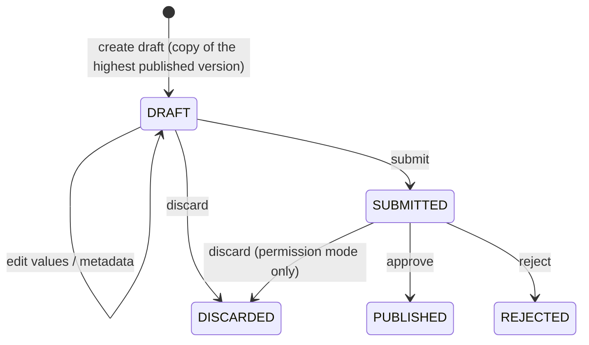

# Concepts

## List

A **list** is one code list or reference entity set: `GENDER`, `CROP_COMMODITY`,
`SEED_VARIETY`, `UNIT_OF_MEASURE`. It is what MDS has always called an *attribute*
(a row in `g2p_attributes`), and its entries are **values**.

| Field | Meaning | Versioned? |
|---|---|---|
| `list_id` | Stable identifier (`attribute_id`). Defaults to the code when the list is created through `/catalogue`; a random id when created through the legacy `/attributes/add_attribute` | — |
| `list_code` | The list's code, e.g. `SEED_VARIETY` (`attribute_code`). A request may name a list by code or by id | Yes |
| `display`, `display_i18n` | Label (`attribute_display`), and labels per locale | Yes |
| `is_hierarchical` | Whether values may have a parent value | Yes |
| `attribute_schema` | Optional JSON Schema for each value's `attributes` (see [Typed attributes](#typed-attributes)) | Yes |
| `description` | What the list is for | No: applied at once |
| `owner_org` | The department that owns it, e.g. the Ministry of Agriculture's crop directorate | No: applied at once |

"Versioned" fields change only through a draft and are published with it; the other
two are administrative and take effect immediately. Reads of a list also return
`current_version_no` (the published version in effect now),
`latest_published_version_no` (the highest published version, which may be
future-effective), `open_draft_version_no`, `open_draft_status` and an
`attribute_schema_summary` (property names, required properties, list references).

Each **value** in a version has a stable `value_id`, a `value_code` (what a
registry stores), `display`, `display_i18n`, an optional `parent_code` (for
hierarchical lists), `sort_order`, `attributes`, `roles` (the roles a country pack
gives a value) and a `status` of `ACTIVE` or `RETIRED`. Because `value_id` is
stable, a value's code can change between versions and the diff still sees it as
the same value.

The **geography** (levels, units and boundaries) is versioned the same way but as
a single dataset, not one list per level. See
[Geography and boundary changes](geography.md).

## Version

A **version** is a numbered state of a list: version 1, 2, 3, … Each version has a
status:

| Status | Meaning | Readable by consumers? | Editable? |
|---|---|---|---|
| `DRAFT` | Being edited | By number, or with `version: "draft"` | Yes |
| `SUBMITTED` | Sent for approval; frozen while it waits | By number, or with `version: "draft"` | No |
| `PUBLISHED` | Approved. **Immutable** from here on | Yes | No, never |
| `REJECTED` | Approval refused. Kept for the record | By number | No |
| `DISCARDED` | Thrown away by its maker before it was published. Kept, with its content, so its number is never used again | By number | No |

A list has **at most one open version** (`DRAFT` or `SUBMITTED`) at a time,
enforced by a unique index; so does the geography.



A draft always starts from the **highest published version**, which it records as
`base_version_no`, so a diff always has something to compare with. To bring older
content forward (for example to rework a rejected draft), a new draft can copy
another version's content with `copy_from_version`; its base is still the highest
published version. Each version records who created, last edited, submitted and
decided it, and when, plus the change note, the decision note and the approval
reference. The `*_by` fields (`created_by`, `updated_by`, `submitted_by`,
`decided_by`) hold the person's **stable user id** (the token's `sub`) or a system
name such as `country-pack-loader`; the matching `*_by_name` fields
(`created_by_name`, …) hold the person's display name as it was when they acted,
for people to read. A system actor has no name (`null`).


**Version numbers are never reused, so the published sequence may have gaps.** A
draft takes the next number when it is created: one more than the highest number
ever used for that list (or the geography), counting rejected and discarded
versions and the change log. A rejected or discarded draft keeps its number, so the
next version skips it. The change log, the Audit Manager trail and boundary object
keys of one version can therefore never be confused with another's.


The status `RETIRED` exists in the vocabulary but nothing sets it: a published
version is never changed. A list that is no longer used keeps its versions; its
values can be retired in a new version.

### Published means immutable

Once a version is `PUBLISHED`, neither the version row nor its values can be
changed or deleted. This is enforced **in the database by triggers**, not only in
the service code, so no script, loader or direct SQL can alter a published version
by accident. Every change, however small, is a new version.

## Effective dates

Every published version has an `effective_from` date and time:

* By default it is the moment of publishing.
* It may be set **in the future**: new woredas that come into force on
  2027-01-01 can be approved and published in October 2026.
* It can only **move forward**: it may not be earlier than the `effective_from` of
  the latest published version.

It can be set when the draft is created, edited later
(`update_list_draft`), given on submit, or overridden on approval.

A future-effective version is published and immutable, is listed among the
versions and can be read by number, but it is **not yet `latest`**. When its date
comes, MDS refreshes the current-state tables (on start, on every publish, and
every `effectiveRefreshSeconds`, 300 by default) and writes a
`list.version.effective` (or `geo.version.effective`) event to the change log. That
event is announced like any other: to the Audit Manager and, when a WebSub hub is
configured, on the `<prefix>.list.effective` (or `<prefix>.geo.effective`) topic,
so a consumer learns when a version **takes effect**, not only when it was
published.

## Reading: latest, pinned, as of, release

Every read names which version it wants, in one of these ways (at most one):

| Read | Request | Returns |
|---|---|---|
| **Latest** (default) | `version: "latest"` or nothing | The latest **published** version whose `effective_from` is now or earlier |
| **Pinned** | `version: 3` | Exactly version 3, whatever has been published since |
| **As of** | `as_of: "2026-06-30T00:00:00Z"` | The latest published version whose `effective_from` is on or before that moment |
| **Release** | `release: "2027.1"` | The version that [catalogue release](#catalogue-release) pins |
| **Draft** | `version: "draft"` | The open draft, for review before approval |

**Every response says which version it came from**, in a `version` object with
`version_no`, `status`, `base_version_no`, `effective_from`, `published_at`,
`is_latest` (whether it is the version in effect now), the change and decision
notes, who created, edited, submitted and decided it and when, and
`approval_ref`. A consumer never has to guess.

Data migrated from before the catalogue is version 1 with `effective_from`
1970-01-01, so an `as_of` read for any past date still resolves.

Which to use is covered in [For consumers](consumers.md#latest-pinned-or-as-of).

## Retired values

A published value is **never deleted**. When a value should no longer be used,
the next version marks it `RETIRED`. It stays in that version and in every later
one, so:

* records that hold the code still resolve to a label;
* a report can still show "Season: Summer (retired)";
* a pinned consumer reading an older version sees it as it was.

A value that was added in the current draft and never published is simply removed
when it is retired. Upserting a retired code in a draft brings it back (`ACTIVE`).
Retiring a value that has active children fails unless `cascade: true` is passed.

Reads leave retired values out unless asked (`include_retired: true`). A dropdown
for new data entry should leave them out; a screen that displays an existing record
should include them, or resolve the code with `get_list_value`, which returns
retired values too.

Geography units are retired the same way; see
[Geography and boundary changes](geography.md).

## Typed attributes

Simple code lists need only a code and a label. Reference **entities** need more:
a seed variety has a crop, maturity days, release year and agro-ecological zones;
an input product has a type and unit.

A list may declare an **`attribute_schema`**: a JSON Schema (draft 2020-12) that
every value's `attributes` object must satisfy. Values are validated against it as
they are written to a draft, again on submit, and again on approval.

A property may refer to another list with **`x-list-ref`**:

```json
{
  "type": "object",
  "required": ["crop", "maturity_days"],
  "properties": {
    "crop":          { "type": "string", "x-list-ref": "CROP_COMMODITY" },
    "maturity_days": { "type": "integer", "minimum": 30, "maximum": 300 },
    "release_year":  { "type": "integer" },
    "agro_ecological_zones": {
      "type": "array",
      "items": { "type": "string", "x-list-ref": "AGRO_ECOLOGICAL_ZONE" }
    }
  }
}
```

A value of `SEED_VARIETY` then looks like:

```json
{
  "value_code": "MAIZE_BH661",
  "display": "BH-661",
  "attributes": {
    "crop": "MAIZE",
    "maturity_days": 160,
    "release_year": 2011,
    "agro_ecological_zones": ["M2", "SH2"]
  }
}
```

An `x-list-ref` code must be an **`ACTIVE`** value of the referenced list's
version **in effect**, so a reference to a retired value is rejected:

* normally, the referenced list's latest published version whose `effective_from`
  is now or earlier;
* for a draft with a **future** `effective_from`, the referenced list's version in
  effect **on that date** (so a variety list that takes effect on 2027-01-01 may use
  a crop that is published to take effect by then);
* when a [release](#catalogue-release) is published, the referenced list's version
  **pinned in the release**, if the release pins it.

**Drafts never count**: a code that exists only in the referenced list's open draft
is not accepted. When a referenced list and the list that refers to it change
together (a new crop and its varieties), **publish the referenced list first**,
with the same or an earlier effective date, then submit the referencing list.
References are checked as values are written to a draft, on submit and on approval;
a failure is `G2P-CAT-400`, and the message names the referenced list, the missing
codes and the version they were checked against (and says so when the codes are
only in the referenced list's draft).

Changing a list's schema is itself a change to the list and goes through a draft:
the new schema applies to the draft's values and is published with them.

## Multilingual labels

Lists, values and geography levels carry a default label (`display`) and a map of
labels per locale (`display_i18n`); geography units carry `name` and `name_i18n`:

```json
{ "display": "Maize", "display_i18n": { "am": "በቆሎ", "om": "Boqqolloo" } }
```

Country packs already carry these labels, and they are loaded as they are.

## Owner department

Each list, and the geography, has an **`owner_org`**: the department that is
responsible for it. Lists and geography created without one get the chart's
`catalogue.defaultOwnerOrg` (or the loader's `geoSeed.ownerOrg`). It is shown in
the admin UI, so a reader knows whom to ask about a list, and in `awe` approval mode
it is passed to AWE in the approval request's context (see
[Change control and approvals](change-control.md#awe-through-the-approval-workflow-engine)).

## Catalogue release

Most consumers pin one or two lists. Some need **everything** to be consistent: a
programme cycle, a statistical survey, a national report. For them there are
**catalogue releases**.

A release is a named set of **list versions plus at most one geography version**:

| Release `2027.1` | |
|---|---|
| `CROP_COMMODITY` | version 4 |
| `SEED_VARIETY` | version 7 |
| `UNIT_OF_MEASURE` | version 2 |
| Geography | version 3 |

A release is `DRAFT` while its members are being chosen and `PUBLISHED` once
fixed; a draft release can be deleted, a published one cannot be changed or
deleted (database triggers again). Only published list and geography versions can
be members, and a release must pin at least one list or a geography version. A
release is published by a user with the publish permission who is **neither its
creator nor whoever last set its members** (`members_set_by` / `members_set_at`),
compared by stable user id. A consumer that reads with `release: "2027.1"` gets
each list at the version the release names; reading a list the release does not
pin is an error.

## Change log and change feed

Every lifecycle step is recorded in an append-only **change log**
(`g2p_catalogue_change_log`): list or geography created, draft created, values or
units changed, change events recorded, boundary uploaded, submitted, approval
requested, approved, rejected, published, come into effect, discarded, migrated,
and the release events. Each entry has a monotonically increasing `event_id`, an
`event_type` (such as `list.version.published`), a `subject_type` (`list`, `geo`
or `release`), a `subject_id` (the list id, `geography`, or the release code), the
version number, the `actor` (stable user id, or a system name), the `actor_name`
(the user's display name; `null` for a system actor), the time and details. The
full list of event types is in the [API reference](api-reference.md#change-feed).

The change log serves three purposes:

* **Audit.** **Every** event is sent to the
  [Audit Manager](../../audit-manager/README.md) as a CloudEvent (off when no Audit
  Manager URL is configured), whoever wrote it: the API, the country-pack loader,
  or the database itself (`*.version.effective`, `*.version.migrated`).
* **Change feed.** Consumers read it with `get_changes` and a cursor (the last
  event id they saw) to learn what was published since.
* **Push.** When a WebSub hub is configured, MDS also publishes a notification
  when a list or geography version is published (`*.version.published`) or takes
  effect (`*.version.effective`), and when a release is published.

The change log is also the **outbox** for these deliveries: each entry is written
in the same transaction as the change, and its `forwarded_at` stays empty until the
event has been delivered (or there was nowhere to send it). The API sends a
request's events right after it commits; a relay in the API (every
`catalogue_outbox_relay_seconds`, 30 by default, one worker at a time) sends
whatever is still pending, including events the loader and the database wrote.
Delivery is therefore **at least once**; the CloudEvent `id` is derived from the
change-log `event_id`, so a receiver can drop a repeat. See
[Change control and approvals](change-control.md#audit).

See [For consumers](consumers.md#following-changes).

## Where it is stored

The authoritative schema is in the
[repository](https://github.com/OpenG2P/master-data-service)
(`models/g2p_catalogue.py` and `catalogue_sql.py`).

| Table | Holds |
|---|---|
| `g2p_attributes` (extended) | Lists, with new columns `description`, `display_i18n`, `attribute_schema`, `owner_org`, `current_version_no` |
| `g2p_list_versions` | One row per list version: status, base version, the versioned list metadata, change note, `effective_from`, who (`*_by` user id and `*_by_name`) and when, decision, `approval_ref` |
| `g2p_list_version_values` | Values per list version |
| `g2p_geo_versions` | Geography versions, with `country`, `owner_org`, `boundary_objects` (level → object key) and `boundary_checksums` |
| `g2p_geo_version_levels`, `g2p_geo_version_units` | Levels and units per geography version; units with status and `valid_from` / `valid_to` |
| `g2p_geo_changes` | Change events (lineage) per geography version |
| `g2p_catalogue_releases`, `g2p_catalogue_release_members` | Releases (with `members_set_by` / `members_set_at`) and their members |
| `g2p_catalogue_change_log` | The append-only change log, also the delivery outbox (`forwarded_at` is the only column that ever changes) |
| `g2p_catalogue_awe_events` | AWE callbacks received, for idempotency |
| `g2p_catalogue_state` | Catalogue schema version (`schema_version`, now 3), the geography version in effect, and `legacy.generation` (bumped whenever the current-state tables are refreshed) |
| `g2p_attribute_values`, `g2p_geo_levels`, `g2p_geo_level_values` | Unchanged in shape: the materialised **current published** state, `ACTIVE` values and units only |
