# Notification Architecture

### 1. Notification Provider as the Orchestration / Infrastructure Layer

Instead of implementing notification infrastructure separately within each OpenG2P application, a **Notification Provider acts as the notification orchestration and infrastructure layer**.

Without a dedicated provider, each application would need to implement and maintain:

* Notification templates
* Notification workflows
* Multi-channel orchestration
* Provider integrations
* Notification preferences
* Scheduling and delays
* Retry and failure handling
* Fallback logic
* Delivery status and tracking
* In-app notification / Inbox management

With a provider in place, OpenG2P applications focus on generating the relevant business events, while the provider handles notification orchestration and delivery.

#### High-Level Architecture

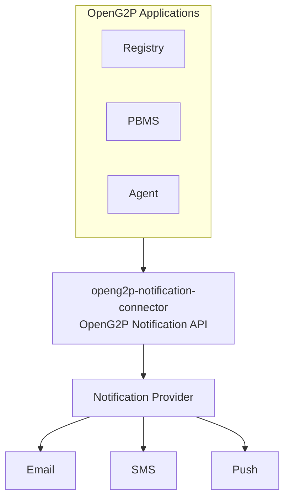

The OpenG2P applications do not need to know which underlying email, SMS, or push provider is being used, nor which notification provider sits behind the connector.

***

## 2. Notification Provider Options

The notification provider is a pluggable component. Several providers offer roughly the same category of capability (workflows, templates, multi-channel delivery, preferences, in-app Inbox), but differ meaningfully on **licensing model and self-hosting support**, which matters for a public-sector platform like OpenG2P where data residency and vendor lock-in are often real constraints.

| Provider              | Self-hosted?       | Notes                                                                                                                                                                                                                                        |
| --------------------- | ------------------ | -------------------------------------------------------------------------------------------------------------------------------------------------------------------------------------------------------------------------------------------- |
| **Novu**              | **Yes**            | MIT-licensed, open-source core. Can run fully self-hosted (e.g., via Docker), as managed cloud, or as a managed VPC. Only provider in this list with a mature, genuinely free self-hosted distribution.                                      |
| **Knock**             | No                 | SaaS-only, closed-source. Strong workflow engine and developer experience, but no option to run it on your own infrastructure.                                                                                                               |
| **Courier**           | No                 | SaaS-only, closed-source. Broadest provider/integration ecosystem and a visual template designer, but data lives on Courier's infrastructure only.                                                                                           |
| **SuprSend**          | No                 | SaaS-only. Strong multi-tenancy and broad SDK/channel coverage, positioned as a Knock alternative, but no self-hosted distribution.                                                                                                          |
| **Engagespot**        | Limited            | Primarily a hosted SaaS product; some client SDKs reference support for pointing at a "self-hosted instance," but this is not a widely documented, freely available open-source self-hosting path in the way Novu's is. Treat as SaaS-first. |
| **OneSignal**         | No                 | SaaS-only. Strong for consumer push/engagement journeys, not positioned around self-hosting.                                                                                                                                                 |
| **MagicBell**         | No                 | SaaS-only. In-app inbox is its headline feature, but it is a managed service.                                                                                                                                                                |
| **Custom / in-house** | Yes, by definition | Full control and full ownership of hosting, at the cost of building and maintaining everything a provider would otherwise handle (see Section 1's list).                                                                                     |

**Takeaway:** if self-hosting is a hard requirement (e.g., for data residency, procurement rules, or avoiding vendor lock-in), **Novu is currently the only mainstream managed-feature-set provider with a genuine free/open-source self-hosted option** among the ones compared here. All other listed SaaS providers require sending notification data to their infrastructure. A custom in-house implementation is always self-hostable, but reintroduces everything listed in Section 1.

This is a point-in-time comparison of external products; provider capabilities, licensing, and self-hosting support can change, and this should be re-verified before a final procurement or architecture decision.

***

## 3. Notification Abstraction Layer

OpenG2P should define a **stable notification contract** so that applications do not directly depend on any specific notification provider.

The abstraction should exist at both the backend and frontend layers.

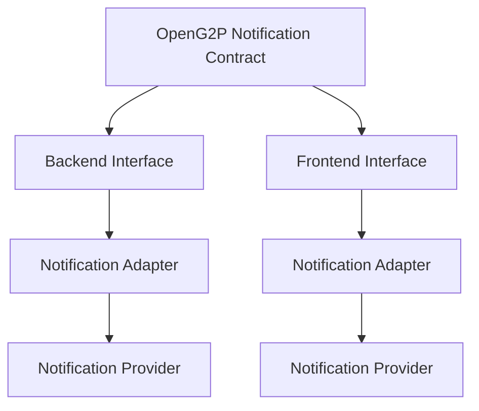

The provider implementation can later be replaced without requiring changes to application business logic or UI code.

Possible implementations, from Section 2, include:

* Novu (self-hostable)
* Knock (SaaS-only)
* Courier (SaaS-only)
* SuprSend (SaaS-only)
* Custom / in-house implementation (self-hosted by definition)

***

## 4. Backend Notification Abstraction

The backend connector provides an abstract interface to OpenG2P applications.

For example:

```python
notification_service.send(
    event="beneficiary.created",
    subscriber_id=user_id,
    payload={
        "name": beneficiary.name
    }
)
```

The application should not directly call any provider's API.

Instead:

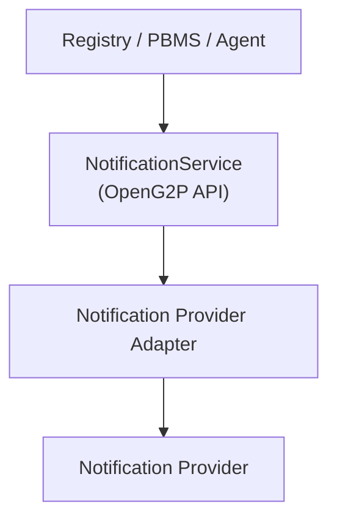

This allows the underlying implementation to change without modifying Registry, PBMS, Agent, or other consumers.

***

## 5. In-App Inbox — Two Architectural Approaches

For the In-App Inbox, there are **two possible architectural approaches**, independent of which notification provider is chosen. Both are valid, well-established patterns and satisfy the core principle that OpenG2P applications and UI should never depend directly on any provider-specific API. The right choice depends on which trade-offs matter more for a given deployment.

***

### Option A — OpenG2P Backend Owns the Inbox Connection

In this approach, the frontend communicates only with the OpenG2P backend.

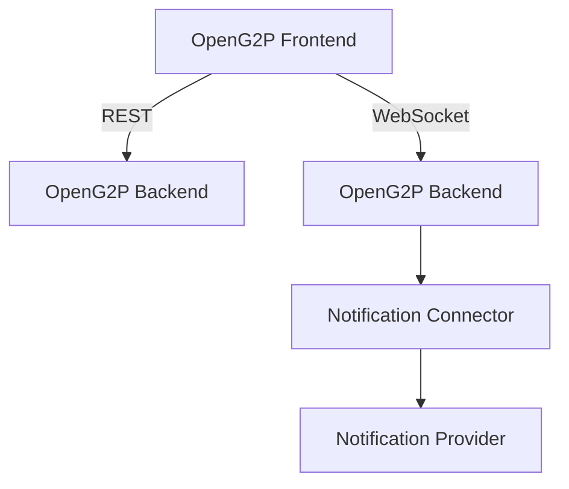

The backend acts as an abstraction/proxy between the frontend and the notification provider.

#### REST

```
GET   /notifications
GET   /notifications/unread-count

PATCH /notifications/{id}/read

POST  /notifications/read-all
```

#### WebSocket

The OpenG2P backend owns the WebSocket protocol:

```
NOTIFICATION_CREATED
NOTIFICATION_UPDATED
NOTIFICATION_DELETED
```

The frontend therefore depends only on the OpenG2P notification API and WebSocket contract.

#### Advantages

* Complete control over the frontend-facing API
* OpenG2P completely owns the notification protocol
* Provider-specific details are fully hidden from the frontend
* Provider can be replaced without changing frontend integration at all — not even a new frontend adapter
* Single point for enforcing auth, rate-limiting, audit logging, and access control on notification data
* Natural fit if notifications ever need to be aggregated from multiple sources into one server-side state
* Consistent with a "backend as system of record" pattern, if that is how other OpenG2P integrations are structured

#### Disadvantages

* OpenG2P needs to build and maintain the realtime (WebSocket) connection
* OpenG2P needs to synchronize/proxy notification events between the provider and the frontend
* Additional backend complexity and operational surface (connection scaling, reconnection logic, etc.)
* The backend takes on responsibility for functionality some providers already offer out of the box
* More upfront engineering effort before the feature is usable

***

### Option B — Frontend Notification Abstraction Over the Provider

If the chosen provider already manages the Inbox state and realtime connection, OpenG2P can avoid proxying the connection through its backend.

The frontend uses an **OpenG2P-owned notification package** that internally uses the provider's frontend SDK.

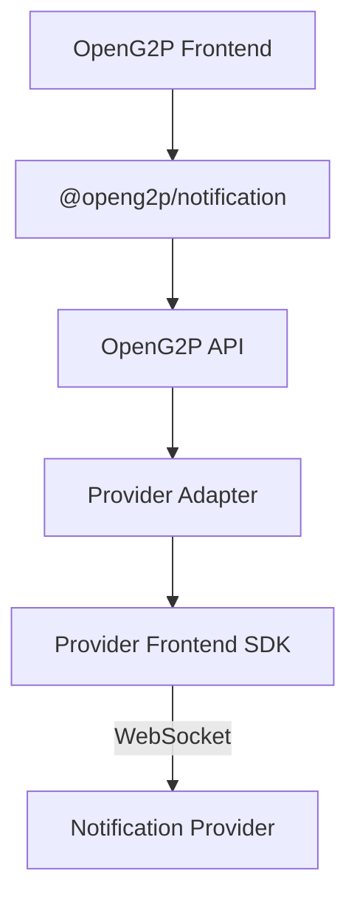

The application UI does **not** directly import or use the provider's package.

Instead:

```typescript
import {
    NotificationInbox,
    NotificationBell
} from "@openg2p/notification";
```

The OpenG2P notification package internally handles the provider's SDK:

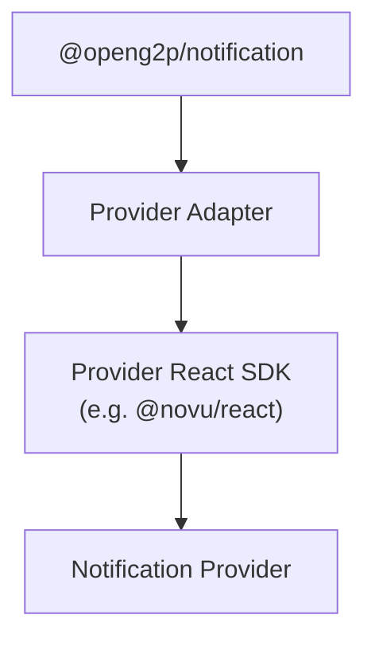

The chosen provider's implementation therefore becomes an implementation detail of the OpenG2P notification package.

#### Advantages

* No OpenG2P WebSocket proxy is required
* No second WebSocket connection between frontend and OpenG2P backend
* The provider manages Inbox state directly, so less state-synchronization logic to write and maintain
* Less backend complexity and a smaller backend operational surface
* The provider's realtime capabilities can be used directly, as-is
* UI remains independent of the provider's package through the OpenG2P abstraction
* Faster to stand up initially, since the provider's existing Inbox infrastructure is reused rather than rebuilt

#### Disadvantages

* The frontend notification package still depends internally on the provider's SDK, which becomes part of the frontend's dependency and risk surface
* The OpenG2P abstraction (`@openg2p/notification`) must be designed carefully to avoid leaking provider-specific concepts
* Replacing the provider requires implementing another frontend adapter (real-time delivery logic is not "free" once switched)
* Some provider-specific capabilities may need to be translated, and may not map cleanly, into the OpenG2P contract
* Server-side notification state lives inside the provider rather than inside OpenG2P's own backend — relevant if the provider is SaaS-only (see Section 2)

***

## 6. Recommended Frontend Abstraction (Applies to Either Option)

Regardless of which option is chosen for the Inbox connection, or which provider sits behind the connector, the frontend should depend on:

```
@openg2p/notification
```

and not directly on a provider package such as `@novu/react`, `@knocklabs/react`, or similar.

For example:

```typescript
<NotificationInbox
    subscriberId={user.id}
/>
```

The application should not need to know about:

```typescript
Inbox
applicationIdentifier
ProviderNotification
ProviderMessage
Provider preferences
Provider WebSocket events
```

Instead, OpenG2P defines its own notification model:

```typescript
interface OpenG2PNotification {
    id: string;
    type: string;
    title: string;
    body: string;
    data?: Record<string, unknown>;
    createdAt: string;
    read: boolean;
}
```

The adapter translates between the OpenG2P model and the provider model.

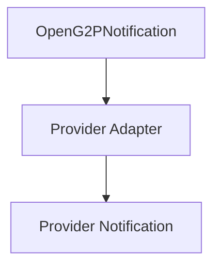

If the provider is replaced (e.g., Novu → Knock, or Knock → a custom implementation):

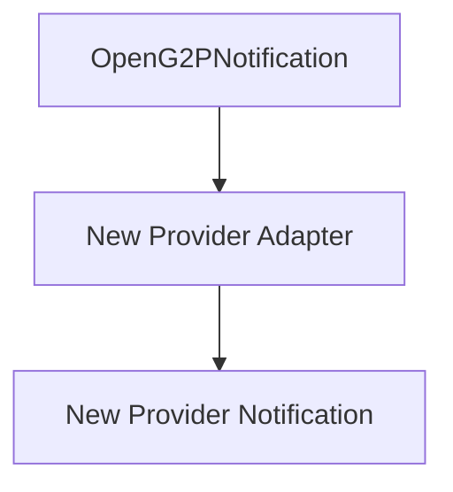

The UI remains unchanged. This holds true under both Option A and Option B — the difference between the two options is _where the realtime connection and Inbox state live_, not whether the UI is abstracted from the provider.

***

## 7. Comparing the WebSocket Topology

**Option A** introduces a proxied connection:

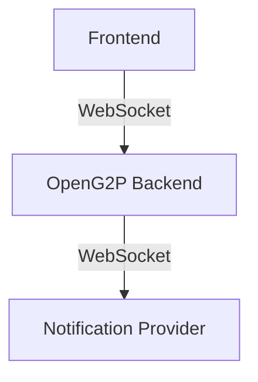

**Option B** uses a direct connection from the frontend SDK to the provider:

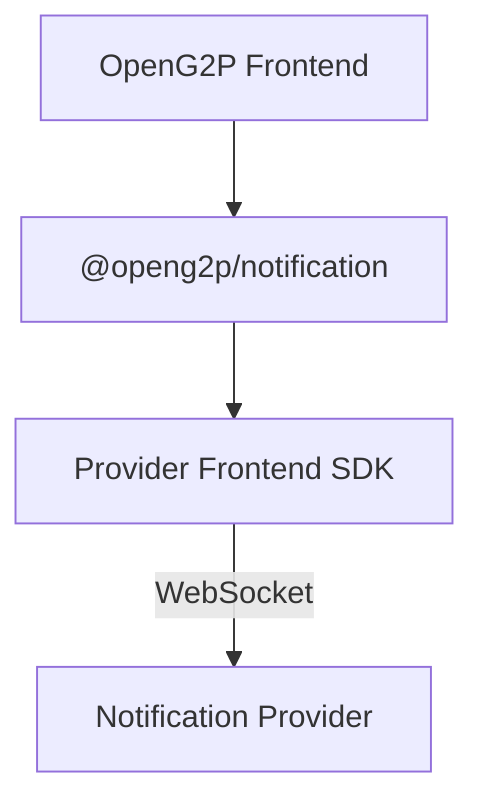

Neither topology is inherently correct — the choice depends on whether OpenG2P wants a single point of backend control over the realtime protocol (Option A) or wants to avoid the extra connection and proxy layer (Option B).

***

## 8. Separation of Responsibilities

The architecture separates notification generation, orchestration, state, and presentation. The diagram below reflects responsibilities under **Option B**; under **Option A**, "Inbox state" and "Inbox realtime connection" shift from the provider / provider frontend SDK to the OpenG2P Backend.

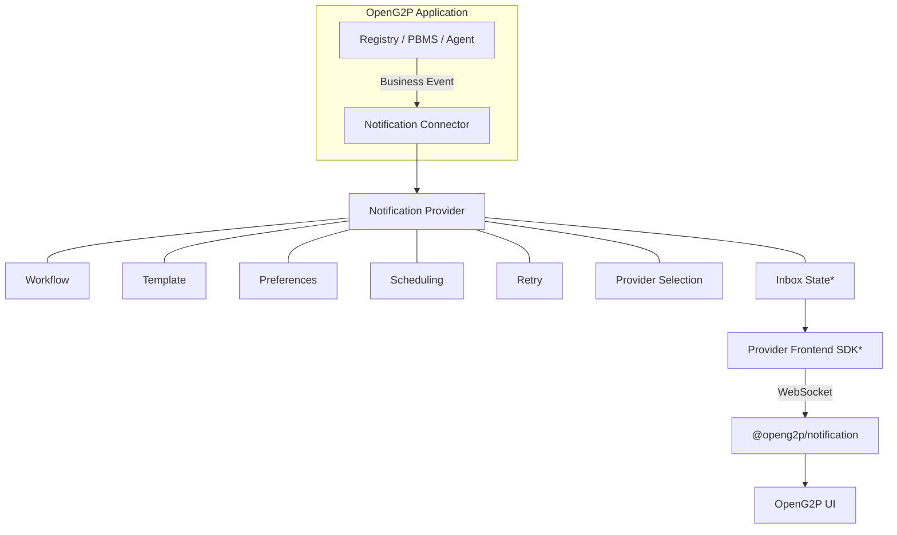

\* Under Option A, these boxes are replaced by the OpenG2P Backend and its own WebSocket protocol.

| Responsibility                    | Owner (Option B)                 | Owner (Option A)                 |
| --------------------------------- | -------------------------------- | -------------------------------- |
| Business events                   | Registry / PBMS / Agent          | Registry / PBMS / Agent          |
| Notification API                  | OpenG2P Notification Connector   | OpenG2P Notification Connector   |
| Notification orchestration        | Notification Provider            | Notification Provider            |
| Workflows                         | Notification Provider            | Notification Provider            |
| Templates                         | Notification Provider            | Notification Provider            |
| Email/SMS/Push delivery           | Notification Provider            | Notification Provider            |
| Inbox state                       | Notification Provider            | OpenG2P Backend                  |
| Inbox realtime connection         | Provider Frontend SDK            | OpenG2P Backend                  |
| Frontend notification abstraction | `@openg2p/notification`          | `@openg2p/notification`          |
| Backend provider abstraction      | `openg2p-notification-connector` | `openg2p-notification-connector` |
| UI notification components        | `@openg2p/notification`          | `@openg2p/notification`          |

***

## 9. Provider Independence

Under either option, the abstraction should exist so that the notification provider can be replaced without affecting OpenG2P application code — including switching between a self-hosted provider (e.g., Novu) and a SaaS-only one (e.g., Knock, Courier, SuprSend), or moving to a custom implementation.

#### Backend

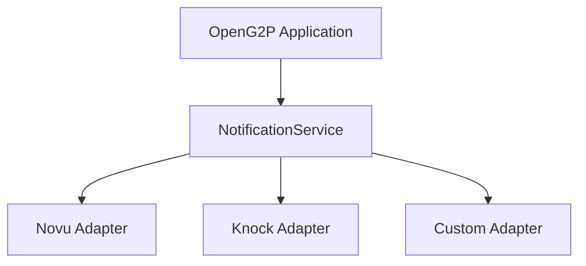

#### Frontend

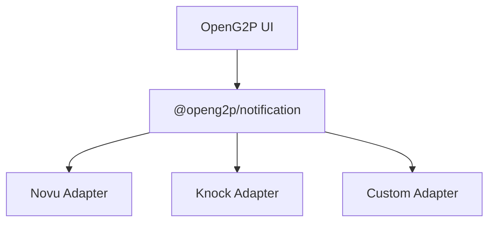

The OpenG2P application interacts only with the abstraction, regardless of which provider is used underneath, and regardless of whether Option A or Option B is used for the Inbox connection.

***

## 10. Core Principle

> **OpenG2P applications define WHAT happened; the Notification Connector provides a stable backend integration interface; the notification provider determines HOW, WHEN, and THROUGH WHICH CHANNEL the notification is delivered; and the OpenG2P frontend notification package provides a stable UI abstraction over the Inbox capabilities.**

The important architectural boundary holds under both options and regardless of provider choice:

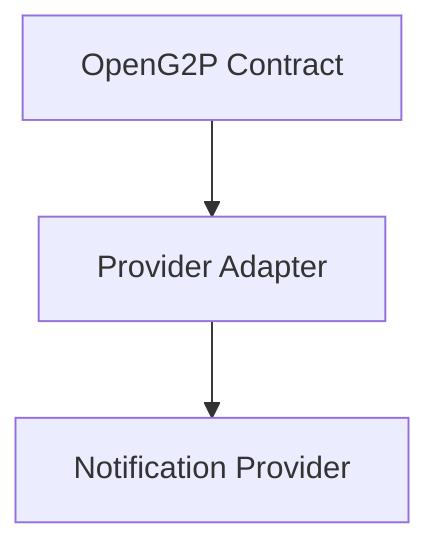

Therefore, **the UI and OpenG2P applications should never depend directly on any provider-specific API**, whether the Inbox connection is owned by the OpenG2P backend (Option A) or by the provider's frontend SDK behind the OpenG2P notification package (Option B), and whether the provider is self-hosted or SaaS-only.

***

## 11. Summary of the Inbox Decision Point

| Factor                                                              | Option A (Backend-owned)                               | Option B (Frontend SDK-based)                                                            |
| ------------------------------------------------------------------- | ------------------------------------------------------ | ---------------------------------------------------------------------------------------- |
| Who owns Inbox state                                                | OpenG2P Backend                                        | Notification Provider                                                                    |
| Who owns the realtime connection                                    | OpenG2P Backend                                        | Provider Frontend SDK                                                                    |
| Number of WebSocket connections                                     | Two (Frontend↔Backend, Backend↔Provider)               | One (Frontend↔Provider)                                                                  |
| Backend engineering effort                                          | Higher                                                 | Lower                                                                                    |
| Centralized audit/access control over notification state            | Yes, natively                                          | Requires additional design if needed                                                     |
| Ease of aggregating notifications from multiple sources server-side | Easier                                                 | Harder                                                                                   |
| Effort to fully replace the provider                                | Frontend contract untouched; backend adapter swap only | Requires a new frontend adapter as well                                                  |
| Dependency exposure to a third-party SDK in production              | None (SDK stays server-side, if used at all)           | Frontend carries the provider's SDK as a transitive dependency                           |
| Time to initial implementation                                      | Slower                                                 | Faster                                                                                   |
| Relevance of provider's self-hosting status                         | Lower — provider data can stay backend-side either way | Higher — with a SaaS-only provider, Inbox state and traffic go directly to a third party |

Both options preserve the core architectural boundary — OpenG2P applications and UI never call the notification provider directly. The decision between them is a trade-off between **centralized backend control and provider-independent server-side state (Option A)** versus **lower implementation and maintenance overhead by relying on the provider's existing Inbox infrastructure (Option B)**.

***

## 12. Summary of the Provider Decision Point

| Factor                                           | Self-hosted provider (e.g., Novu)                                  | SaaS-only provider (e.g., Knock, Courier, SuprSend) | Custom / in-house                    |
| ------------------------------------------------ | ------------------------------------------------------------------ | --------------------------------------------------- | ------------------------------------ |
| Data residency / control                         | Full — runs on OpenG2P-controlled infrastructure                   | Data flows to the provider's infrastructure         | Full                                 |
| Vendor lock-in risk                              | Lower                                                              | Higher                                              | None, but highest maintenance burden |
| Operational burden                               | OpenG2P runs and scales the provider                               | Provider handles hosting and scaling                | OpenG2P builds and runs everything   |
| Feature maturity out of the box                  | Generally strong, though some enterprise features may be paid-tier | Generally strong; varies by provider                | None — must be built                 |
| Fit for procurement/data-sovereignty constraints | Good fit                                                           | May require legal/compliance review                 | Good fit, at high build cost         |

This is independent of the Option A / Option B Inbox decision — a self-hosted provider can be paired with either Inbox architecture, as can a SaaS-only provider.
