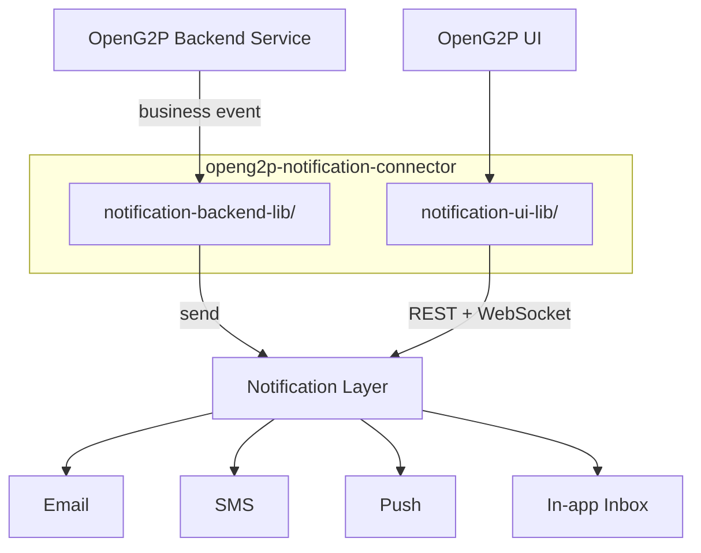
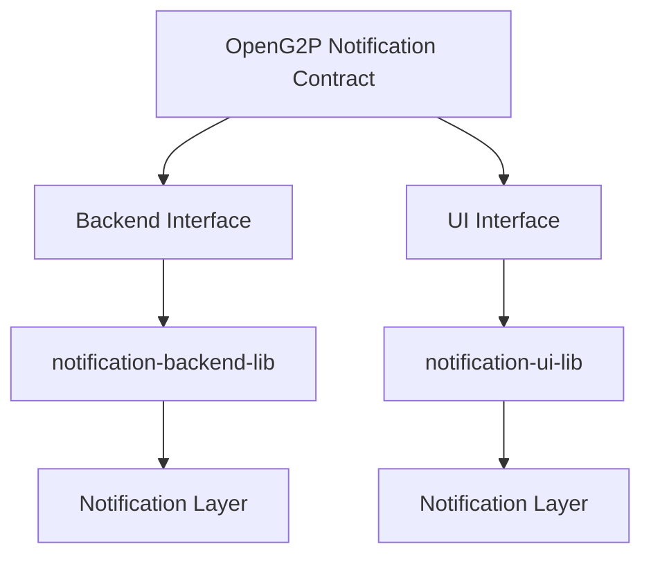
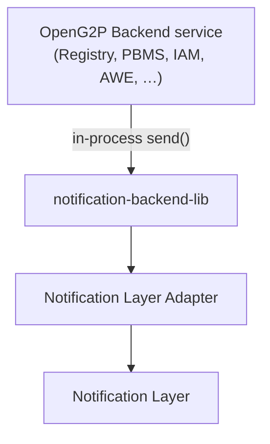
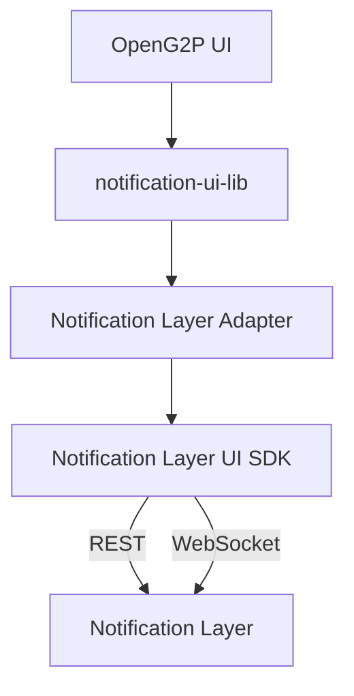
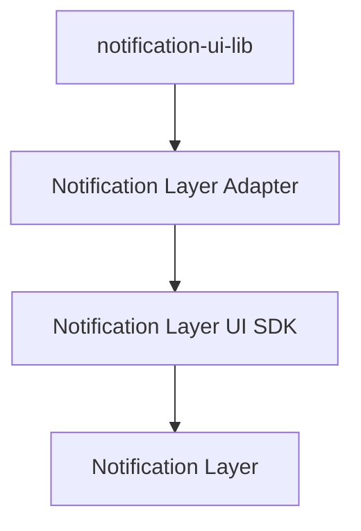
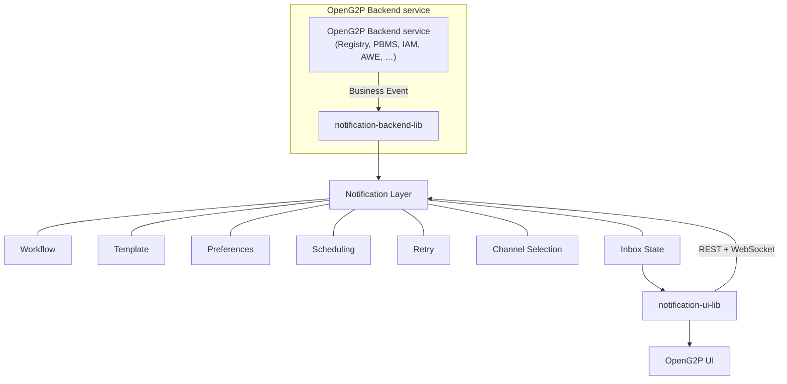
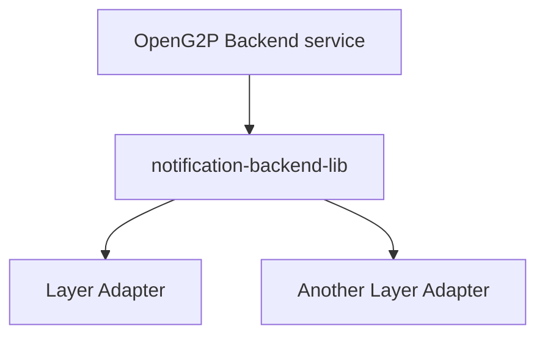
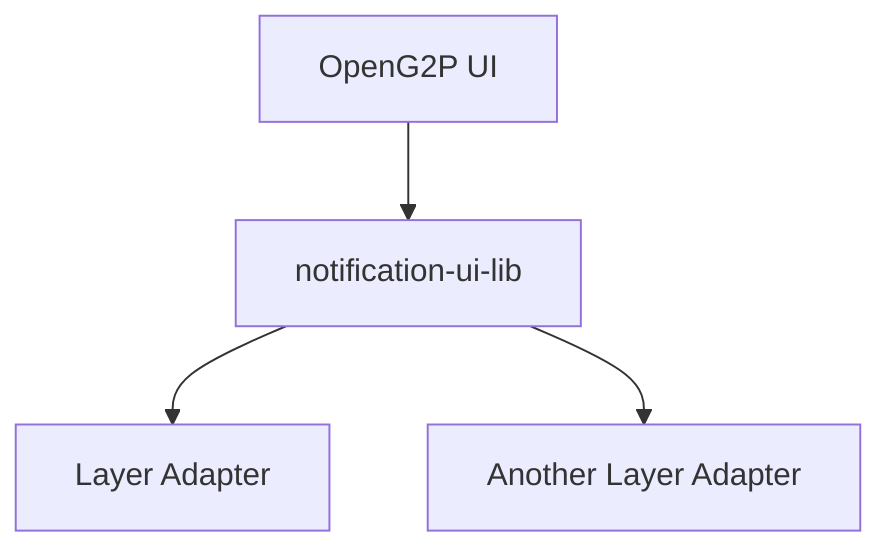
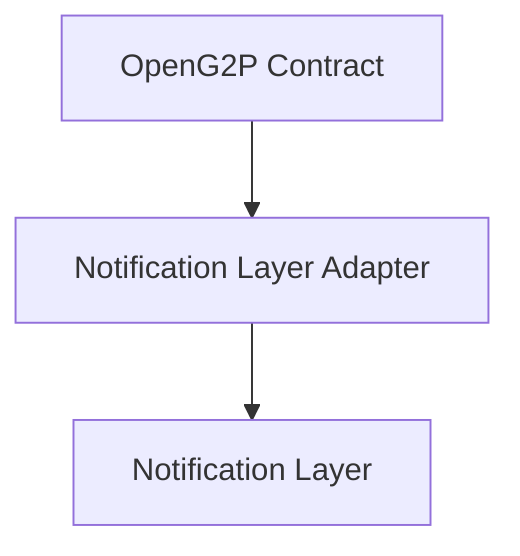

# Notification Architecture

OpenG2P applications emit business events. A **notification layer** handles orchestration and delivery — templates, workflows, channels, retries, and the in-app Inbox. Applications never call a notification-layer API directly.

`openg2p-notification-connector` is a single library, not a standalone HTTP service. Backend and UI live as **two folders in the same repo**:

| Folder | Layer | Role |
| --- | --- | --- |
| `notification-backend-lib` | Backend | Event trigger (`send`) from product services, using the notification-layer secret key |
| `notification-ui-lib` | UI | Inbox UI, notification-layer REST APIs, and the WebSocket connection to the notification layer |

> OpenG2P applications define **what** happened. The connector provides a stable backend and UI contract. The notification layer decides **how, when, and on which channel** the notification is delivered.

***

## 1. Notification Layer as the Orchestration Layer

Instead of implementing notification infrastructure separately within each OpenG2P application, a **notification layer acts as the notification orchestration and infrastructure layer**.

Without a dedicated layer, each application would need to implement and maintain:

* Notification templates
* Notification workflows
* Multi-channel orchestration
* Channel integrations
* Notification preferences
* Scheduling and delays
* Retry and failure handling
* Fallback logic
* Delivery status and tracking
* In-app notification / Inbox management

With a notification layer in place, OpenG2P applications focus on generating the relevant business events, while the layer handles notification orchestration and delivery.

#### High-Level Architecture

OpenG2P Backend Service and OpenG2P UI do not need to know which underlying email, SMS, or push channel is being used, nor which notification layer sits behind the connector.

***

## 2. Notification Abstraction Layer

OpenG2P defines a **stable notification contract** so that applications do not directly depend on any specific notification layer.

The abstraction exists at **both** the backend and UI layers.

The notification-layer implementation can later be replaced without requiring changes to application business logic or UI code.

***

## 3. Backend — Event Trigger

OpenG2P Backend services (for example Registry, PBMS, IAM, AWE) trigger notification events. That logic lives in `openg2p-notification-connector/notification-backend-lib`.

There is **no standalone notification HTTP service**. The product service that owns the business event imports the backend lib and calls `send()` in-process.

The application should not directly call any notification-layer API.

The secret API key stays in the product backend. Channel selection (in-app, email, SMS, push) is a workflow step in the notification layer, not a `channel=` argument on `send()`.

If that subscriber's browser is connected, the notification layer pushes on **their** socket. The product service does not forward the event over a WebSocket.

***

## 4. UI — REST and WebSocket to the Notification Layer

OpenG2P UI consumes the notification layer's REST APIs and opens the WebSocket connection **to the notification layer**. That code lives in `openg2p-notification-connector/notification-ui-lib`.

OpenG2P backends do **not** proxy Inbox REST or WebSocket traffic, and they do not open a second WebSocket to the UI.

Application UI does **not** import the notification layer's package. The OpenG2P notification package internally handles the notification layer's SDK.

The chosen notification layer is an implementation detail of `notification-ui-lib`.

***

## 5. Separation of Responsibilities

| Responsibility | Owner |
| --- | --- |
| Business events | OpenG2P Backend service (Registry, PBMS, IAM, AWE, …) |
| Event trigger (`send`) | Same product service, via `notification-backend-lib` |
| Notification orchestration | Notification Layer |
| Workflows, templates, email/SMS/push | Notification Layer |
| Inbox state | Notification Layer |
| Inbox REST APIs | `notification-ui-lib` → Notification Layer |
| Inbox realtime connection | `notification-ui-lib` → Notification Layer |
| Backend notification-layer abstraction | `notification-backend-lib` |
| UI notification components | `notification-ui-lib` |

***

## 6. Layer Independence

The abstraction exists so that the notification layer can be replaced without affecting OpenG2P application code.

#### Backend

#### UI

The OpenG2P application interacts only with the abstraction, regardless of which notification layer is used underneath.

***

## 7. Core Principle

> **OpenG2P applications define WHAT happened; `notification-backend-lib` provides a stable backend trigger interface; the notification layer determines HOW, WHEN, and THROUGH WHICH CHANNEL the notification is delivered; and `notification-ui-lib` provides a stable UI abstraction over the notification layer's Inbox REST APIs and WebSocket.**

Therefore, **the UI and OpenG2P applications should never depend directly on any notification-layer-specific API**.

***

## 8. Possible Notification Layers

The architecture above is independent of any one product. The notification layer behind the connector adapters can be any of:

* **Novu**
* **SuprSend**
* **Custom layer** — an in-house implementation of the same contract

OpenG2P applications and UI continue to use `notification-backend-lib` and `notification-ui-lib`. Only the adapter behind those libraries changes.
