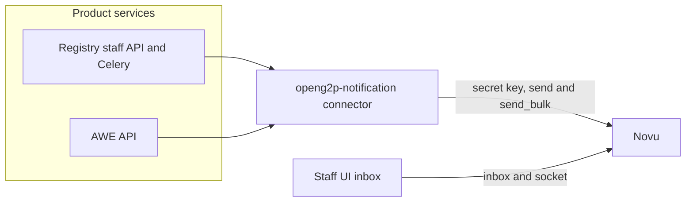

# Notifications

OpenG2P product services emit a business event after their own transaction commits. They do not render email, SMS, or in-app copy, and they do not choose a channel.

The Python package [`openg2p-notification`](https://github.com/OpenG2P/notifications/tree/develop/connector) is the send connector. The default provider is self-hosted Novu. Staff see in-app notifications in the registry staff UI, which talks to Novu from the browser.

## Design at a glance

| Piece | What it does |
| --- | --- |
| Product service | Decides that something happened, who should hear about it, and which payload fields to send |
| Connector | Maps the event key to a provider workflow id and calls `send` or `send_bulk` |
| Novu | Runs the workflow: in-app, email, SMS, retries, and inbox state |
| Staff UI | Lists the inbox and opens the live socket. It does not send |

`NOTIFICATION_WORKFLOWS` is the allow-list. An event key that is missing from that map is not sent. An empty map sends nothing. `NOTIFICATION_ENABLED=false` skips every send even when the map lists the event.

A send that fails is logged and swallowed. The change request, the intake submission, the export, and the approval still succeed.

## Who reads which page

| You are | Start here |
| --- | --- |
| Wiring Helm, Novu, or the staff UI bell | [Deployment](deployment.md), then [Novu](novu.md) and [Inbox](inbox.md) |
| Adding a send to a service | [Implementing a send](implementing.md), then [Connector](connector.md) |
| Changing who receives a registrant email | [Workflows and payloads](workflows-and-payloads.md#registrant-contact-in-an-extension) |
| Replacing Novu | [Switch provider](connector.md#switch-provider) |
| Checking why one event is silent | [Architecture](architecture.md#when-a-send-does-not-happen) |

## In this section

| Page | Covers |
| --- | --- |
| [Architecture](architecture.md) | Hops, identity, and what each side owns |
| [Connector](connector.md) | Python API, environment variables, and switching the provider |
| [Inbox](inbox.md) | Staff UI client and the session it uses today |
| [Novu](novu.md) | Default self-hosted Novu and workflow seeding |
| [Implementing a send](implementing.md) | How a service calls the connector |
| [Workflows and payloads](workflows-and-payloads.md) | Registry and AWE events, recipients, and template fields |
| [Deployment](deployment.md) | Helm values, secrets, and Docker build args |

Source: [OpenG2P/notifications](https://github.com/OpenG2P/notifications).
