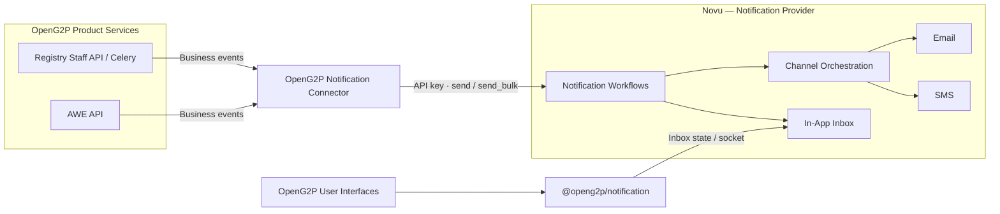

# Notifications

**How OpenG2P Sends Notifications:** Product services emit business events. The **Connector** delivers these events to the **Notification Provider**, which handles notification workflows, channel orchestration, and the in-app inbox. The **client package** consumes the in-app inbox state and exposes it to OpenG2P user interfaces.

Two libraries live in [OpenG2P/notifications](https://github.com/OpenG2P/notifications). The connector and the client package talk to the notification provider. The default system is self-hosted Novu. Its install, workflow seeding, and email and SMS channel notes are in [Novu](notification-provider/novu.md).

| Piece | What it is |
| --- | --- |
| [Connector](connector.md) | The [`connector/`](https://github.com/OpenG2P/notifications/tree/develop/connector) library in [OpenG2P/notifications](https://github.com/OpenG2P/notifications). A service uses it to send a notification. |
| [Client](client.md) | The [`client/`](https://github.com/OpenG2P/notifications/tree/develop/client) library in the same repository. A UI uses it to show the inbox. |
| [Notification provider](notification-provider/README.md) | Workflows, channel steps, retries, and inbox state. [Novu](notification-provider/novu.md) is the built-in notification provider. |

The connector and the client do not import each other. Replacing the notification provider does not change Registry or AWE call sites, and it does not change the `Inbox` component.

## Design at a glance

| Piece | What it does |
| --- | --- |
| Product service | Decides that something happened, who should hear about it, and which payload fields to send |
| Connector | Maps the event key to a notification provider workflow id and calls `send` or `send_bulk` |
| Notification provider | Runs the workflow: in-app, email, SMS, retries, and inbox state |
| Client | Lists the inbox and opens the live socket. It does not send |

`NOTIFICATION_WORKFLOWS` is the allow-list. An event key that is missing from that map is not sent. An empty map sends nothing. `NOTIFICATION_ENABLED=false` skips every send even when the map lists the event.

A send that fails is logged and swallowed. The change request, the intake submission, the export, and the approval still succeed.

## Who reads which page

| You are | Start here |
| --- | --- |
| Adding notifications to a new service and its UI | [Integrating a new service](integrating.md) |
| Adding a send to a service | [Implementing a send](implementing.md), then [Connector](connector.md) |
| Putting the bell in a UI | [Client](client.md) |
| Wiring Helm for Registry or AWE | [Deployment](deployment.md) |
| Installing Novu or seeding workflows | [Novu](notification-provider/novu.md) |
| Adding an email or SMS integration | [Email and SMS](notification-provider/novu.md#email-and-sms) |
| Changing who receives a registrant email | [Workflows and payloads](workflows-and-payloads.md#registrant-contact-in-an-extension) |
| Replacing the notification provider | [Switch provider on the connector](connector.md#switch-provider) and [on the client](client.md#switch-provider) |
| Checking why one event is silent | [Architecture](architecture.md#when-a-send-does-not-happen) |

## In this section

| Page | Covers |
| --- | --- |
| [Architecture](architecture.md) | Hops, identity, and what each side owns |
| [Connector](connector.md) | Python API, environment variables, and switching the provider |
| [Client](client.md) | npm package, packaging, and the staff UI bell |
| [Integrating a new service](integrating.md) | Backend send and UI inbox for a new app |
| [Implementing a send](implementing.md) | How a service calls the connector |
| [Workflows and payloads](workflows-and-payloads.md) | Registry and AWE events, recipients, and template fields |
| [Deployment](deployment.md) | Helm values, secrets, and Docker build args |
| [Notification provider](notification-provider/README.md) | Index of the notification provider pages |
| [Novu](notification-provider/novu.md) | Default install, secrets, workflow seeding, and email and SMS links |
