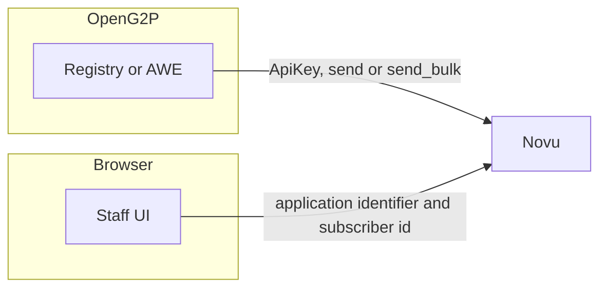
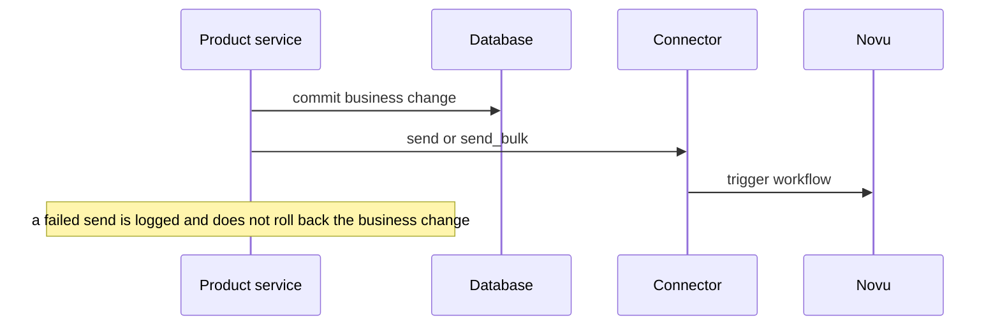
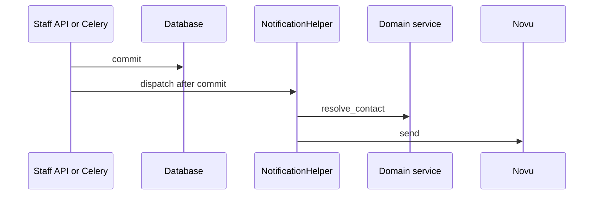

# Architecture

A product service defines what happened. The [connector](connector.md) triggers a provider workflow. The provider decides the channel, the copy, and the inbox. The staff UI reads that inbox. It does not send.

## Hops



| Hop | What moves |
| --- | --- |
| Product service to connector | Event key, entity id, payload, recipient. In process. No HTTP from the product code itself |
| Connector to Novu | Secret API key on trigger or bulk trigger. The connector upserts the subscriber on send |
| Staff UI to Novu | Public application identifier, subscriber id, inbox REST, and the WebSocket |

Python does not list the inbox, mark a notification read, open a WebSocket, or pass `channel=` on send. Channel steps live on the Novu workflow.

## Send after commit



AWE collects intents inside the transaction and sends them only in `flush()`, after commit. `discard()` drops them if the transaction rolls back. Registry helpers run after `session.commit()`. See [Implementing a send](implementing.md).

### Registry



The helper builds the payload first. Display lookups that fail leave fields empty and still send. A registrant with no email and no phone does not send. Staff export sends to `requested_by` and does not call `resolve_contact`.

### AWE

```mermaid
sequenceDiagram
  participant Engine as Approval engine
  participant DB as Database
  participant Note as notification service
  participant KC as Keycloak
  participant Novu as Novu
  Engine->>Note: collect inside the transaction
  Engine->>DB: commit
  Engine->>Note: flush
  Note->>KC: email and name by username
  Note->>Novu: send_bulk
```

`collect()` does not call Novu. A Keycloak miss still sends. The in-app step can land without an email address.

## When a send does not happen

Check these in order. The business action still succeeds in every row.

| Check | Result |
| --- | --- |
| `openg2p-notification` is not installed | Registry and AWE return before any HTTP call |
| `NOTIFICATION_ENABLED` is false | Connector returns `skipped` |
| Event key is missing or blank in `NOTIFICATION_WORKFLOWS` | Connector returns `skipped` |
| Registrant contact is missing, or has no email and no phone | Registry returns before `send` |
| Export row has no `requested_by` | Registry returns before `send` |
| AWE engine event is not in the notify map | `collect()` stores nothing |
| AWE requester id equals `source_service` | Terminal events have no recipient |
| AWE webhook was already applied | Registry returns before the notify helpers |
| Novu rejects the trigger | Logged `FAILURE` or an exception. The row stays committed |

The connector does not retry. Novu retries its own channel steps after it accepts the trigger.

## Identity

| Person | Novu subscriber id | Email and name |
| --- | --- | --- |
| Staff | Keycloak username (`preferred_username`) | AWE looks the user up in Keycloak at flush time. A missing profile still sends, so the in-app step can land |
| Registrant | `person:{internal_record_id}` from `registrant_id()` | Email and phone come from the register domain service. No email and no phone skips the send |

Do not use an email address as the subscriber id. The same username on a later login is the same staff inbox.

Registry export uses `requested_by` as that staff username. Change-request and intake-form events go to the registrant, not to the staff member who created the record.

## Responsibilities

| Responsibility | Owner |
| --- | --- |
| Business event and payload | Registry or AWE |
| Allow-list (`NOTIFICATION_WORKFLOWS`) | Deployment configuration |
| Trigger call | Same product service, through the connector |
| Workflow, template, channel, retry, inbox state | Novu |
| Inbox list, unread count, mark read, live bell | Staff UI |

Replacing Novu does not change Registry or AWE call sites. Only the provider behind the connector changes. See [Switch provider](connector.md#switch-provider).
